[Русский](questions.md) | English

# AWS

## Core services

>## Which AWS services are used in backend applications?

**Compute:**

- **EC2** – virtual machines.
- **Auto Scaling Group (ASG)** – horizontal scaling and replacement of unhealthy EC2 instances.
- **Elastic Load Balancing (ELB)** – distributes requests across instances and services.
- **ECS + Fargate** – runs containers without managing servers; **EKS** provides managed Kubernetes.
- **Lambda** – runs functions without managing servers, for event processing, background jobs, and scheduled tasks.

**Networking:**

- **VPC** – an isolated network with subnets, route tables, Internet Gateways, and NAT.
- **Security Groups** – access rules for resource network interfaces.
- **Route 53** – DNS, health checks, and routing policies.
- **API Gateway** – a managed entry point for HTTP APIs, including Lambda-backed APIs.

**Data:**

- **RDS** – managed relational databases, such as PostgreSQL and MySQL.
- **DynamoDB** – a managed NoSQL database for key-based access and scaling.
- **S3** – object storage for files, backups, artifacts, and static content.
- **ElastiCache** – in-memory caching, rate limiting, and other Redis/Memcached use cases.

**Messaging and events:**

- **SQS** – task queues and traffic-spike buffering.
- **SNS** – publish/subscribe messaging and fan-out delivery to multiple subscribers.
- **EventBridge** – event routing between applications and integrations.

**Security and observability:**

- **IAM** – users, roles, and access policies; the principle of least privilege.
- **Secrets Manager** – secret storage and rotation.
- **KMS** – encryption-key management.
- **CloudWatch** – logs, metrics, and alarms.

**Infrastructure and delivery:**

- **Terraform / CloudFormation** – infrastructure as code (IaC).
- **ECR** – container image registry.
- **CodeBuild / CodePipeline** – builds and CI/CD; alternatives to external tools such as GitHub Actions.

## IAM

>## How are IAM users, groups, and policies related?

**IAM (Identity and Access Management)** controls access to AWS resources. A **user** represents an identity, a **group** combines users, and a **policy** describes allowed and denied actions.

A user can belong to multiple groups and inherit their permissions. Policies can be attached to a group or user; an inline policy belongs to a specific identity. A **role** allows an application or service to obtain temporary credentials instead of using a permanent access key.

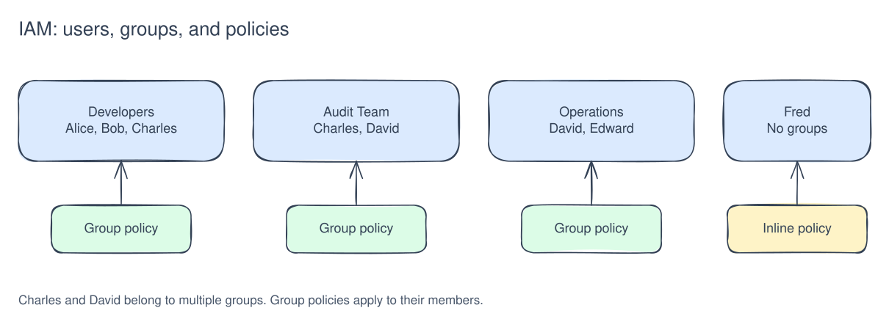

>## What does an IAM policy contain?

A policy is a JSON document with a language version (`Version`) and a set of rules (`Statement`). The main statement fields are:

- **Effect** – `Allow` or `Deny`; an explicit `Deny` takes precedence.
- **Action** – operations such as `s3:GetObject`.
- **Resource** – ARNs of resources to which the actions apply.
- **Condition** – additional conditions, such as IP restrictions or encryption requirements.
- **Principal** – the identity granted access; used in resource-based and trust policies, rather than ordinary identity-based policies.
- **Sid / Id** – optional statement and policy identifiers.

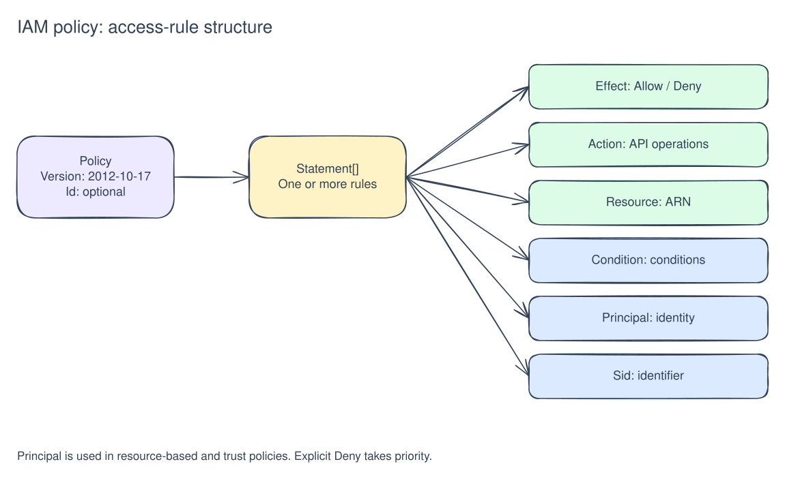

## EC2 and storage

>## What does EC2 provide?

**EC2 (Elastic Compute Cloud)** provides virtual machines with configurable CPU, RAM, operating systems, and networking. Data can be stored on **EBS**, traffic distributed through **ELB**, and instance counts managed through **ASG**.

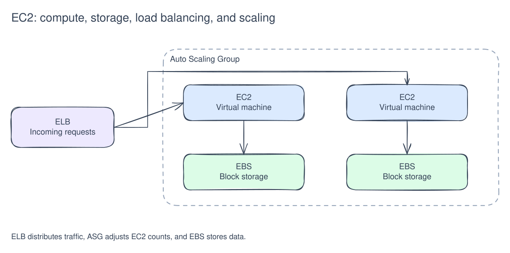

>## What EC2 purchasing and placement options are available?

| Option | Suitable workloads |
| --- | --- |
| **On-Demand** | Short-lived or unpredictable workloads without long-term commitments. |
| **Reserved Instances** | Predictable workloads with a one- or three-year commitment; Convertible reservations allow certain parameters to change. |
| **Savings Plans** | A one- or three-year compute-spend commitment in exchange for a discount. |
| **Spot Instances** | Interruptible computing, such as batch processing and restartable data-processing tasks. |
| **Dedicated Hosts** | Dedicated physical servers for licensing or placement requirements. |
| **Dedicated Instances** | Instances on hardware dedicated to one account. |
| **Capacity Reservations** | Reserve compute capacity in a specific AZ; this does not itself provide a discount. |

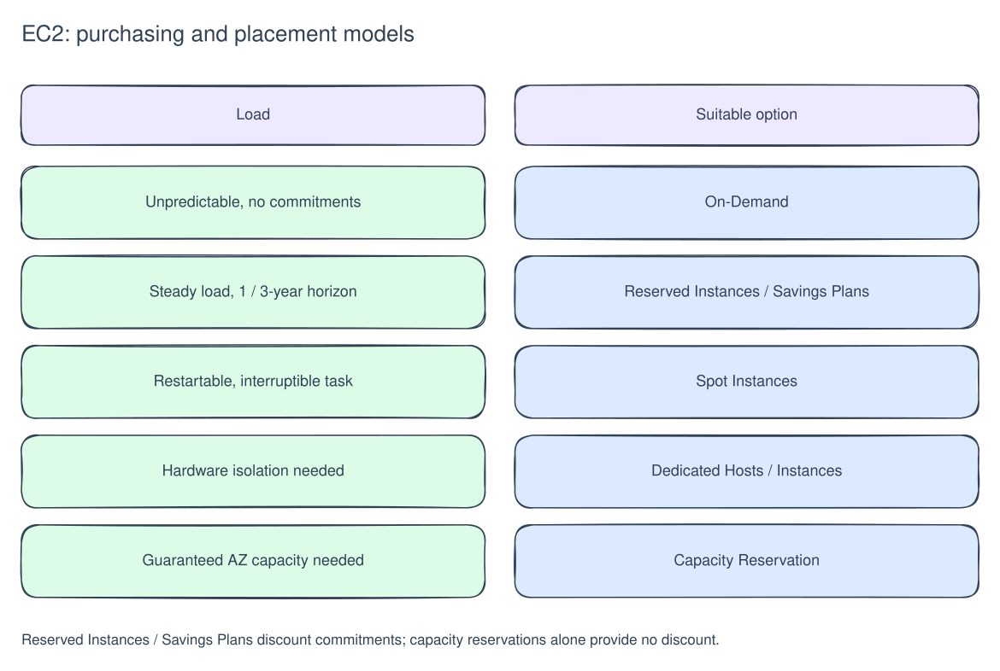

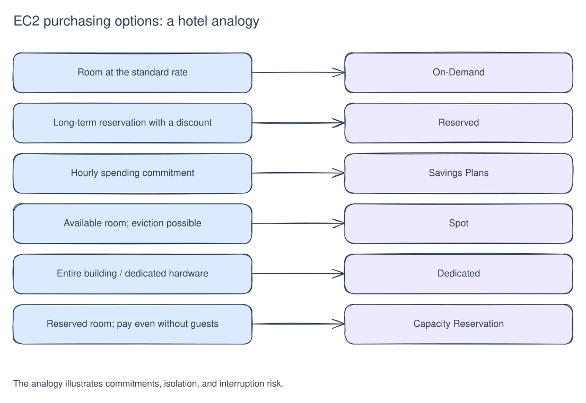

Compare instance types using [EC2 Instance Comparison](https://instances.vantage.sh/).

>## How do you connect to EC2 over SSH?

When creating a Linux instance, choose a key pair and save the private `.pem` key. You need a reachable IP address and a Security Group rule allowing SSH from your address.

```powershell
ssh -i .\TestServer1_Key.pem ec2-user@<public-ip>
```

Use `ec2-user` for Amazon Linux; the username depends on the AMI.

>## What is EBS, and which Availability Zone does a volume belong to?

**EBS (Elastic Block Store)** provides network-attached block storage for EC2. A volume exists independently of a running instance, but attachment requires both the volume and instance to be in the same **Availability Zone (AZ)**. An EC2 instance can have multiple volumes, and a volume can remain unattached.

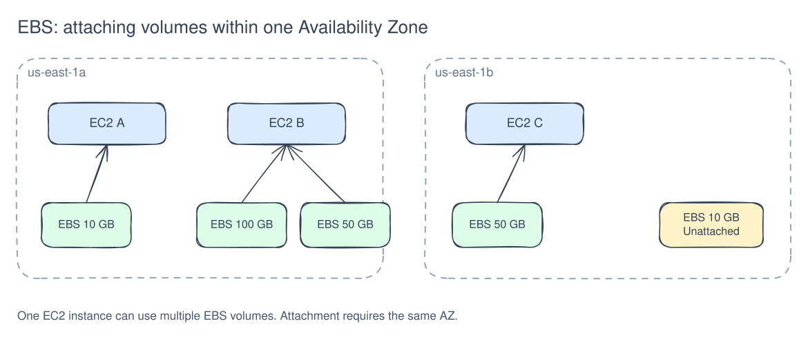

>## What does EBS Multi-Attach allow?

**Multi-Attach** connects one `io1` or `io2` volume to multiple compatible EC2 instances in the same AZ, up to 16 instances. The application must coordinate concurrent writes and use a filesystem designed for shared access. This is different from an ordinary shared filesystem such as EFS.

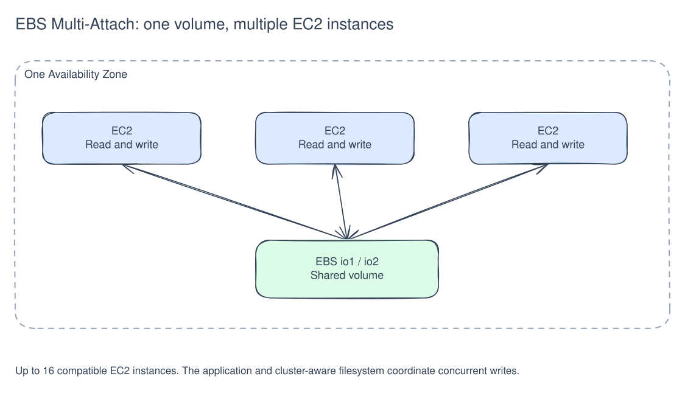

>## What types of EBS volumes are available?

- **gp2 / gp3** – general-purpose SSDs for most applications.
- **io1 / io2** – provisioned-IOPS SSDs for demanding I/O and latency requirements.
- **st1** – Throughput Optimized HDD for large sequential operations.
- **sc1** – Cold HDD for infrequently accessed data.

An EC2 boot volume must use SSD storage. Consider capacity, IOPS, throughput, and cost when choosing a volume.

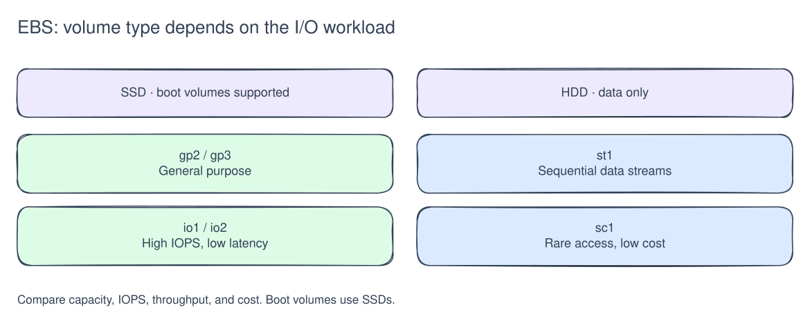

>## How do you move EBS data to another AZ?

Create a **snapshot**, then restore a new EBS volume from it in the destination AZ. To move data to another Region, first copy the snapshot to that Region.

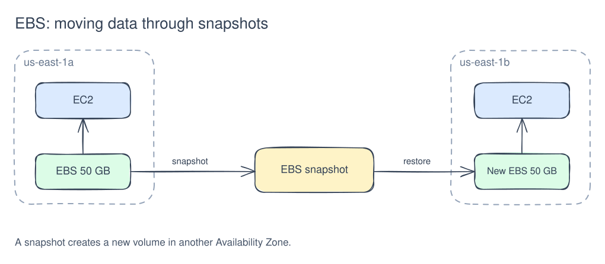

>## What additional features do EBS snapshots offer?

- **Snapshot Archive** – lower-cost archive storage; restoration takes 24–72 hours.
- **Recycle Bin** – retains deleted snapshots according to retention rules, from one day to one year.
- **Fast Snapshot Restore (FSR)** – creates volumes with full performance without waiting for blocks to load on first read; charged separately.

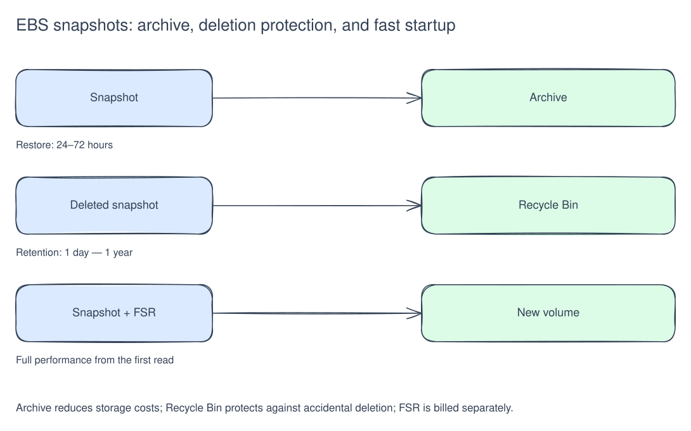

>## How does Instance Store differ from EBS?

**Instance Store** uses local disks on the physical host: fast but temporary storage suitable for caches, buffers, and intermediate results. Data survives a reboot but is lost on stop/termination or failure of the underlying disk.

**EBS** is a network volume with an independent lifecycle. Data survives EC2 stops; deletion on termination depends on `DeleteOnTermination`. Important data needs backups. [Instance Store lifecycle](https://docs.aws.amazon.com/AWSEC2/latest/UserGuide/instance-store-lifetime.html).

>## What is EFS, and how does it differ from EBS?

**EFS (Elastic File System)** is a managed NFS filesystem for Linux. Multiple EC2 instances can use it simultaneously, including across AZs. EBS provides block storage; EFS provides shared file access. EFS capacity grows as data is written, with pricing based on usage and storage class.

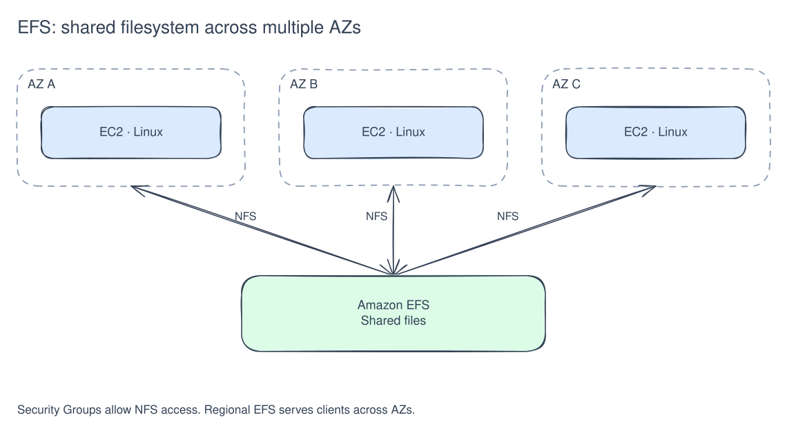

>## What EFS storage classes and deployment options are available?

- **Standard** – frequently accessed files.
- **Infrequent Access (IA)** – less frequently accessed files, with cheaper storage and separate access charges.
- **Archive** – long-term storage of rarely accessed files.

**Lifecycle Management** moves files between classes. **Regional** stores data across multiple AZs; **One Zone** uses one AZ and suits recoverable data. The cost comparison between EFS and EBS depends on the Region, class, and workload.

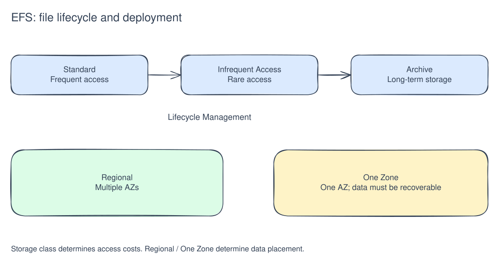

## Load balancing and scaling

>## How do ALB, NLB, and Gateway Load Balancer differ?

**ELB (Elastic Load Balancing)** is a family of managed load balancers:

- **ALB (Application Load Balancer)** – Layer 7 HTTP/HTTPS routing by host, path, and other request properties, with TLS termination.
- **NLB (Network Load Balancer)** – Layer 4 TCP/UDP/TLS, high throughput, a static IP per AZ, and support for Elastic IPs.
- **Gateway Load Balancer (GWLB)** – distributes network traffic across virtual appliances, such as firewalls, IDS/IPS, and deep packet inspection systems. It operates at the IP layer and uses GENEVE on port 6081 to forward traffic to appliances.

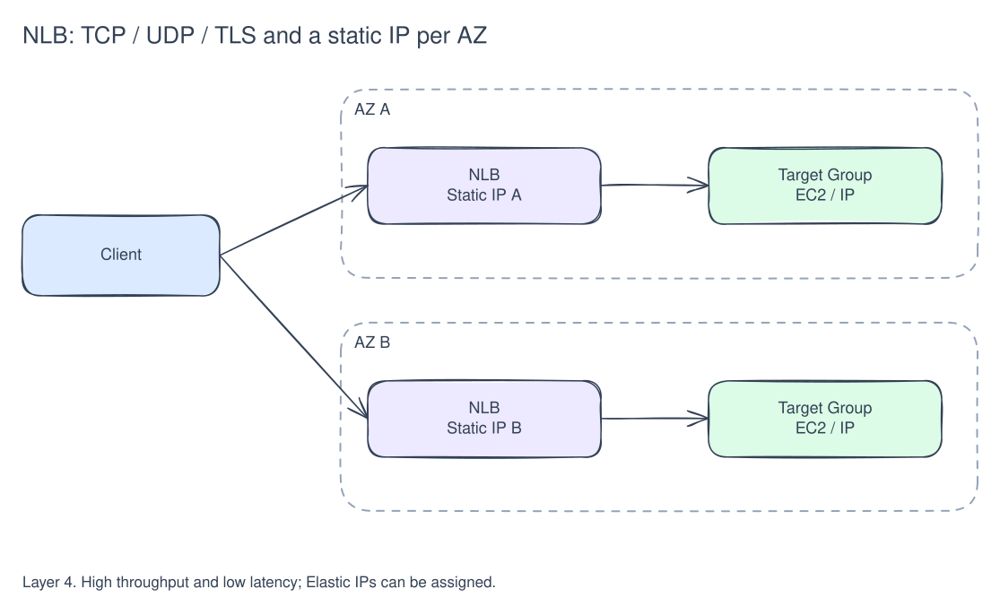

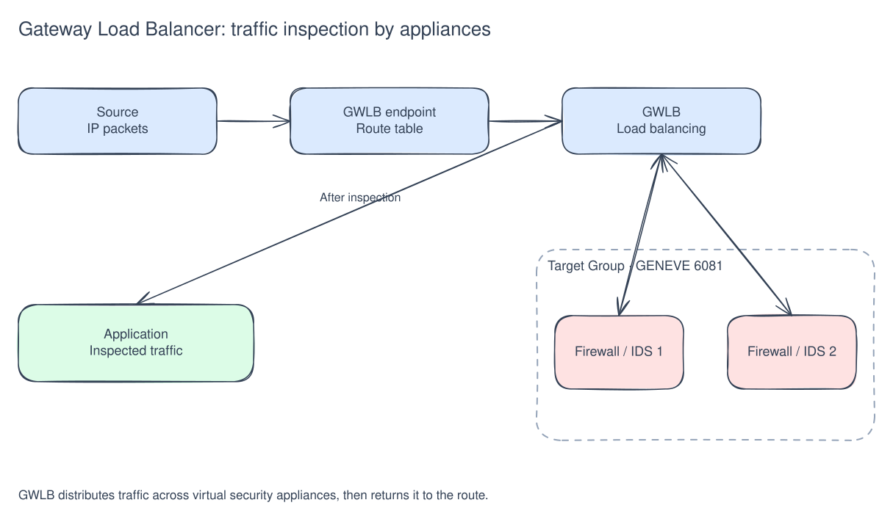

>## How does ALB select an application, and how do you configure EC2 access?

A **listener** accepts the request; its rules select a **target group**, which contains targets and health-check settings. For example, `/user` routes to the user service and `/search` to search.

1. Create EC2 instances running the application.
2. Create an ALB with a Security Group allowing inbound HTTP/HTTPS.
3. Create a target group and register the instances.
4. In the instances' Security Group, allow the application port with the **load balancer's Security Group** as the source.

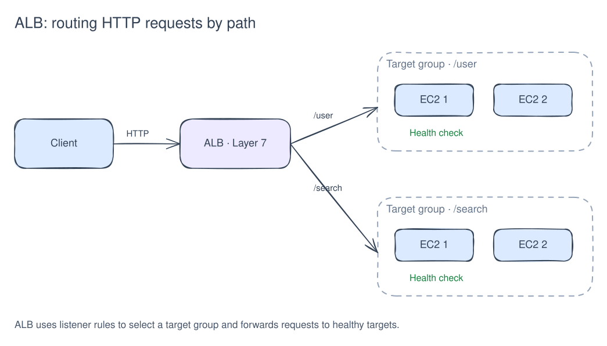

>## What does Cross-Zone Load Balancing change?

With **cross-zone** enabled, a load-balancer node distributes traffic across targets in multiple AZs. When disabled, it routes only to targets in its own AZ.

If each AZ receives 50% of traffic and they contain two and eight identical instances, without cross-zone each instance receives 25% and 6.25% respectively. With cross-zone, each of the ten receives about 10%. Default settings and inter-AZ traffic costs depend on the load-balancer type.

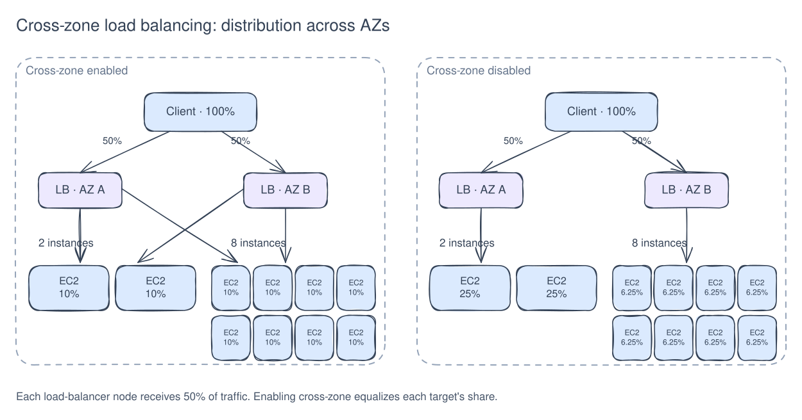

>## What capacity settings does an ASG have?

An **ASG (Auto Scaling Group)** automatically adjusts the number of EC2 instances and replaces unhealthy instances.

- **Minimum** – the lower instance-count limit.
- **Desired** – the number of instances the group should currently maintain.
- **Maximum** – the upper limit, which scaling policies cannot exceed.

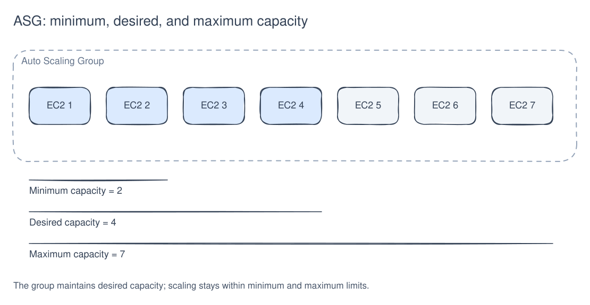

>## Which metrics and policies are used to scale an ASG?

Metrics include average **CPU utilization**, ALB **RequestCountPerTarget**, network traffic, and custom **CloudWatch** metrics such as queue length per worker.

- **Target Tracking** – maintains a target metric value, such as 40% CPU utilization.
- **Step Scaling** – changes capacity by different amounts depending on how far a threshold is exceeded.
- **Simple Scaling** – applies a fixed change after an alarm, with a cooldown.
- **Scheduled Scaling** – changes capacity on a schedule.
- **Predictive Scaling** – forecasts recurring load from historical data and increases capacity in advance.

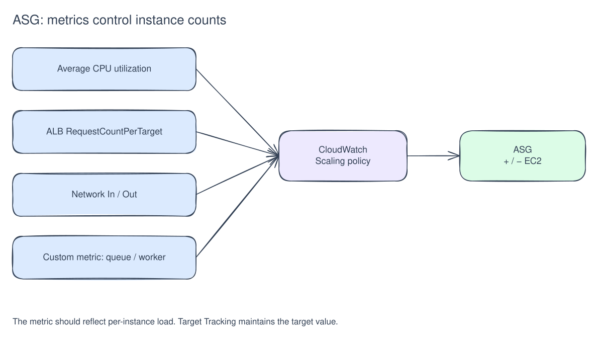

>## What is ASG Instance Refresh used for?

**Instance Refresh** gradually replaces instances, for example after an AMI or launch-template update. The minimum healthy capacity setting controls how many instances remain available during the rollout; **instance warmup** gives new instances time to start and initialize.

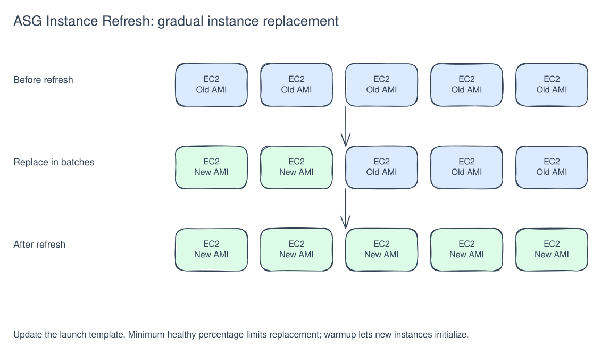

## RDS and ElastiCache

>## Which tasks does RDS handle?

**RDS (Relational Database Service)** manages database provisioning, infrastructure maintenance, OS updates, backups, point-in-time recovery, and monitoring. It supports read replicas, Multi-AZ deployment, and compute/storage scaling. An ordinary RDS instance does not provide SSH access to the server.

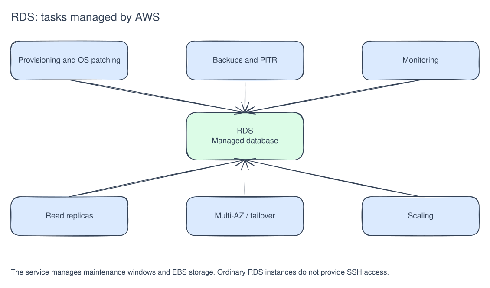

>## When does RDS Storage Auto Scaling trigger?

Automatically increases allocated storage up to the configured **maximum storage threshold**. The main conditions are: no more than 10% free space for at least five minutes, completion of the previous storage optimization, and fewer than four storage changes during the preceding 24 hours. Storage is not automatically reduced. See the current conditions in the [RDS Storage Auto Scaling documentation](https://docs.aws.amazon.com/AmazonRDS/latest/UserGuide/USER_PIOPS.Autoscaling.html).

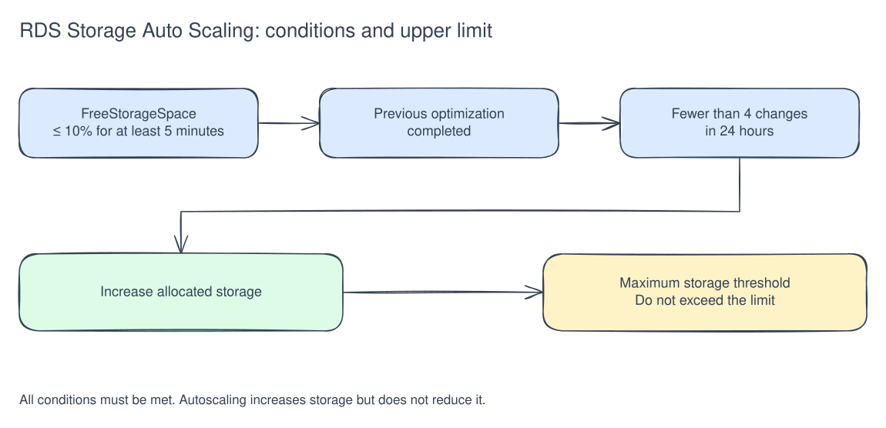

>## What is an RDS Read Replica used for, and how does it differ from Multi-AZ?

A **read replica** asynchronously receives changes from the primary database and serves reads, such as reports, to reduce production load. Writes go to the primary; reads can go to a replica, but replication lag may make its data slightly stale.

A **Multi-AZ DB instance** with a standby is intended for high availability and failover, rather than read scaling. A **Multi-AZ DB cluster** has readable replicas and is a different deployment option.

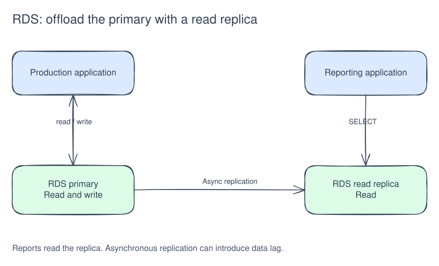

>## How does a Read Replica's Region affect network costs?

RDS does not charge for replication data transfer between RDS instances in the same Region, including across AZs. Cross-Region replication incurs inter-Region transfer charges. This does not make all application-to-database traffic free.

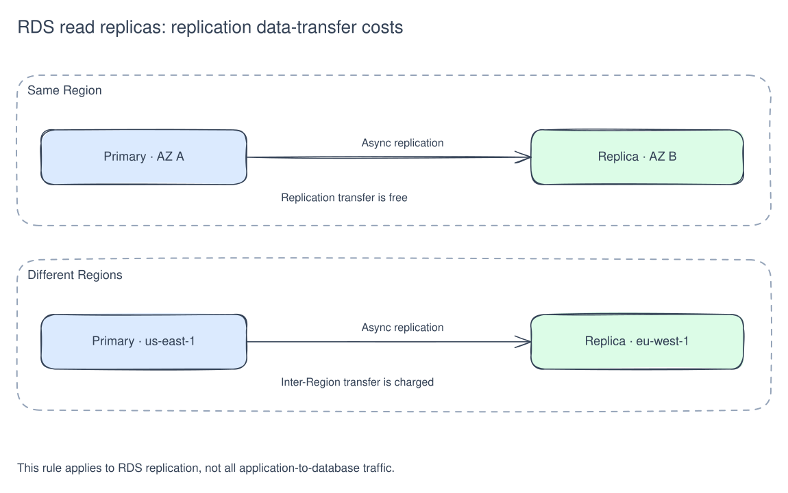

>## What problem does RDS Proxy solve?

**RDS Proxy** manages database connection pools, absorbs connection spikes, and helps during failover. It is especially useful when many short-lived Lambda invocations open connections simultaneously.

It supports IAM authentication and Secrets Manager integration. It operates inside a VPC without a public endpoint and is a managed, highly available service.

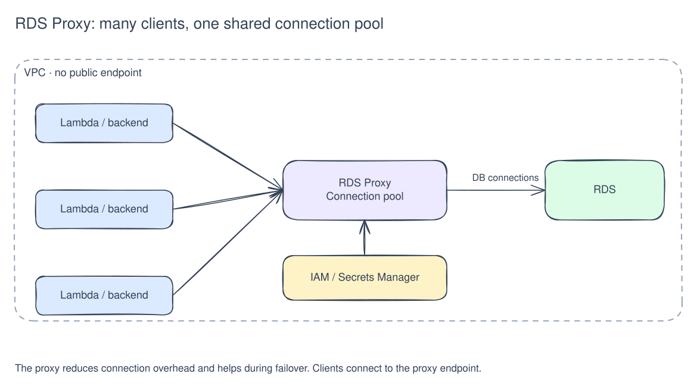

>## What is ElastiCache used for?

**ElastiCache** is a managed in-memory cache that reduces database load and read latency. AWS handles deployment, maintenance, monitoring, and parts of recovery. Applications must implement cache reads/writes, TTLs, and invalidation.

A shared cache stores state outside individual backend instances, allowing the application to scale horizontally.

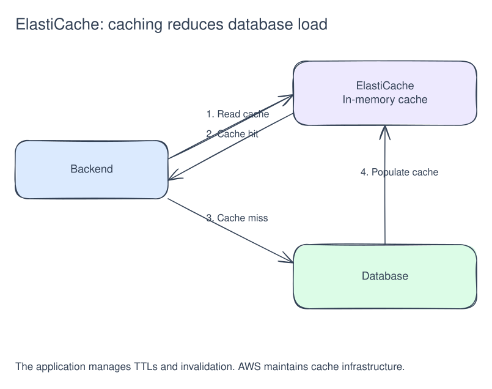

>## How do Redis and Memcached differ in ElastiCache?

**Redis** supports richer data structures, including sets and sorted sets, replication, read replicas, Multi-AZ failover, and snapshots. It suits caching and use cases requiring more advanced data operations.

**Memcached** is a simple multithreaded key-value cache that distributes data across nodes. Ordinary node-based clusters have no replication or persistence. **Serverless Memcached** supports snapshots. AOF persistence is not supported by ElastiCache for modern Redis OSS versions; snapshots are used for backups. [ElastiCache backups](https://docs.aws.amazon.com/AmazonElastiCache/latest/dg/backups.html), [AOF limitations](https://docs.aws.amazon.com/AmazonElastiCache/latest/APIReference/API_Snapshot.html).

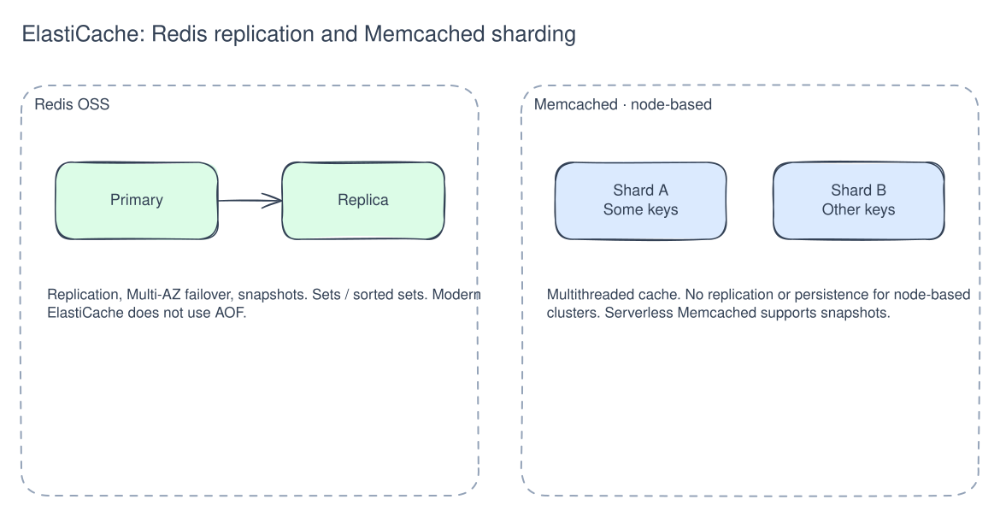

## Route 53

>## How does DNS resolution work through Route 53?

**Route 53** stores DNS records and returns a target resource's address or name. After DNS resolution, the client connects directly to the application; Route 53 does not proxy HTTP traffic.

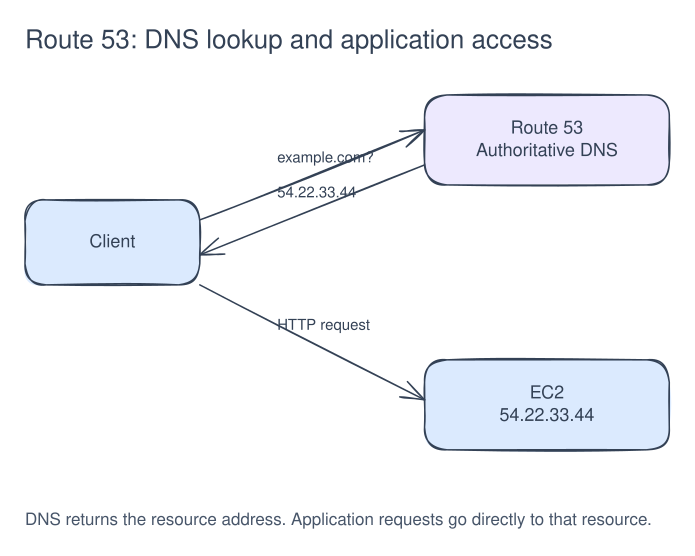

>## Which DNS record types should you know?

- **A** – an IPv4 address.
- **AAAA** – an IPv6 address.
- **CNAME** – an alias to another DNS name; cannot be used at a zone apex such as `example.com`.
- **NS** – a zone's authoritative DNS servers.

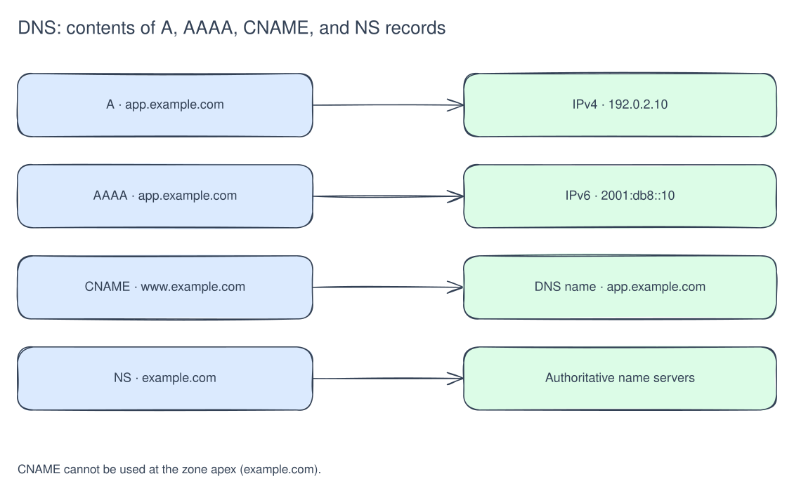

>## How do Public and Private Hosted Zones differ?

A **hosted zone** contains DNS records for a domain and its subdomains. A **Public Hosted Zone** is resolvable through public DNS. A **Private Hosted Zone** is resolvable inside its associated VPCs, for example for internal API and database names.

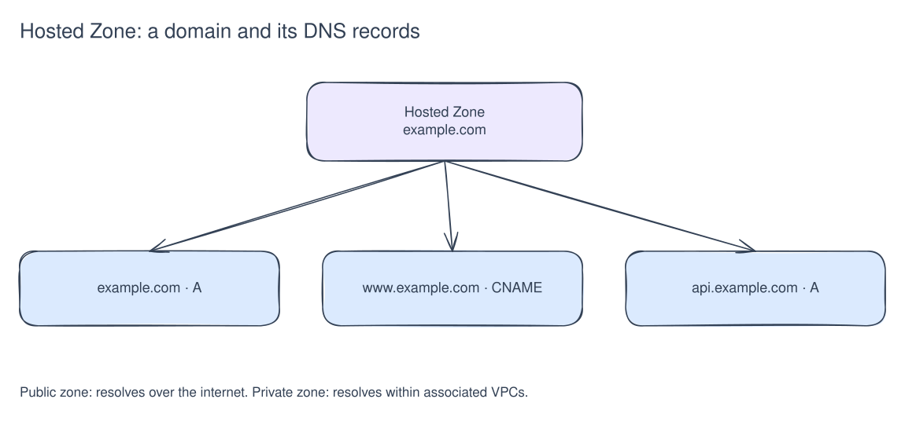

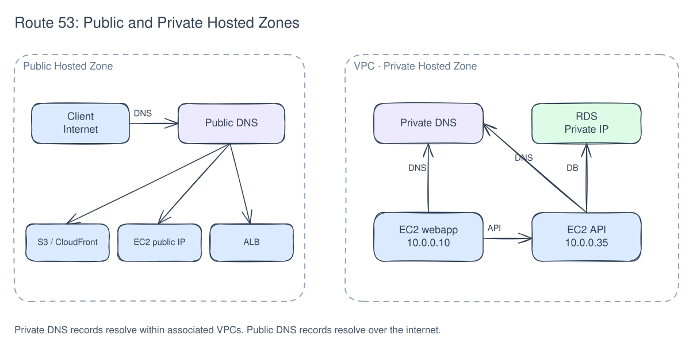

>## How does an Alias differ from a CNAME?

A **CNAME** points to another DNS name and cannot be used at a domain apex. An **Alias** is a Route 53 feature that points to a supported AWS resource or another record in the same hosted zone. Aliases can be used at the apex; Route 53 does not charge for Alias DNS queries to AWS resources.

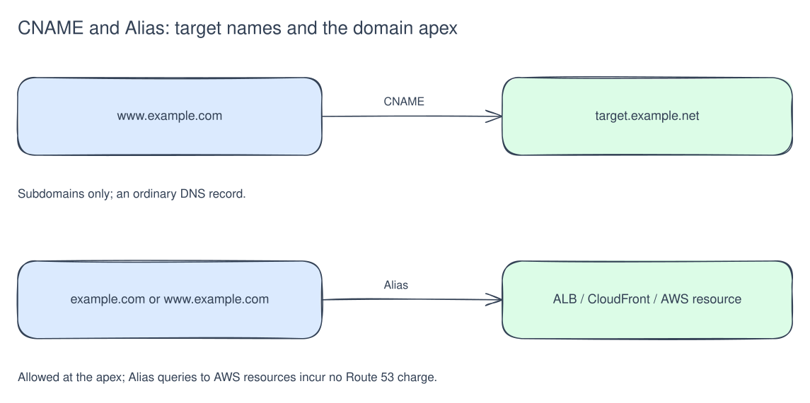

>## Which resources can an Alias record target?

Examples include ELB, CloudFront, API Gateway, Elastic Beanstalk, S3 website endpoints, VPC interface endpoints, Global Accelerator, and supported records in the same hosted zone. An ordinary EC2 DNS name is not an Alias target; use an A record with its IP address or a CNAME on a subdomain.

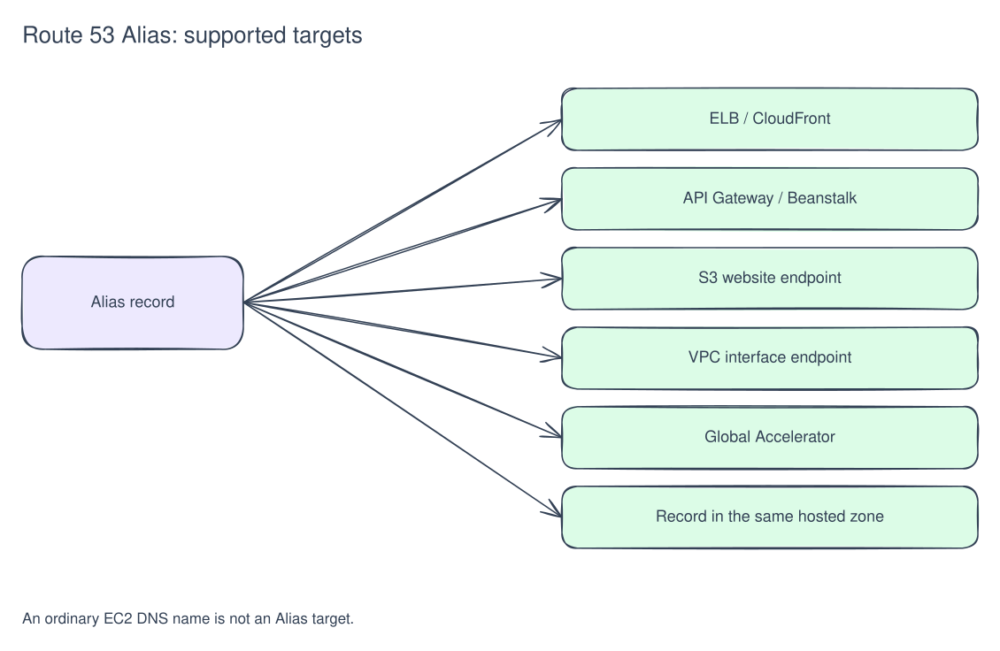

>## Which health checks does Route 53 support?

- **HTTP / HTTPS / TCP** endpoint checks.
- **Calculated health checks** combining several check results.
- Checks based on a **CloudWatch alarm's** state.

Associate a health check with a DNS record to account for target availability during routing, for example for failover.

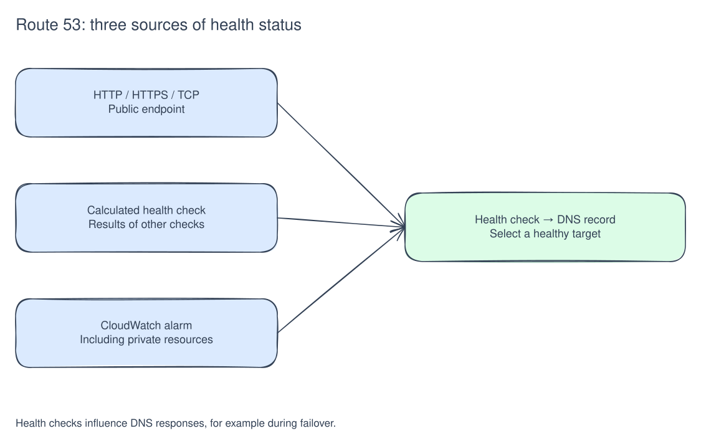

>## How does Route 53 check a public endpoint?

Distributed health checkers send requests at the standard 30-second interval or a fast 10-second interval. HTTP 2xx/3xx responses count as successful; an optional string match checks the first 5,120 bytes of the response body. The threshold for consecutive successful or failed checks is configurable.

The endpoint must be reachable from the health checkers' addresses. These checks do not support HTTP/2. Overall health is determined from multiple checkers' results rather than a single request.

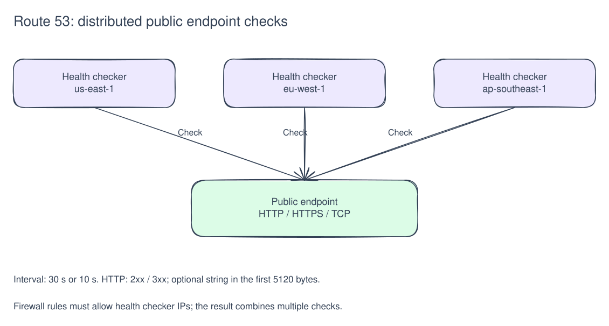

>## How do you check a private resource's health?

Public Route 53 health checkers cannot access a private IP. Publish a metric to **CloudWatch**, create an alarm, and use its state in a Route 53 health check.

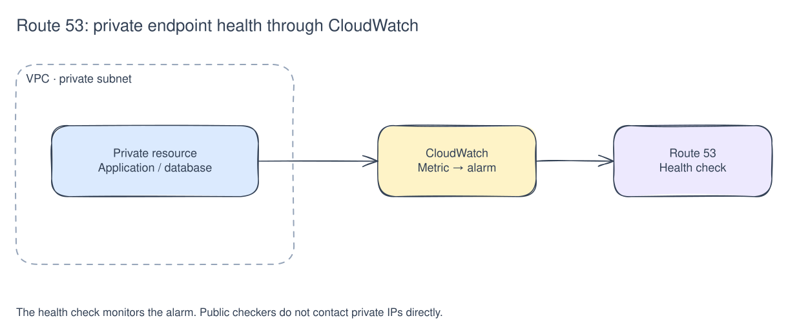

>## How does Weighted Routing work?

Assign weights to records with the same name and type. A record's approximate share of DNS responses is `weight / sum of weights`; weights need not add up to 100. This is useful for gradual rollouts and A/B testing.

A weight of zero normally excludes a record, but zero-weight records can act as fallbacks if positive-weight records are unhealthy. If all weights are zero, Route 53 treats them equally. DNS caching prevents an exact guarantee of HTTP request distribution.

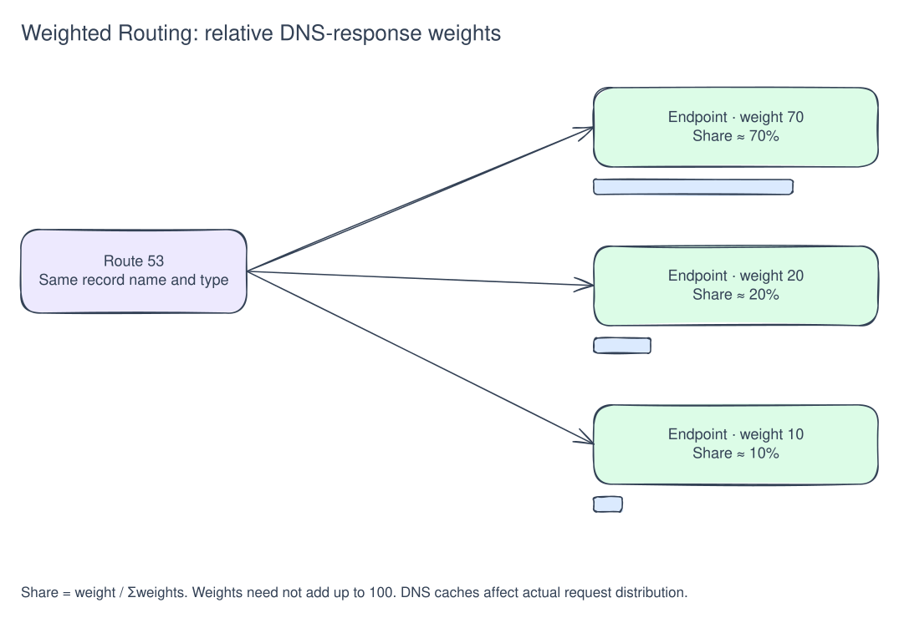

>## How does Latency-Based Routing work?

**Latency Routing** selects the configured Region with the lowest measured network latency for the client/resolver. It is not necessarily the geographically closest Region; the result depends on network routes and changes over time.

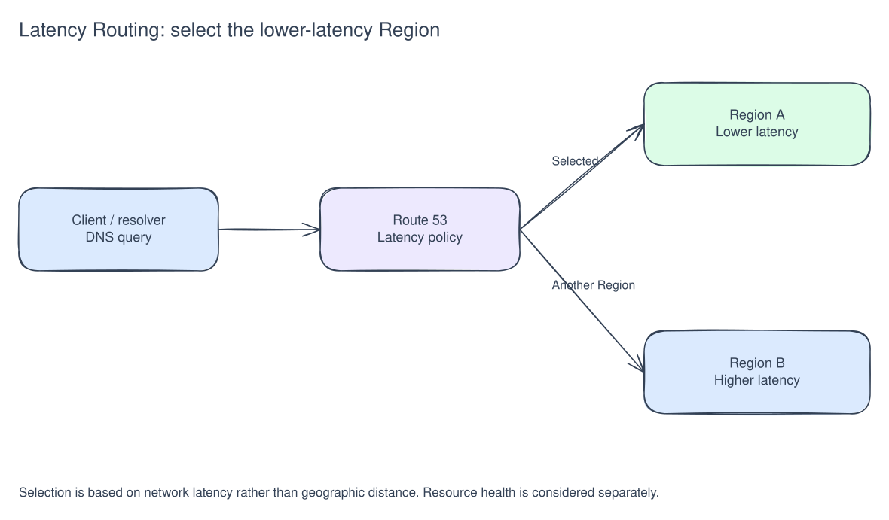

>## How does Failover Routing work?

**Active-passive**: the **primary** record is used while its health check succeeds. On failure, Route 53 returns the **secondary** record. Client switchover also depends on TTLs and DNS caches.

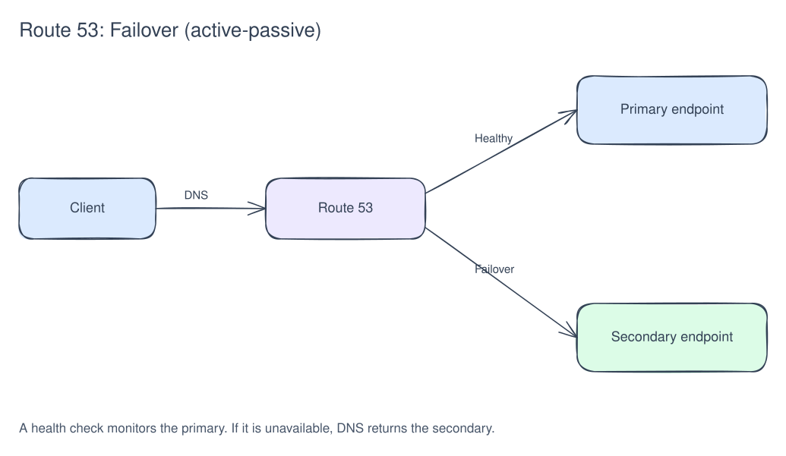

>## How do Geolocation and Geoproximity Routing differ?

**Geolocation** selects records according to the client's location: continent, country, or US state. More specific rules take precedence; a default record covers other or unknown locations.

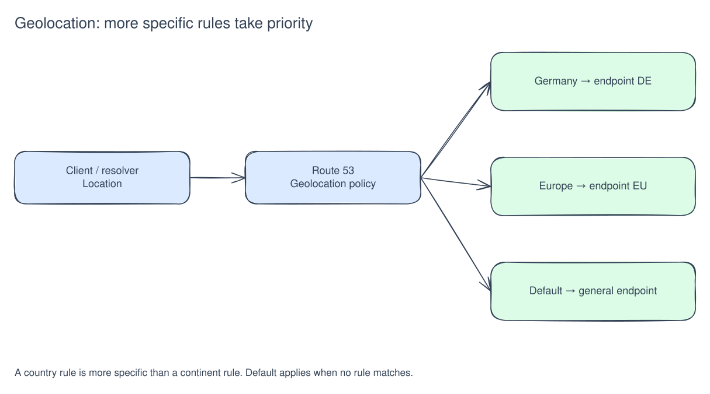

**Geoproximity** selects a resource based on the client's proximity to resource locations. A **bias** value expands or shrinks the geographic area routed to a resource.

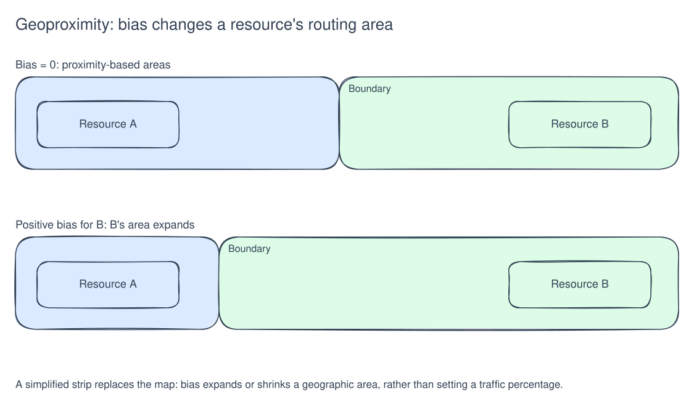

>## What is Route 53 Traffic Flow used for?

**Traffic Flow** is a visual editor for complex routing policies. It combines rules, saves traffic policies, and applies them to DNS names.

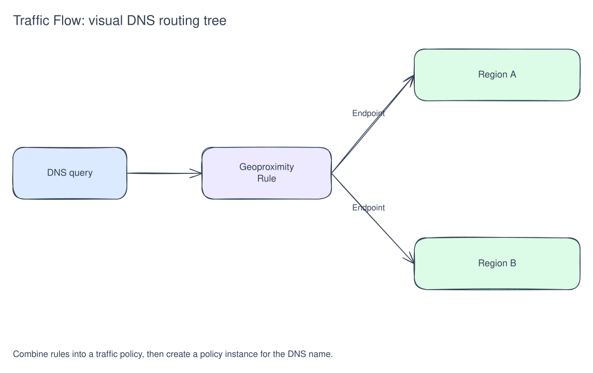

>## How does IP-Based Routing work?

Record selection depends on configured IP ranges (**CIDR collections**). For example, clients from a particular ISP or corporate network can receive a specific endpoint.

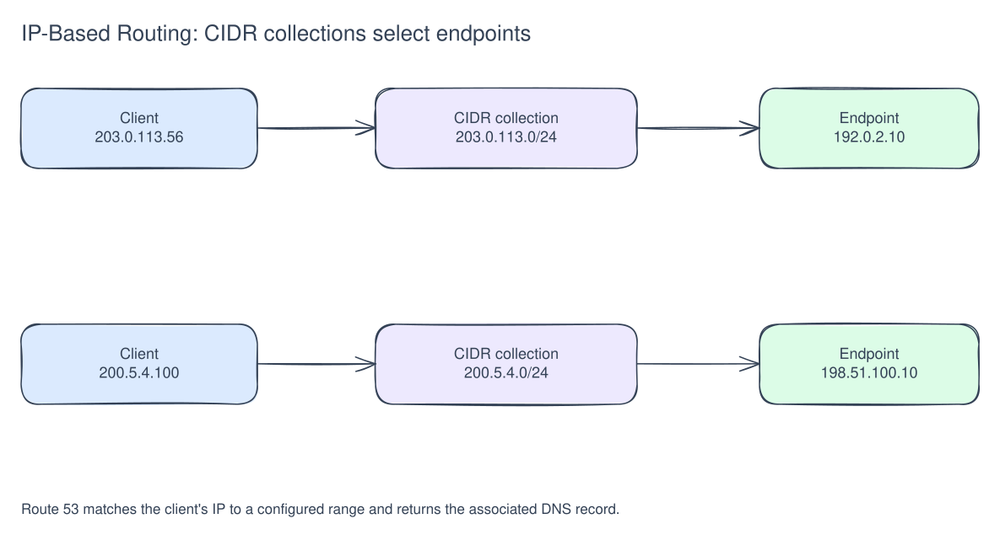

>## How does Multi-Value Answer Routing differ from a load balancer?

**Multi-Value Answer** returns up to eight healthy records in a DNS response. The client selects an address and can try another on failure. Route 53 does not balance individual connections and does not replace ELB.

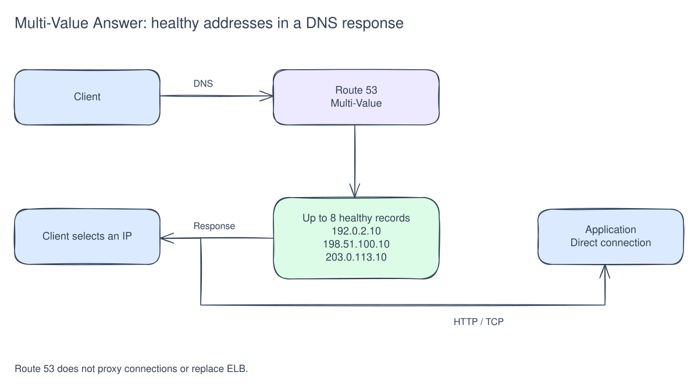

## VPC

>## How are VPCs, subnets, and Availability Zones related?

A **VPC (Virtual Private Cloud)** is a network within a Region. A **subnet** belongs to one AZ; a VPC can contain subnets in multiple AZs. Applications are typically deployed across multiple zones for fault tolerance.

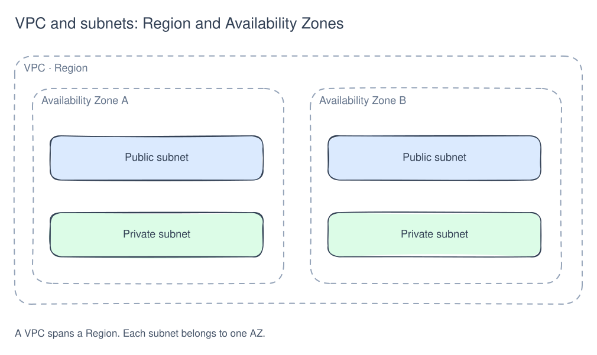

>## How do Internet Gateway and NAT Gateway differ?

An **Internet Gateway (IGW)** connects a VPC to the internet. A public subnet has a route to the IGW; direct IPv4 access also requires a public EC2 IP address and permissive security rules.

A **NAT Gateway** allows resources in private subnets to initiate IPv4 internet connections without accepting unsolicited inbound connections. A public NAT Gateway is placed in a public subnet with an IGW route and an Elastic IP; private subnets route outbound traffic through NAT.

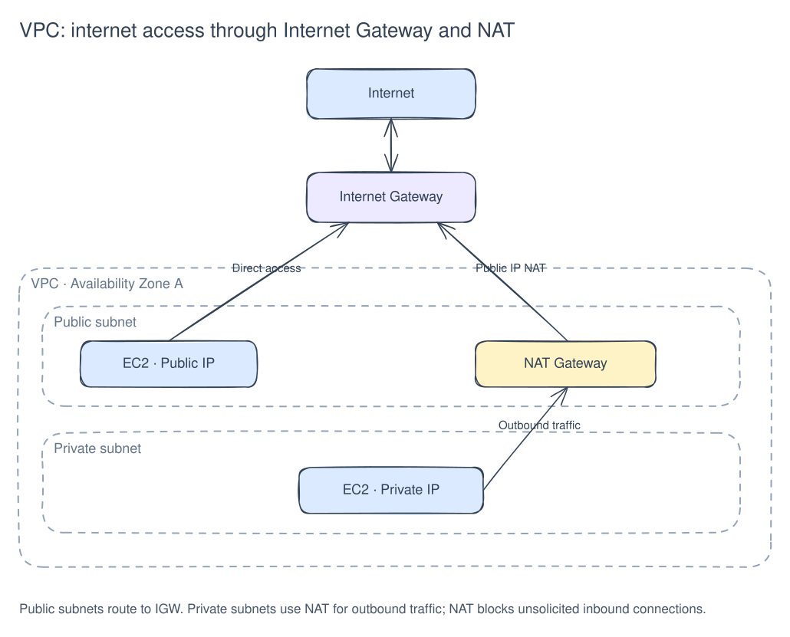

>## How does a Network ACL differ from a Security Group?

| | **Security Group** | **Network ACL** |
| --- | --- | --- |
| Scope | A resource's network interface. | A subnet. |
| Rules | Allow rules only. | Allow and deny rules. |
| State | Stateful: response traffic is automatically allowed. | Stateless: inbound and outbound traffic are checked separately. |
| Order | All allow rules are considered together. | Ascending rule number; the first matching rule applies. |

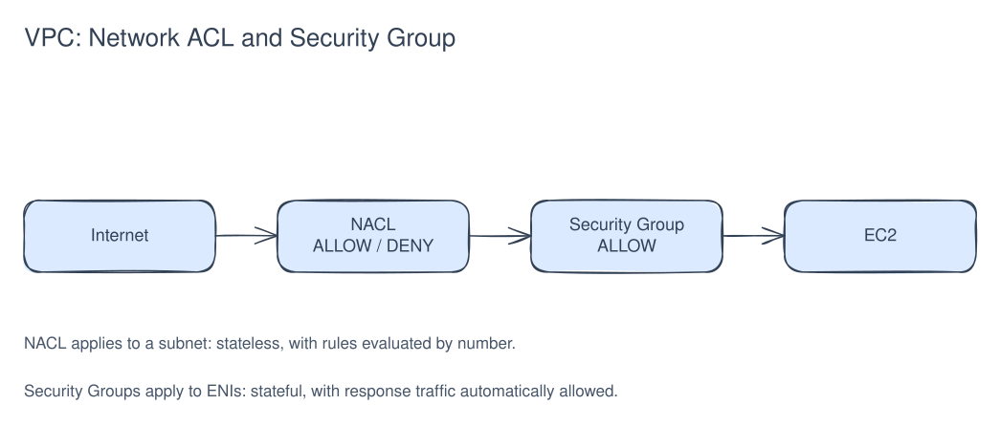

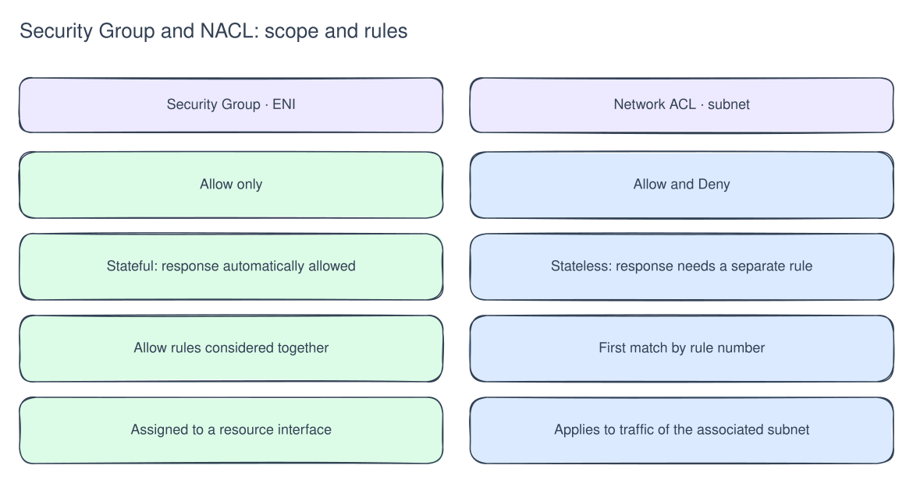

>## What are VPC Flow Logs used for?

**VPC Flow Logs** record traffic-flow information for network interfaces, including IPs, ports, and `ACCEPT / REJECT` outcomes. They help diagnose routing and security rules but do not contain packet payloads.

>## What limitations does VPC Peering have?

**VPC Peering** connects two VPCs using private addresses. Their CIDR ranges must not overlap, and routing and security rules must be configured.

Peering is **not transitive**: A–B and B–C connections do not give A access to C. Each pair needs its own connection, or an alternative architecture such as Transit Gateway.

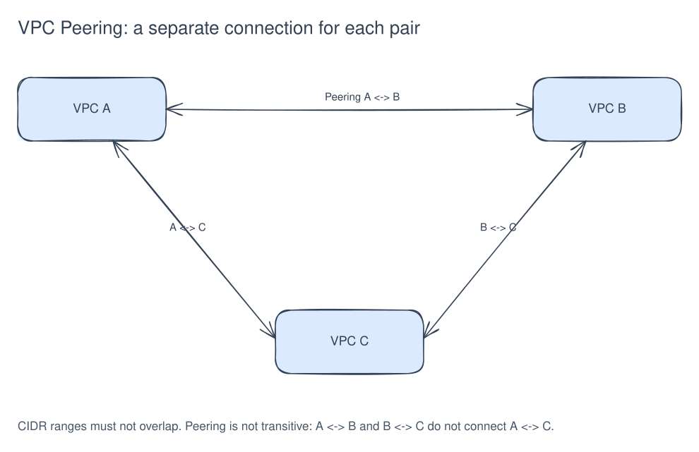

## S3

>## How are S3 buckets and object names organized?

**S3 (Simple Storage Service)** provides object storage. A **bucket** is created in a chosen Region; its name in the general namespace must be unique within the AWS partition. An ordinary bucket name has 3–63 characters consisting of lowercase letters, digits, dots, and hyphens; underscores and IP-address formats are not allowed.

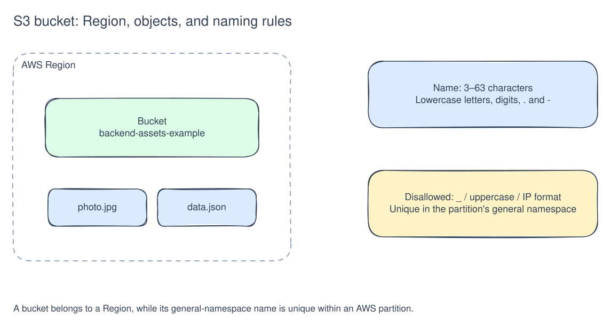

An **object** stores content and metadata. Its **key** is its full name, for example `reports/2026/result.json`. `reports/2026/` is a prefix rather than a real directory; the console simulates folders.

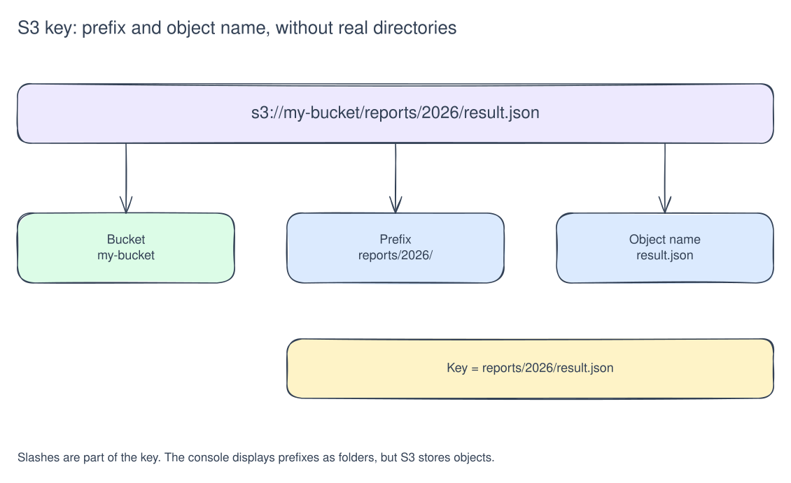

>## How do you control access to S3?

- **IAM policies** – user or role permissions.
- **Bucket policy** – a resource-based bucket policy, including cross-account access.
- **ACL** – a legacy bucket/object access mechanism, usually disabled in modern configurations.
- **Block Public Access** – restrictions on public access.

Within one account, an identity or resource policy can grant access if there is no explicit denial or another restricting policy. Cross-account access requires permissions on both sides. **Encryption** protects data but does not replace access controls.

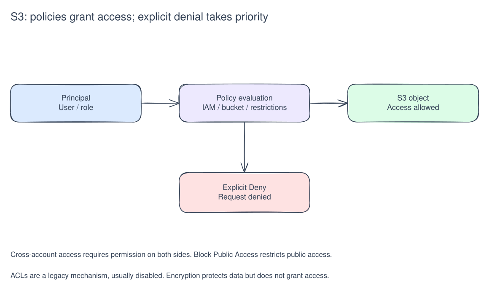

>## How do you give an EC2 application and an IAM user access to S3?

Assign EC2 an **IAM role through an instance profile** with the required S3 permissions. The application obtains temporary credentials; permanent keys do not need to be stored on the server.

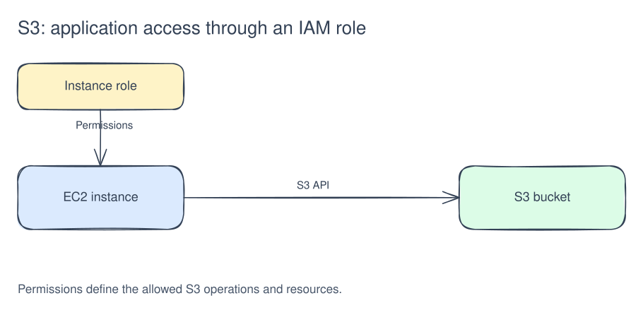

Assign the IAM user a policy specifying the required actions and resources. Listing objects requires the bucket resource; `GetObject / PutObject` requires object resources.

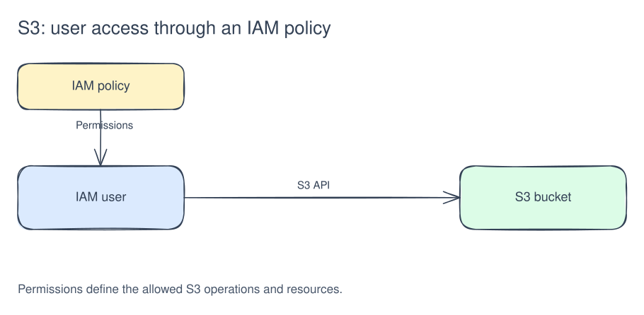

>## How does S3 Versioning work?

Versioning is enabled at the bucket level. Writing to an existing key creates a new version instead of destroying the previous one, allowing earlier content to be restored.

Objects created before versioning was enabled have a `null` version ID. Suspending versioning does not delete existing versions. Ordinary deletion in a versioned bucket creates a delete marker; individual versions can be deleted separately.

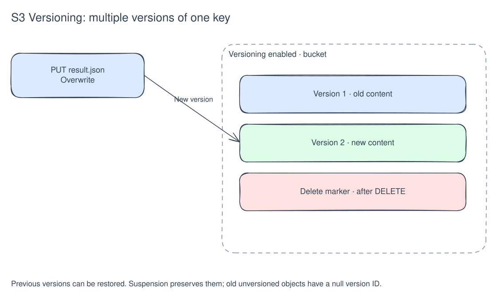

>## How do CRR and SRR differ in S3 Replication?

- **CRR (Cross-Region Replication)** – copies objects to another Region, for regional disaster recovery or data-placement requirements.
- **SRR (Same-Region Replication)** – copies objects within one Region, for example to consolidate logs or separate production and test environments.

Replication is asynchronous. Both buckets must have versioning enabled, and the IAM role needs appropriate permissions. Buckets can belong to different accounts. Use S3 Batch Replication for objects that already existed.

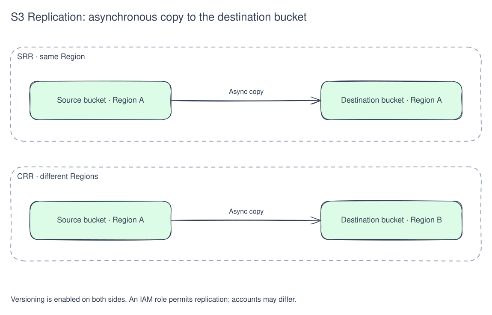

## S3 storage classes

>## When should you use Standard and Infrequent Access?

**S3 Standard** is designed for frequent access, offering low latency, storage across multiple AZs, designed availability of 99.99%, and durability of 99.999999999%.

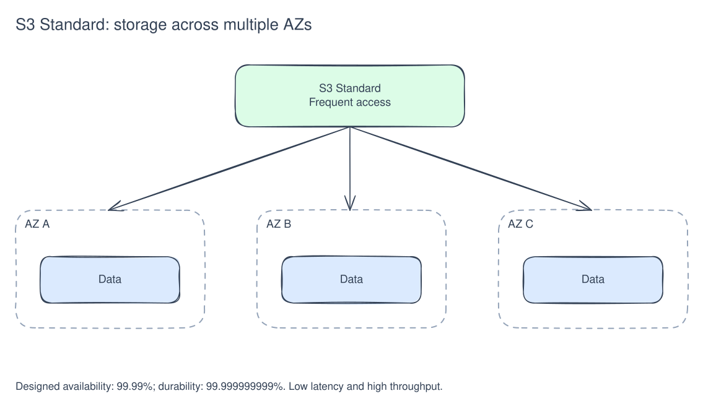

**Standard-IA** provides infrequent access with fast retrieval, cheaper storage, retrieval charges, and designed availability of 99.9%. **One Zone-IA** stores data in one AZ with designed availability of 99.5%. It does not protect against loss of the entire zone and therefore suits recoverable data.

**Durability** describes the likelihood of retaining data; **availability** describes the ability to read and write it. These are different measures.

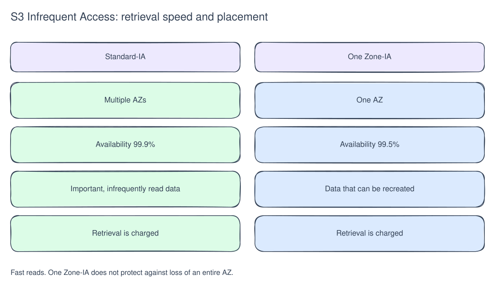

>## How do S3 Glacier storage classes differ?

| Class | Retrieval time | Minimum billed storage duration |
| --- | --- | --- |
| **Glacier Instant Retrieval** | Milliseconds; infrequent access. | 90 days. |
| **Glacier Flexible Retrieval** | Expedited: 1–5 minutes; Standard: 3–5 hours; Bulk: 5–12 hours. | 90 days. |
| **Glacier Deep Archive** | Standard: about 12 hours; Bulk: about 48 hours. | 180 days. |

Flexible Retrieval and Deep Archive require restoration before reading. Pricing depends on the retrieval mode; choose a class based on acceptable waiting time.

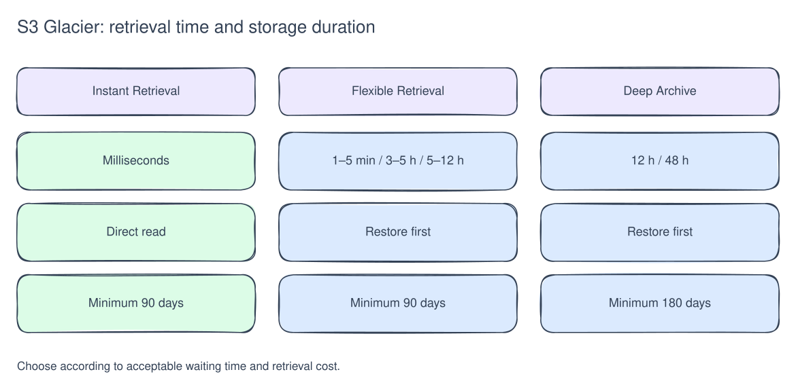

>## How does S3 Intelligent-Tiering work?

It automatically moves objects between tiers based on access patterns: **Frequent Access**, then **Infrequent Access** after 30 days without access, and **Archive Instant Access** after 90 days.

Optional archive tiers include **Archive Access** (from 90 days) and **Deep Archive Access** (from 180 days). They require restoration before reading. Eligible objects incur monitoring charges; the standard tiers have no retrieval charges.

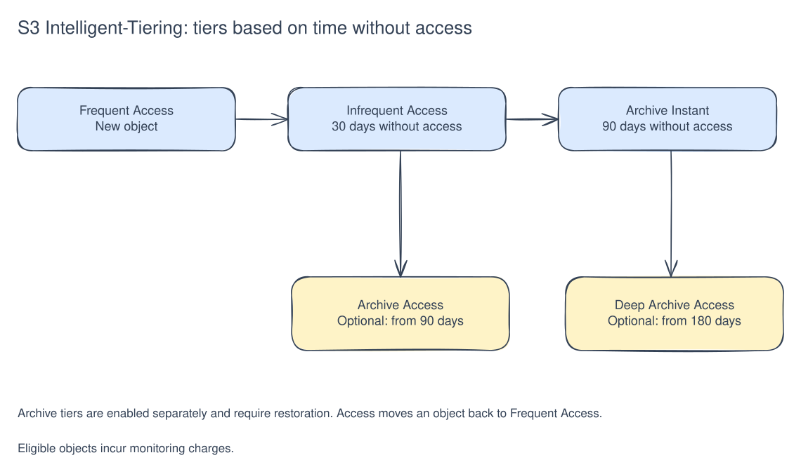

## S3 events and performance

>## How can you react to S3 events?

**S3 Event Notifications** deliver events to **SNS**, **SQS**, or **Lambda**. Examples include object uploads/deletions, archive restores, and replication events. Notifications can be filtered by key prefix/suffix.

Handlers must account for possible duplicate events and be idempotent.

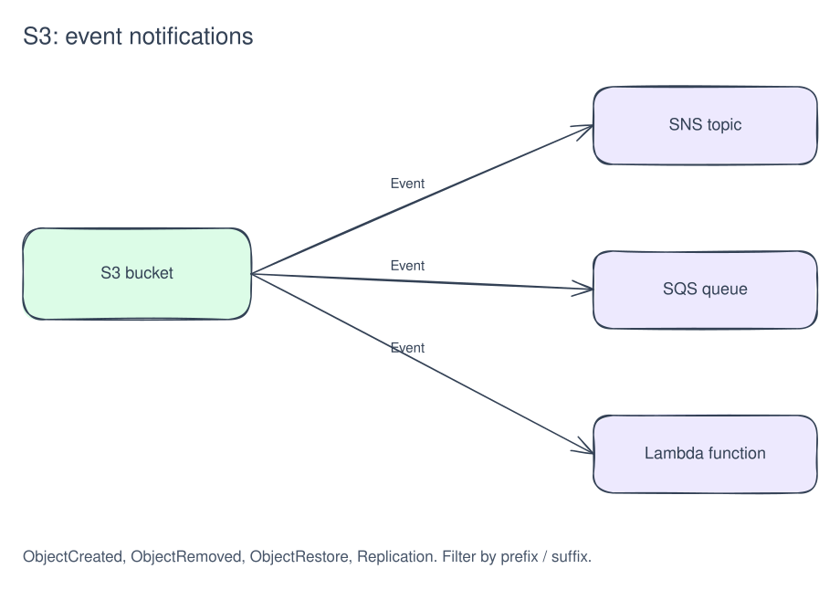

>## What determines S3 performance?

S3 scales to at least 3,500 writes (`PUT / COPY / POST / DELETE`) or 5,500 reads (`GET / HEAD`) per second per partitioned prefix. Multiple prefixes allow parallel load distribution; scaling occurs gradually.

Latency depends on operation and workload; 100–200 ms is a guideline rather than a per-request guarantee. Sudden load increases can cause `503 Slow Down`, so clients need retries.

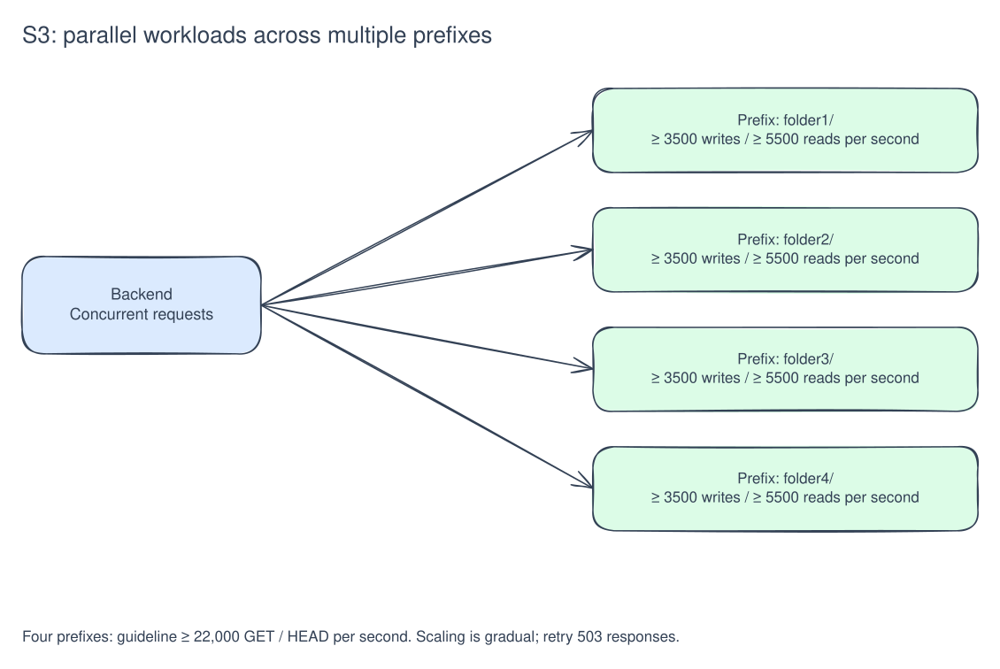

>## What are Multipart Upload and Transfer Acceleration used for?

**Multipart Upload** splits a file into parts that can be uploaded in parallel, retrying only failed parts. Consider it from 100 MB; it is required for objects larger than the single-PUT limit of 5 GB.

**Transfer Acceleration** sends data through the nearest AWS edge location and the AWS network to the S3 bucket. It helps clients far from the bucket's Region and is compatible with multipart upload.

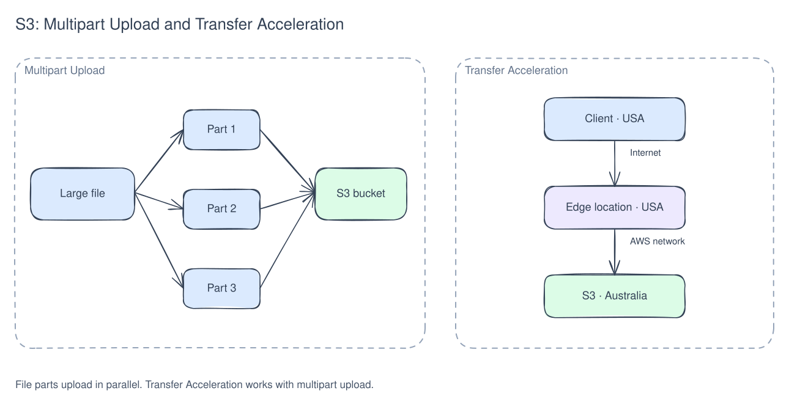

>## How do metadata and object tags differ, and how can you search them?

**User-defined metadata** is sent during upload in `x-amz-meta-*` headers; names are normalized to lowercase. **Object tags** are separate key/value pairs used in IAM conditions, lifecycle rules, and analytics. They can be changed without rewriting object content.

Ordinary `ListObjects` does not search arbitrary metadata. DynamoDB can provide a custom index. **S3 Metadata** also offers managed metadata tables queryable through Athena and other analytics tools. [S3 Metadata documentation](https://docs.aws.amazon.com/AmazonS3/latest/userguide/metadata-tables-configuring.html).

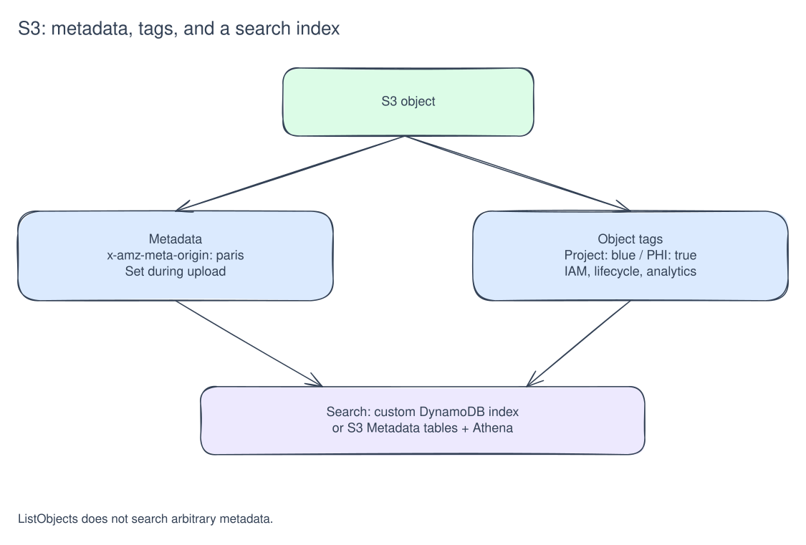

>## What is an S3 Presigned URL used for?

A **presigned URL** grants temporary access to a specific object operation on behalf of the signing principal. It can download private files or let clients upload directly to S3 without receiving AWS credentials.

The console supports expiration from one minute to 12 hours; CLI/SDK URLs signed with long-term credentials can last up to seven days. A URL signed with temporary credentials expires no later than those credentials. It cannot grant more permissions than the signing identity has.

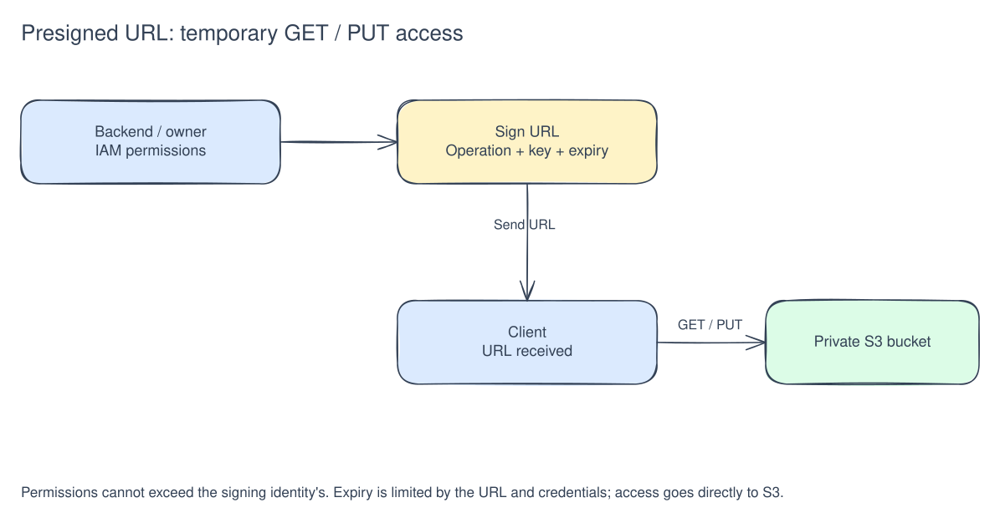

>## Why should S3 access logs go to a separate bucket?

**Server Access Logging** records bucket requests for auditing and analysis. Writing logs to the same bucket causes each log write to generate another loggable request, creating a loop. The destination must be a separate bucket in the same Region and account.

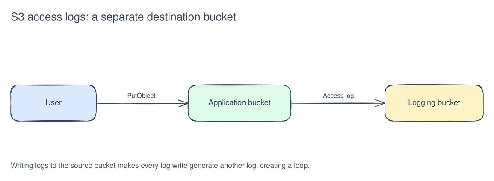

>## When does S3 need CORS?

**CORS (Cross-Origin Resource Sharing)** is needed when browser JavaScript accesses S3 from a different origin. An origin consists of a scheme, hostname, and port. Rules specify allowed origins, methods, and headers.

For some requests, the browser first sends a **preflight OPTIONS** request, then the actual request. CORS controls whether the browser exposes the response to JavaScript; it does not grant S3 permissions or replace IAM/bucket policies.

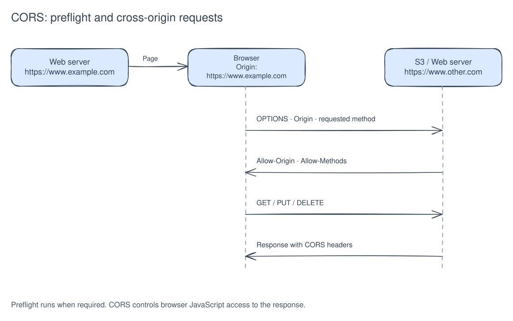

## S3 encryption

>## How do SSE-S3, SSE-KMS, SSE-C, and client-side encryption differ?

**Server-Side Encryption (SSE)** occurs inside S3; **client-side encryption** occurs before data is sent.

- **SSE-S3** – S3 manages the keys and uses AES-256; basic encryption is enabled by default for new objects. To select it explicitly, use `x-amz-server-side-encryption: AES256`.
- **SSE-KMS** – KMS manages the keys, with key access controls and CloudTrail auditing. Use `x-amz-server-side-encryption: aws:kms` and account for KMS permissions and quotas.
- **SSE-C** – the client sends the encryption/decryption key with each applicable HTTPS request; S3 does not store the key itself.
- **Client-side encryption** – the client encrypts the file, manages keys, and decrypts downloaded data; S3 stores ciphertext.

Since April 2026, **SSE-C is disabled by default for new general-purpose buckets** and some existing buckets. It must be explicitly allowed in bucket settings. [S3 security settings](https://docs.aws.amazon.com/AmazonS3/latest/userguide/security.html).

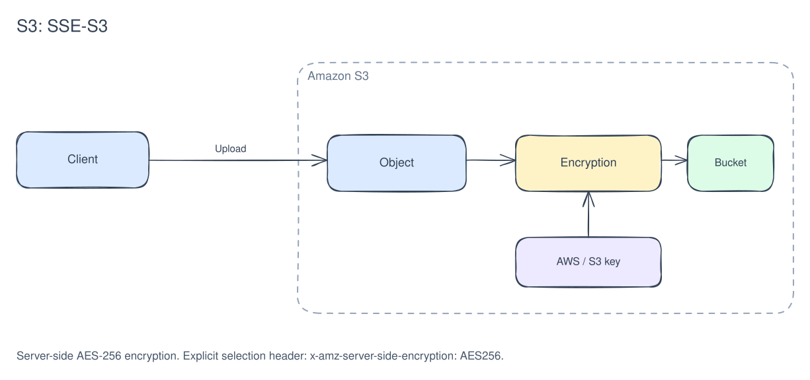

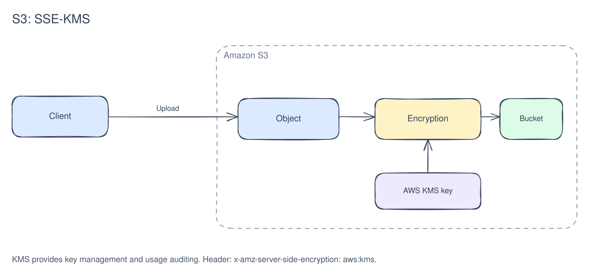

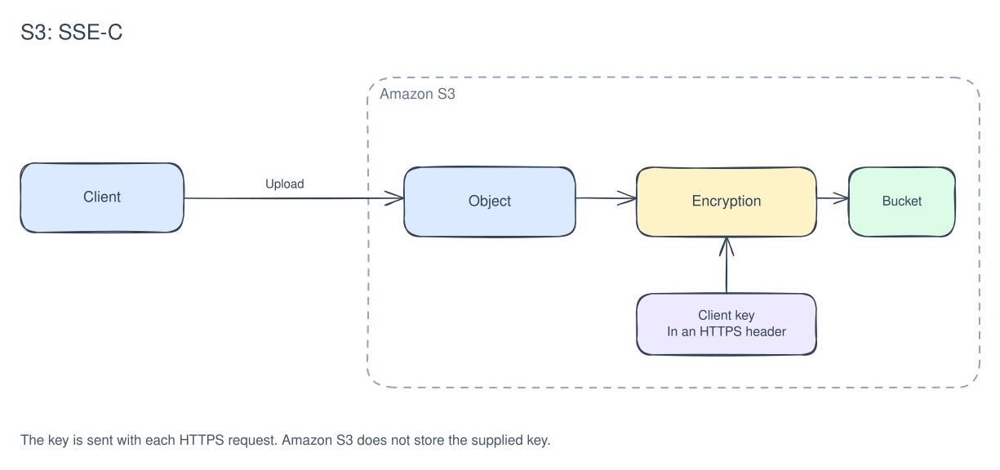

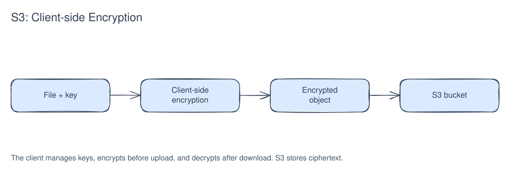

## S3 Access Points

>## What problem do S3 Access Points solve?

An **access point** is a separate bucket entry point with its own DNS name and policy. It simplifies permissions for different applications: finance accesses `finance/`, sales accesses `sales/`, and analytics receives read-only access.

The access point and bucket policies must align. Access can be restricted to a particular VPC.

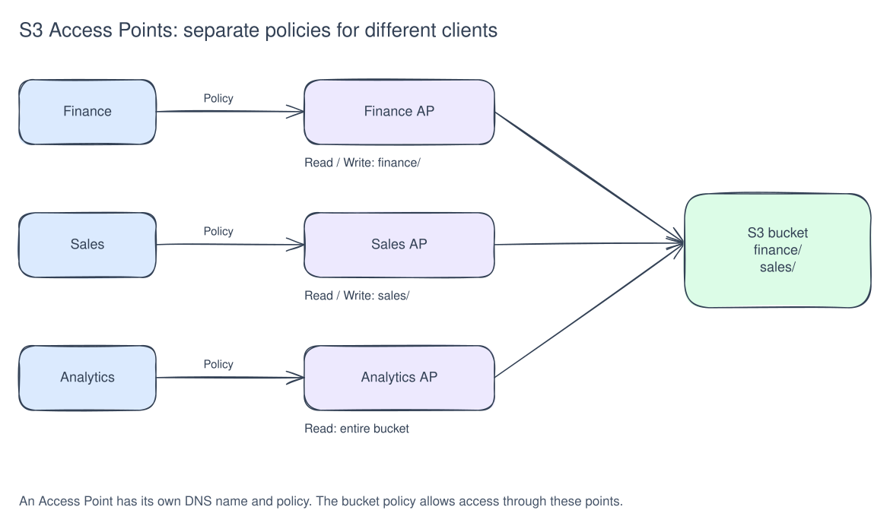

>## How do you configure an Access Point accessible only from a VPC?

Create an access point with **VPC origin** and use a **VPC endpoint** to connect to S3. Check IAM, endpoint, access point, and bucket policies; none may deny the required operation.

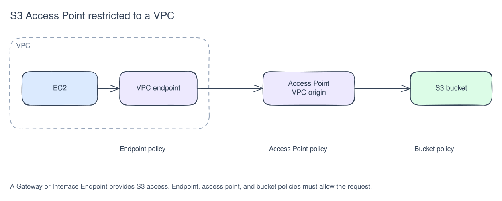

>## What is S3 Object Lambda used for?

**S3 Object Lambda** applies a Lambda transformation when an object is retrieved, such as hiding personal data, converting XML to JSON, modifying an image, or adding a watermark. The original bucket object remains unchanged.

Since November 7, 2025, the service is available only to existing Object Lambda customers and selected APN partners. New projects must account for this restriction. [Object Lambda availability change](https://docs.aws.amazon.com/AmazonS3/latest/userguide/amazons3-ol-change.html).

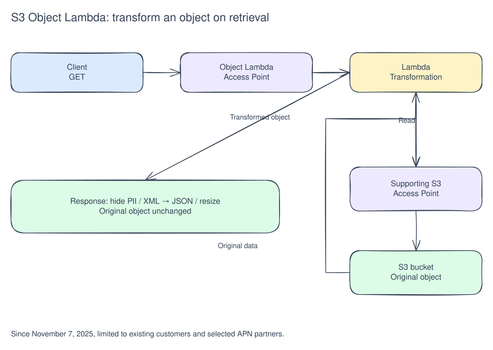

## Limits and retries

>## How should you handle throttling and temporary AWS API errors?

**Exponential backoff** increases the delay between attempts, for example 1, 2, 4, and 8 time units. **Jitter** adds randomness so many clients do not retry simultaneously. Set a maximum number of attempts and a maximum delay.

AWS SDKs include retry mechanisms. Implement them in the client for direct API calls. Retry suitable temporary 5xx errors and throttling, including 429 and some service-specific HTTP 400 errors. Ordinary authorization or invalid-request errors are not fixed by retries. Account for idempotency when operations have side effects.

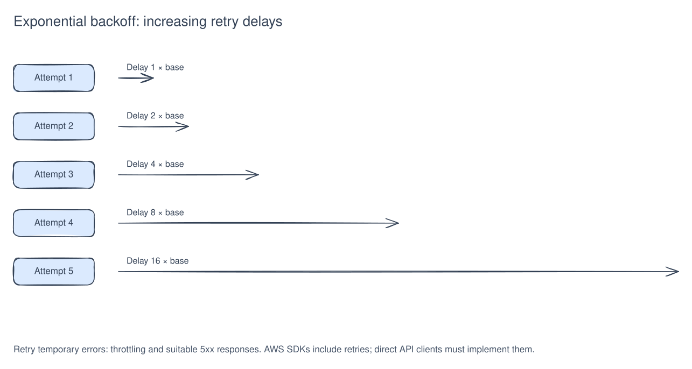
