Русский | [English](questions.en.md)

# AWS

## Основные сервисы

>## Какие сервисы AWS используются в backend-приложениях?

**Вычисления**:

- **EC2** — виртуальные машины.
- **Auto Scaling Group (ASG)** — горизонтальное масштабирование и замена нездоровых EC2-инстансов.
- **Elastic Load Balancing (ELB)** — распределение запросов между инстансами и сервисами.
- **ECS + Fargate** — запуск контейнеров без управления серверами; **EKS** — управляемый Kubernetes.
- **Lambda** — выполнение функций без управления серверами: обработка событий, фоновые задачи, расписания.

**Сеть**:

- **VPC** — изолированная сеть, подсети, таблицы маршрутизации, Internet Gateway и NAT.
- **Security Groups** — правила доступа к сетевым интерфейсам ресурсов.
- **Route 53** — DNS, проверки здоровья и политики маршрутизации.
- **API Gateway** — управляемый вход для HTTP API, в том числе перед Lambda.

**Данные**:

- **RDS** — управляемые реляционные БД, например PostgreSQL и MySQL.
- **DynamoDB** — управляемая NoSQL БД для доступа по ключам и масштабирования.
- **S3** — объектное хранилище: файлы, бэкапы, артефакты и статика.
- **ElastiCache** — кеш в памяти: кеширование, лимиты запросов и другие сценарии с Redis/Memcached.

**Сообщения и события**:

- **SQS** — очередь задач и сглаживание пиков нагрузки.
- **SNS** — pub/sub и доставка сообщения нескольким подписчикам (fan-out).
- **EventBridge** — маршрутизация событий между приложениями и интеграциями.

**Безопасность и наблюдаемость**:

- **IAM** — пользователи, роли и политики доступа; принцип минимальных привилегий.
- **Secrets Manager** — хранение и ротация секретов.
- **KMS** — управление ключами шифрования.
- **CloudWatch** — логи, метрики и alarms.

**Инфраструктура и доставка**:

- **Terraform / CloudFormation** — описание инфраструктуры в коде (IaC).
- **ECR** — реестр образов контейнеров.
- **CodeBuild / CodePipeline** — сборка и CI/CD; альтернатива внешним инструментам, например GitHub Actions.

## IAM

>## Как связаны пользователи, группы и политики IAM?

**IAM (Identity and Access Management)** управляет доступом к ресурсам AWS. **User** представляет пользователя, **Group** объединяет пользователей, **Policy** описывает разрешённые и запрещённые действия.

Пользователь может состоять в нескольких группах и получать их права. Политику можно прикрепить к группе или пользователю; inline policy принадлежит конкретной identity. **Role** позволяет приложению или сервису получать временные credentials вместо постоянного access key.

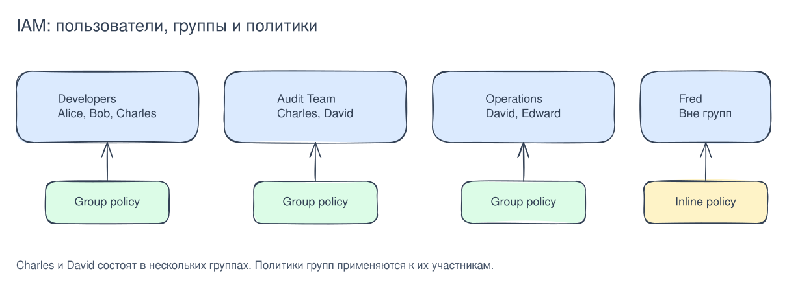

[Схема в Excalidraw](diagrams/iam-groups.excalidraw)

>## Из чего состоит IAM policy?

Политика — JSON с версией языка (`Version`) и набором правил (`Statement`). Основные поля правила:

- **Effect** — `Allow` или `Deny`; явный `Deny` имеет приоритет.
- **Action** — операции, например `s3:GetObject`.
- **Resource** — ARN ресурсов, к которым применяются операции.
- **Condition** — дополнительные условия, например IP или требования к шифрованию.
- **Principal** — кому разрешён доступ; используется в resource-based policies и trust policies, а не в обычной identity-based policy.
- **Sid / Id** — необязательные идентификаторы правила и политики.

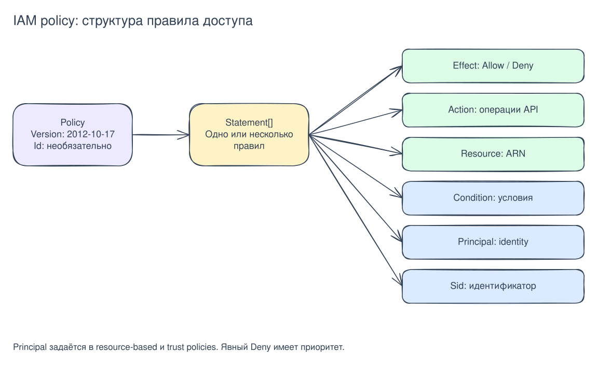

[Схема в Excalidraw](diagrams/iam-policy-structure.excalidraw)

## EC2 и хранилища

>## Что предоставляет EC2?

**EC2 (Elastic Compute Cloud)** — виртуальные машины с выбранными CPU, RAM, ОС и сетью. Данные можно хранить на **EBS**, трафик распределять через **ELB**, а число инстансов менять через **ASG**.

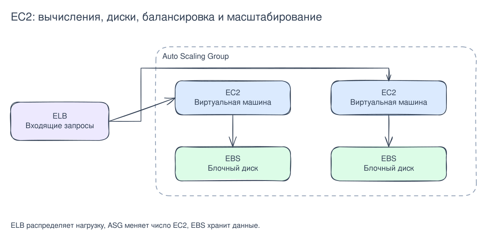

[Схема в Excalidraw](diagrams/ec2-overview.excalidraw)

>## Какие варианты оплаты и размещения EC2 существуют?

| Вариант | Когда подходит |
| --- | --- |
| **On-Demand** | Короткая или непредсказуемая нагрузка без долгосрочных обязательств. |
| **Reserved Instances** | Предсказуемая нагрузка с обязательством на 1 или 3 года; Convertible допускает изменение ряда параметров. |
| **Savings Plans** | Обязательство по объёму расходов на вычисления на 1 или 3 года в обмен на скидку. |
| **Spot Instances** | Прерываемые вычисления: batch, обработка данных и другие задачи, которые можно перезапустить. |
| **Dedicated Hosts** | Выделенный физический сервер, например для лицензирования и требований к размещению. |
| **Dedicated Instances** | Инстансы на оборудовании, выделенном одному аккаунту. |
| **Capacity Reservations** | Резервирование вычислительной ёмкости в конкретной AZ. Само по себе не даёт скидку. |

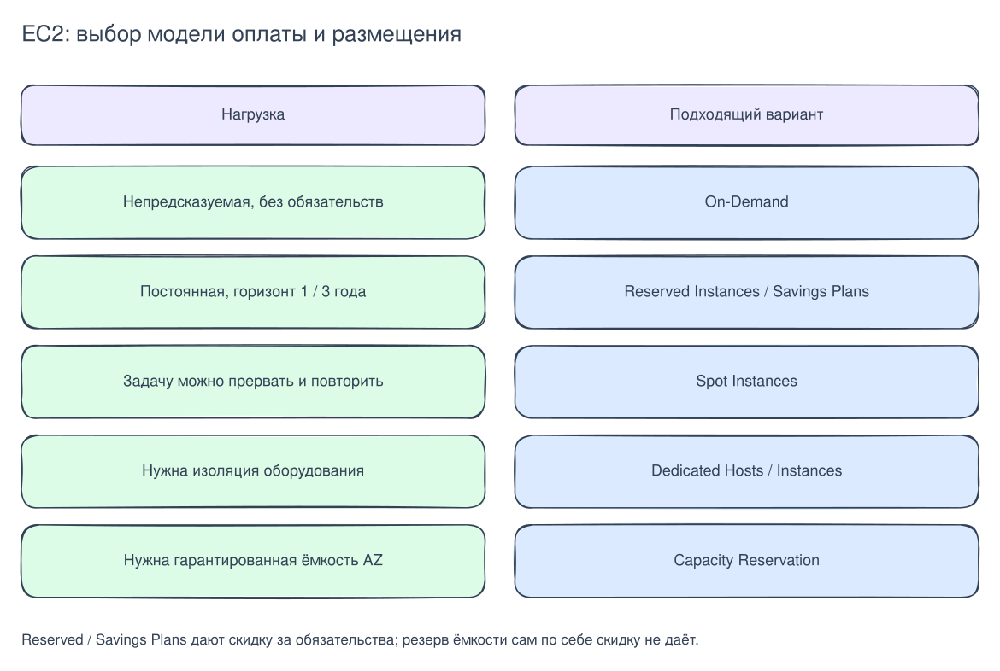

[Схема в Excalidraw](diagrams/ec2-purchasing-options.excalidraw)

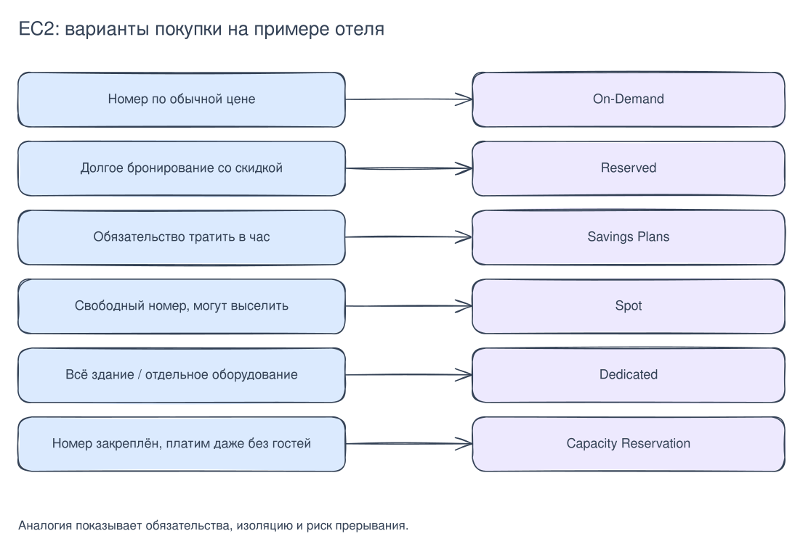

[Схема в Excalidraw](diagrams/ec2-purchasing-hotel-analogy.excalidraw)

Типы инстансов удобно сравнивать в [EC2 Instance Comparison](https://instances.vantage.sh/).

>## Как подключиться к EC2 по SSH?

При создании Linux-инстанса выбрать key pair и сохранить приватный ключ `.pem`. Нужны доступный IP и разрешение SSH в Security Group для своего адреса.

```powershell
ssh -i .\TestServer1_Key.pem ec2-user@<public-ip>
```

`ec2-user` подходит для Amazon Linux; имя пользователя зависит от AMI.

>## Что такое EBS и к какой зоне доступности привязан том?

**EBS (Elastic Block Store)** — сетевое блочное хранилище для EC2. Том существует независимо от работающего инстанса, но подключение требует, чтобы том и инстанс находились в одной **Availability Zone (AZ)**. Один EC2 может иметь несколько томов; том может оставаться неподключённым.

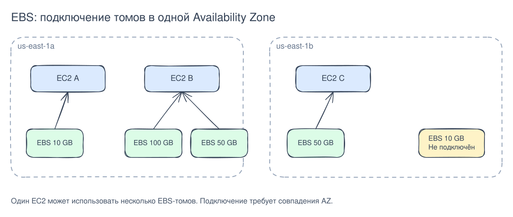

[Схема в Excalidraw](diagrams/ebs-availability-zones.excalidraw)

>## Что позволяет EBS Multi-Attach?

**Multi-Attach** позволяет подключить один том `io1` или `io2` к нескольким совместимым EC2-инстансам в одной AZ, до 16 инстансов. Приложение должно координировать одновременную запись; нужна файловая система, рассчитанная на совместный доступ. Это не обычная общая папка, как EFS.

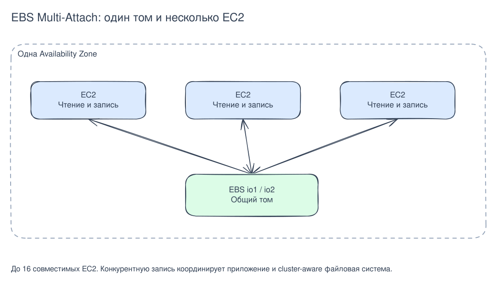

[Схема в Excalidraw](diagrams/ebs-multi-attach.excalidraw)

>## Какие типы EBS-томов существуют?

- **gp2 / gp3** — SSD общего назначения; подходят для большинства приложений.
- **io1 / io2** — SSD с provisioned IOPS для нагрузки с высокими требованиями к I/O и задержке.
- **st1** — Throughput Optimized HDD для больших последовательных операций.
- **sc1** — Cold HDD для редко используемых данных.

Загрузочный том EC2 должен быть SSD. Для выбора учитывают размер, IOPS, throughput и стоимость.

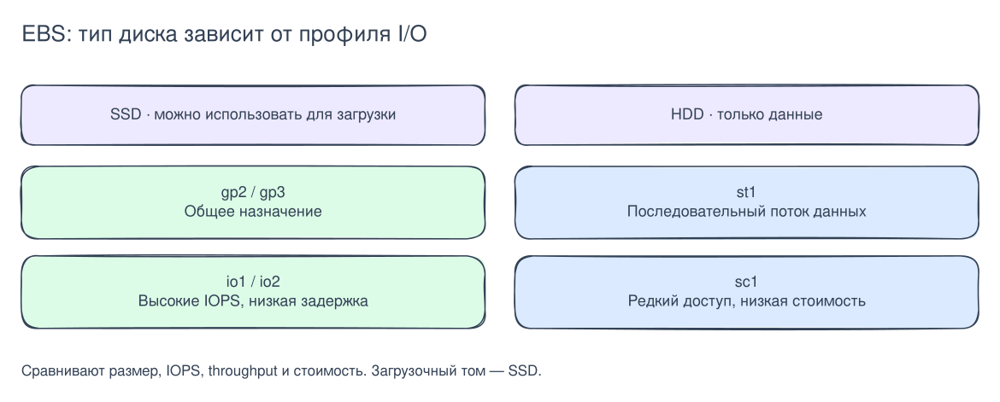

[Схема в Excalidraw](diagrams/ebs-volume-types.excalidraw)

>## Как перенести EBS-данные в другую AZ?

Создать **snapshot**, затем восстановить из него новый EBS-том в нужной AZ. Для переноса в другой регион сначала копируют snapshot в этот регион.

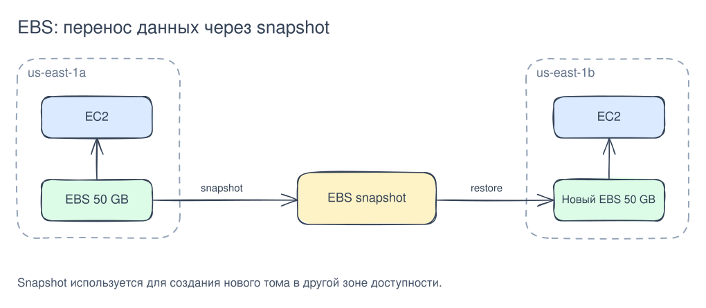

[Схема в Excalidraw](diagrams/ebs-snapshot-migration.excalidraw)

>## Какие дополнительные возможности есть у EBS snapshots?

- **Snapshot Archive** — более дешёвое архивное хранение; восстановление занимает 24–72 часа.
- **Recycle Bin** — удержание удалённых snapshots по правилам retention, от 1 дня до 1 года.
- **Fast Snapshot Restore (FSR)** — создание тома с полной производительностью без ожидания загрузки блоков при первом чтении; оплачивается отдельно.

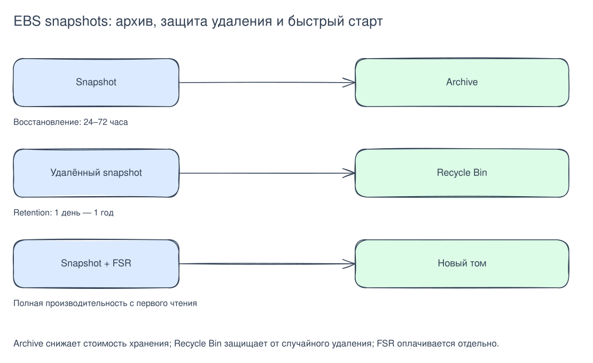

[Схема в Excalidraw](diagrams/ebs-snapshot-features.excalidraw)

>## Чем Instance Store отличается от EBS?

**Instance Store** — локальные диски физического хоста: быстрые, но временные. Подходят для кеша, буферов и промежуточных результатов. Данные сохраняются при reboot, но теряются при stop/terminate и при потере соответствующего диска.

**EBS** — сетевой том с независимым жизненным циклом. Данные сохраняются после остановки EC2; удаление при terminate зависит от `DeleteOnTermination`. Для важных данных нужны бэкапы. [Жизненный цикл Instance Store](https://docs.aws.amazon.com/AWSEC2/latest/UserGuide/instance-store-lifetime.html).

>## Что такое EFS и чем он отличается от EBS?

**EFS (Elastic File System)** — управляемая файловая система NFS для Linux. Её могут одновременно использовать несколько EC2-инстансов, в том числе в разных AZ. EBS предоставляет блочный диск, EFS — общий файловый доступ. Ёмкость EFS растёт по мере записи данных, оплата зависит от использования и выбранного класса.

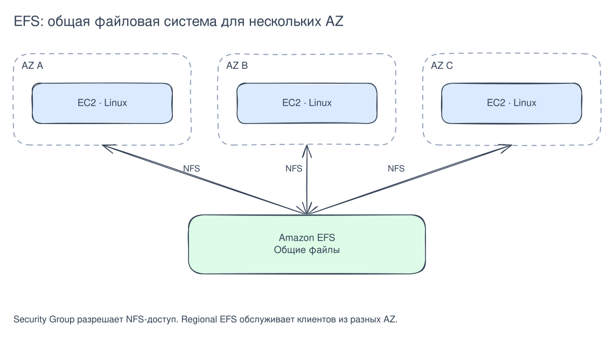

[Схема в Excalidraw](diagrams/efs-overview.excalidraw)

>## Какие классы и варианты размещения есть у EFS?

- **Standard** — часто используемые файлы.
- **Infrequent Access (IA)** — реже используемые файлы, более дешёвое хранение и отдельная плата за доступ.
- **Archive** — длительное хранение редко используемых файлов.

**Lifecycle Management** переводит файлы между классами. **Regional** хранит данные в нескольких AZ; **One Zone** — в одной, поэтому подходит для данных, которые можно восстановить. Фиксированное соотношение стоимости EFS и EBS зависит от региона, класса и нагрузки.

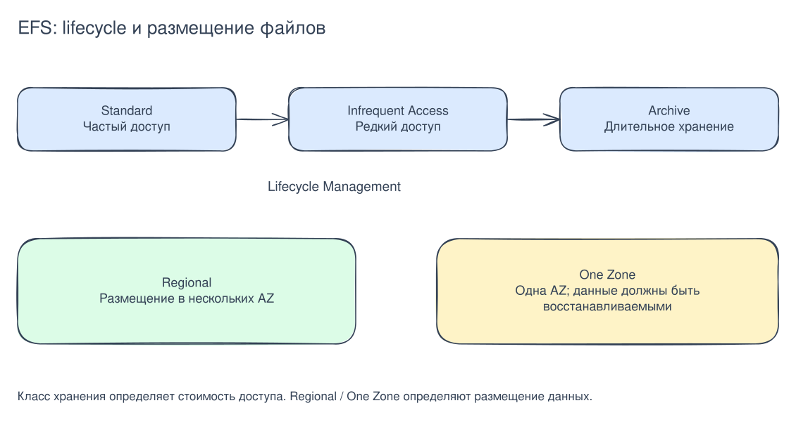

[Схема в Excalidraw](diagrams/efs-storage-classes.excalidraw)

## Балансировка и масштабирование

>## Чем отличаются ALB, NLB и Gateway Load Balancer?

**ELB (Elastic Load Balancing)** — семейство управляемых балансировщиков:

- **ALB (Application Load Balancer)** — уровень 7, HTTP/HTTPS: маршрутизация по host, path и другим параметрам запроса, TLS termination.
- **NLB (Network Load Balancer)** — уровень 4: TCP/UDP/TLS, высокая пропускная способность, статический IP для каждой AZ, возможность назначить Elastic IP.
- **Gateway Load Balancer (GWLB)** — распределение сетевого трафика между виртуальными appliances: firewall, IDS/IPS, deep packet inspection. Работает на уровне IP, использует GENEVE на порту 6081 для передачи трафика appliances.

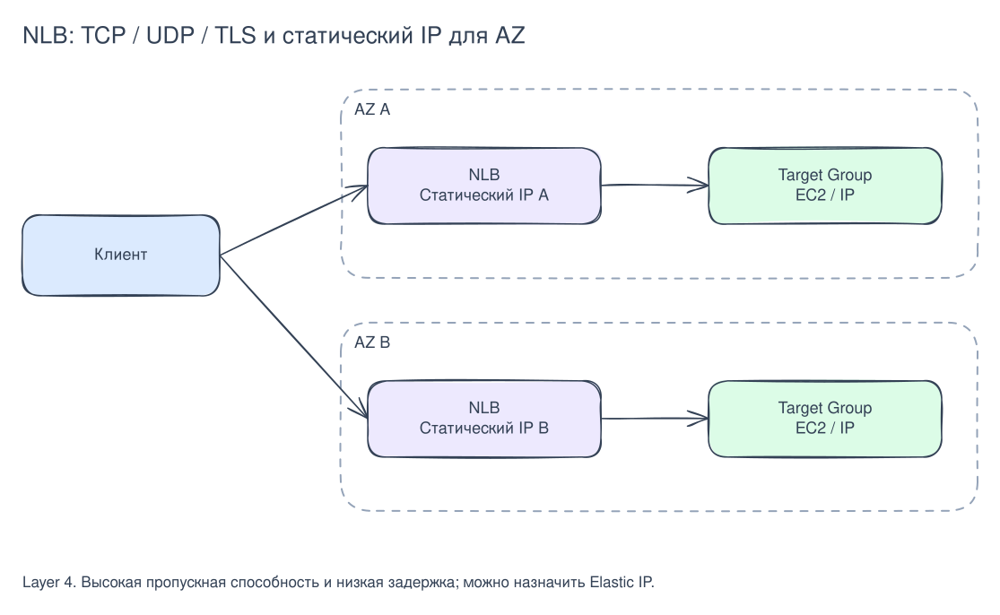

[Схема в Excalidraw](diagrams/nlb-overview.excalidraw)

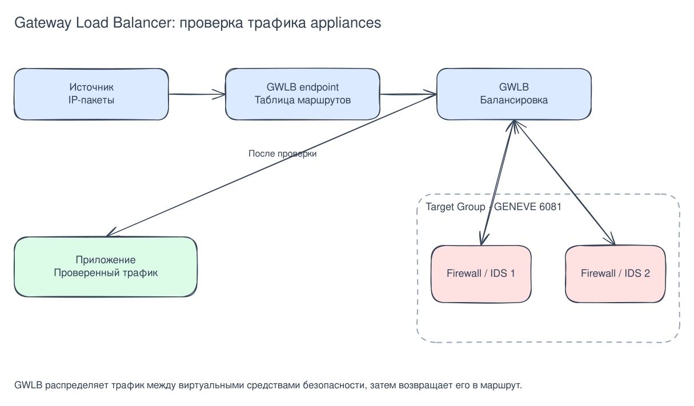

[Схема в Excalidraw](diagrams/gateway-load-balancer.excalidraw)

>## Как ALB выбирает приложение и как настроить доступ к EC2?

**Listener** принимает запрос, его правила выбирают **Target Group**, а та содержит цели и настройки health checks. Например, `/user` направляется в сервис пользователей, `/search` — в поиск.

1. Создать EC2-инстансы с приложением.
2. Создать ALB и его Security Group для входящего HTTP/HTTPS.
3. Создать Target Group и зарегистрировать инстансы.
4. В Security Group инстансов разрешить порт приложения с источником **Security Group балансировщика**.

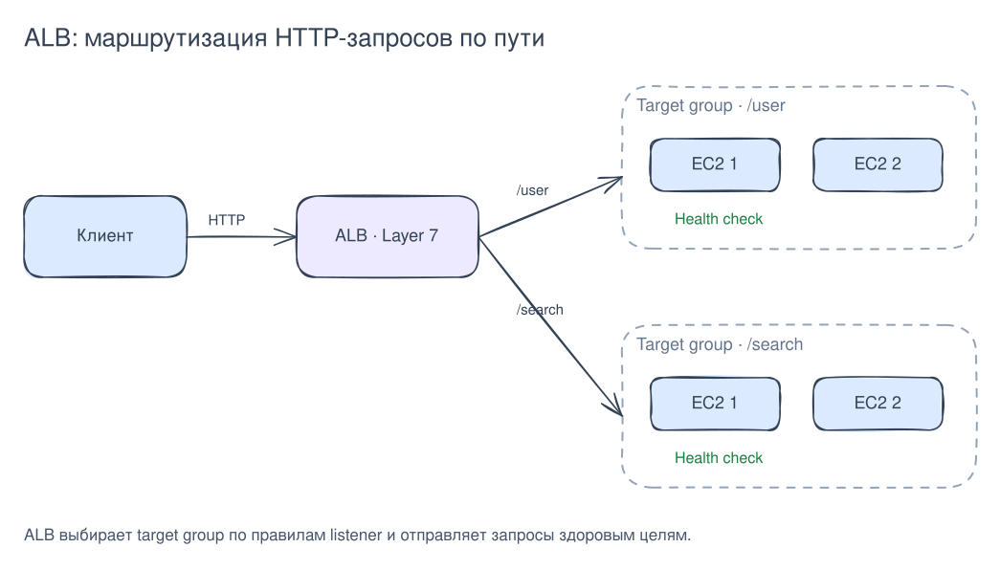

[Схема в Excalidraw](diagrams/alb-routing.excalidraw)

>## Что меняет Cross-Zone Load Balancing?

При включённом **cross-zone** узел балансировщика распределяет трафик по целям в разных AZ. При выключенном — по целям своей AZ.

Если AZ получают по 50% входящего трафика, а в них 2 и 8 одинаковых инстансов, без cross-zone каждый инстанс получит 25% и 6,25% соответственно. С cross-zone каждый из 10 получит около 10%. Настройки по умолчанию и стоимость межзонального трафика зависят от вида балансировщика.

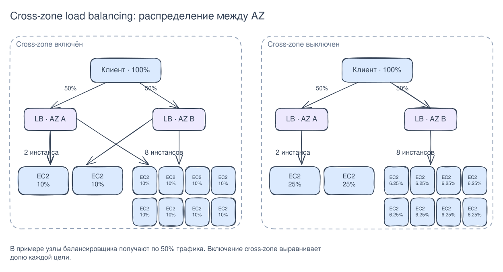

[Схема в Excalidraw](diagrams/elb-cross-zone.excalidraw)

>## Какие параметры ёмкости есть у ASG?

**ASG (Auto Scaling Group)** автоматически меняет количество EC2-инстансов и заменяет нездоровые инстансы.

- **Minimum** — нижняя граница количества инстансов.
- **Desired** — сколько инстансов группа должна поддерживать сейчас.
- **Maximum** — верхняя граница; scaling policy не может превысить её.

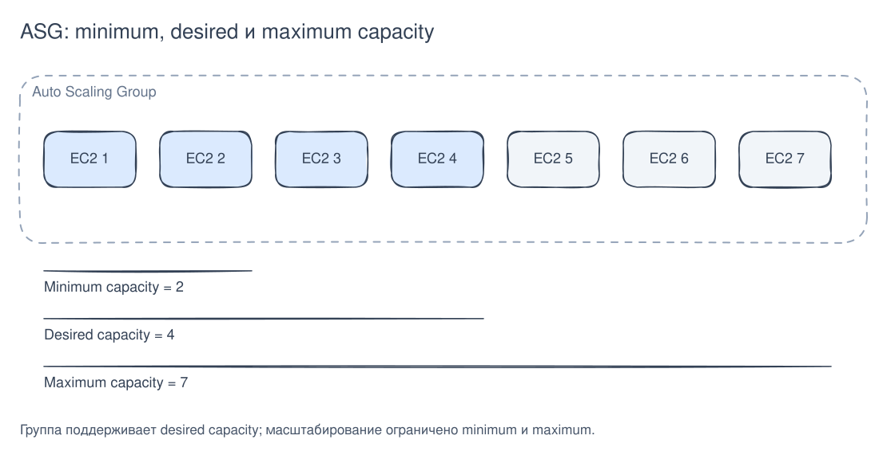

[Схема в Excalidraw](diagrams/asg-capacity.excalidraw)

>## По каким метрикам и политикам масштабируется ASG?

Метрики: средняя **CPU utilization**, **RequestCountPerTarget** у ALB, сетевой трафик и пользовательские метрики **CloudWatch**, например длина очереди на одного worker.

- **Target Tracking** — поддерживать целевой уровень метрики, например CPU 40%.
- **Step Scaling** — менять ёмкость на разное число инстансов в зависимости от степени превышения порога.
- **Simple Scaling** — заданное изменение по alarm с cooldown.
- **Scheduled Scaling** — менять ёмкость по расписанию.
- **Predictive Scaling** — прогнозировать повторяющуюся нагрузку по истории и заранее увеличивать ёмкость.

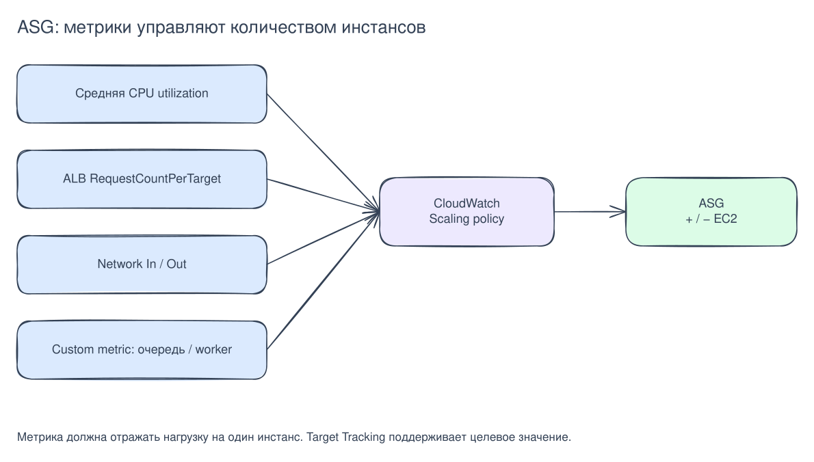

[Схема в Excalidraw](diagrams/asg-scaling-metrics.excalidraw)

>## Для чего нужен ASG Instance Refresh?

**Instance Refresh** постепенно заменяет инстансы, например после изменения AMI или launch template. Параметр минимальной здоровой ёмкости задаёт, сколько инстансов должно оставаться доступно во время обновления, а **instance warmup** даёт новым инстансам время на запуск и прогрев.

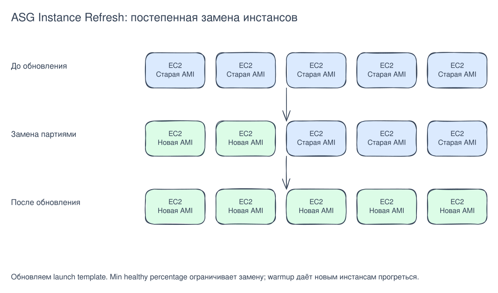

[Схема в Excalidraw](diagrams/asg-instance-refresh.excalidraw)

## RDS и ElastiCache

>## Какие задачи берёт на себя RDS?

**RDS (Relational Database Service)** управляет созданием БД, обслуживанием инфраструктуры, обновлениями ОС, резервными копиями, point-in-time recovery и мониторингом. Поддерживает read replicas, Multi-AZ и масштабирование вычислений/хранилища. У обычного RDS-инстанса нет SSH-доступа к серверу.

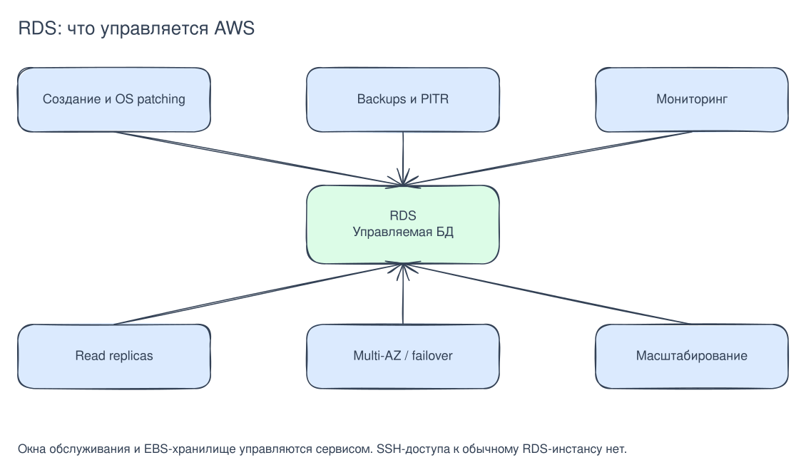

[Схема в Excalidraw](diagrams/rds-overview.excalidraw)

>## Когда срабатывает RDS Storage Auto Scaling?

Автоматически увеличивает выделенное хранилище до заданного **maximum storage threshold**. Основные условия: свободно не более 10%, это состояние длится не менее 5 минут, завершена предыдущая storage optimization и за последние 24 часа было менее 4 изменений хранилища. Уменьшение хранилища автоматически не выполняется. Текущие условия описаны в [документации RDS Storage Auto Scaling](https://docs.aws.amazon.com/AmazonRDS/latest/UserGuide/USER_PIOPS.Autoscaling.html).

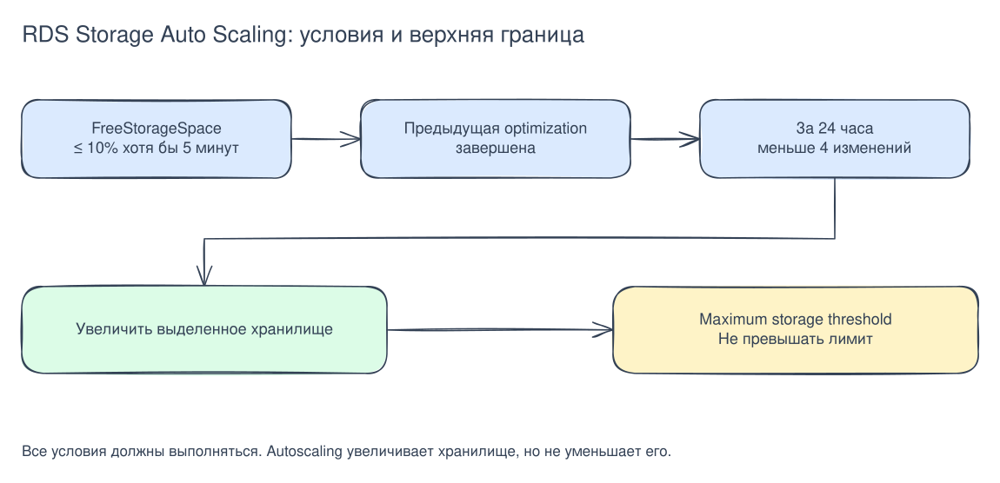

[Схема в Excalidraw](diagrams/rds-storage-auto-scaling.excalidraw)

>## Для чего нужна RDS Read Replica и чем она отличается от Multi-AZ?

**Read Replica** асинхронно получает изменения основной БД и обслуживает чтение, например отчёты, чтобы не нагружать production. Записи идут в primary, чтения можно направлять в replica; из-за задержки репликации данные могут быть не самыми свежими.

**Multi-AZ DB instance** со standby предназначен для высокой доступности и failover, а не для разгрузки чтения. У **Multi-AZ DB cluster** есть читаемые replicas — это другой вариант размещения.

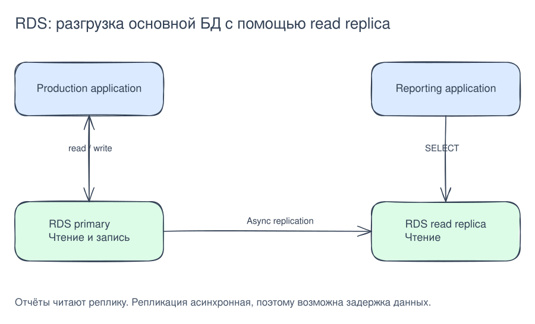

[Схема в Excalidraw](diagrams/rds-read-replica.excalidraw)

>## Как влияет регион Read Replica на сетевую стоимость?

Для репликации между RDS-инстансами в одном регионе, включая разные AZ, RDS не взимает плату за передачу данных репликации. Для cross-region replication возникает стоимость межрегиональной передачи. Это не означает, что любой трафик приложения к БД бесплатен.

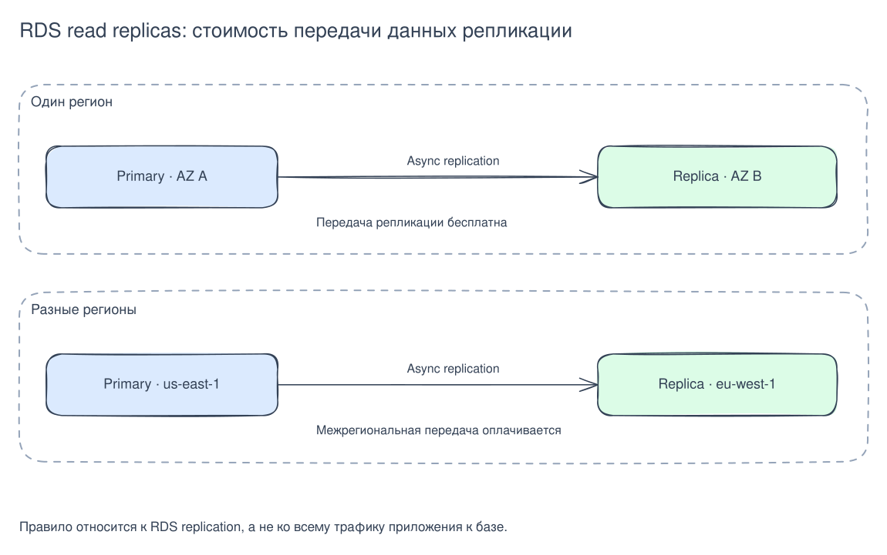

[Схема в Excalidraw](diagrams/rds-read-replica-network-cost.excalidraw)

>## Какую проблему решает RDS Proxy?

**RDS Proxy** управляет пулом соединений к БД, сглаживает пики числа соединений и помогает при failover. Особенно полезен, когда множество короткоживущих Lambda-вызовов создают соединения одновременно.

Поддерживает IAM-аутентификацию и интеграцию с Secrets Manager. Работает внутри VPC, без публичного endpoint; управляемый и отказоустойчивый сервис.

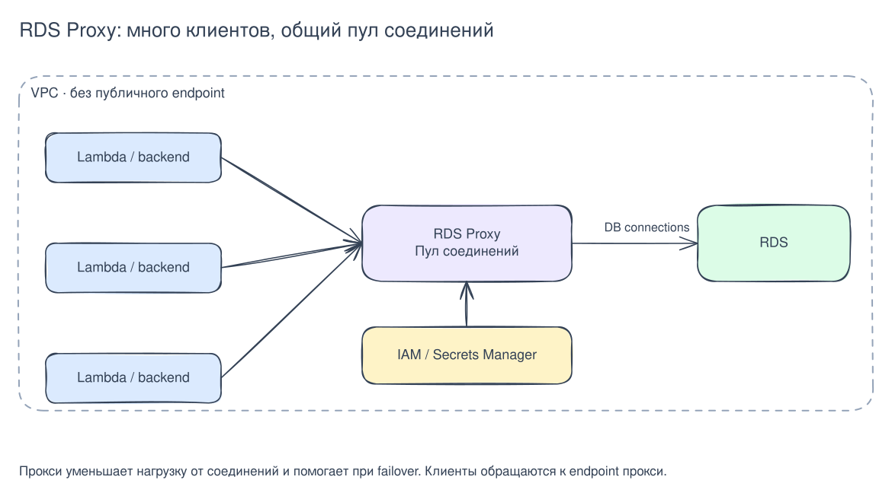

[Схема в Excalidraw](diagrams/rds-proxy.excalidraw)

>## Для чего нужен ElastiCache?

**ElastiCache** — управляемый кеш в памяти, который уменьшает нагрузку на БД и задержку чтения. AWS берёт на себя развёртывание, обслуживание, мониторинг и часть механизмов восстановления. Использование кеша требует изменений приложения: чтение/запись кеша, TTL и инвалидация.

Общий кеш позволяет хранить состояние вне отдельных backend-инстансов и горизонтально масштабировать приложение.

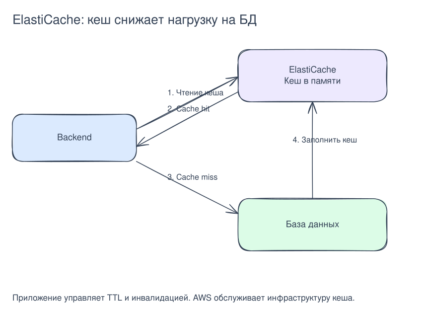

[Схема в Excalidraw](diagrams/elasticache-overview.excalidraw)

>## Чем отличаются Redis и Memcached в ElastiCache?

**Redis** поддерживает сложные структуры данных, включая sets и sorted sets, репликацию, read replicas, Multi-AZ failover и snapshots. Подходит для кеша и сценариев, которым нужны более богатые операции с данными.

**Memcached** — простой многопоточный кеш ключ–значение, распределяет данные между узлами; обычный node-based кластер не имеет репликации и persistence. **Serverless Memcached** поддерживает snapshots. AOF из общего описания Redis не поддерживается в ElastiCache для современных версий Redis OSS; для резервных копий используют snapshots. [Резервное копирование ElastiCache](https://docs.aws.amazon.com/AmazonElastiCache/latest/dg/backups.html), [ограничения AOF](https://docs.aws.amazon.com/AmazonElastiCache/latest/APIReference/API_Snapshot.html).

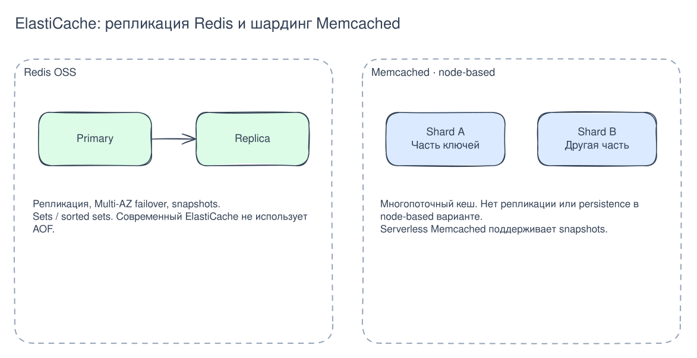

[Схема в Excalidraw](diagrams/elasticache-redis-vs-memcached.excalidraw)

## Route 53

>## Как работает DNS через Route 53?

**Route 53** хранит DNS-записи и возвращает адрес/имя целевого ресурса. После DNS-разрешения клиент обращается к приложению напрямую; Route 53 не проксирует HTTP-трафик.

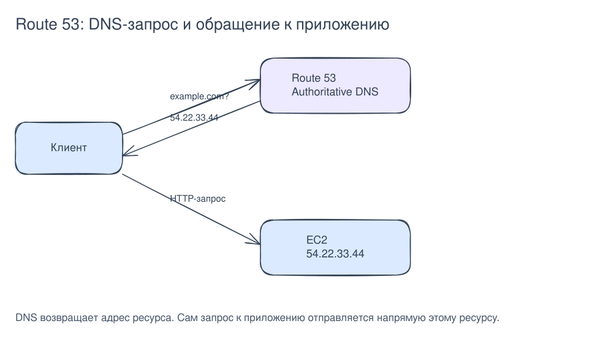

[Схема в Excalidraw](diagrams/route53-dns.excalidraw)

>## Какие DNS record types нужно знать?

- **A** — IPv4-адрес.
- **AAAA** — IPv6-адрес.
- **CNAME** — ссылка на другое DNS-имя; не используется на корне зоны, например `example.com`.
- **NS** — authoritative DNS-серверы зоны.

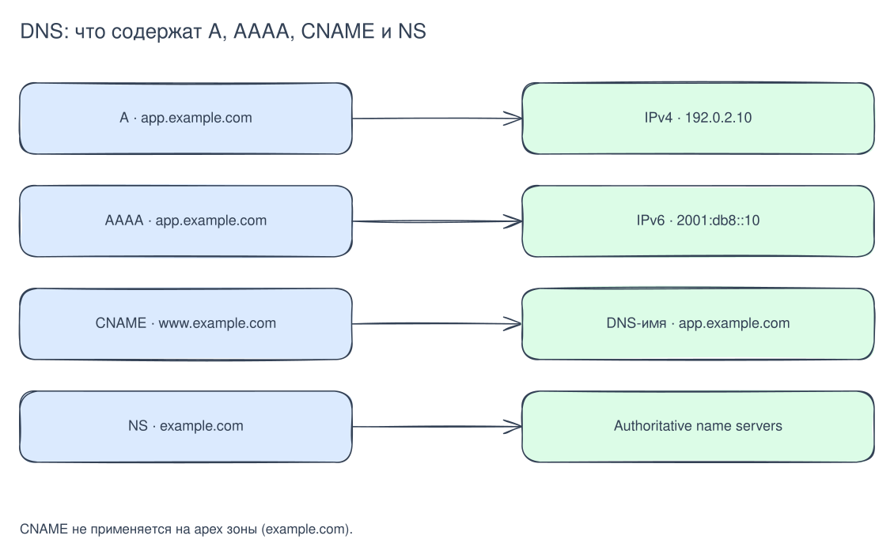

[Схема в Excalidraw](diagrams/route53-record-types.excalidraw)

>## Чем отличаются Public и Private Hosted Zones?

**Hosted Zone** — набор DNS-записей для домена и его поддоменов. **Public Hosted Zone** доступна через публичный DNS. **Private Hosted Zone** разрешается внутри связанных с ней VPC, например для имён внутренних API и БД.

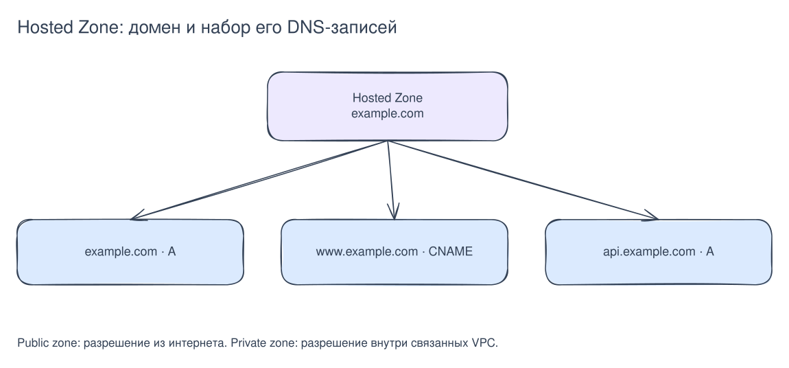

[Схема в Excalidraw](diagrams/route53-hosted-zones-overview.excalidraw)

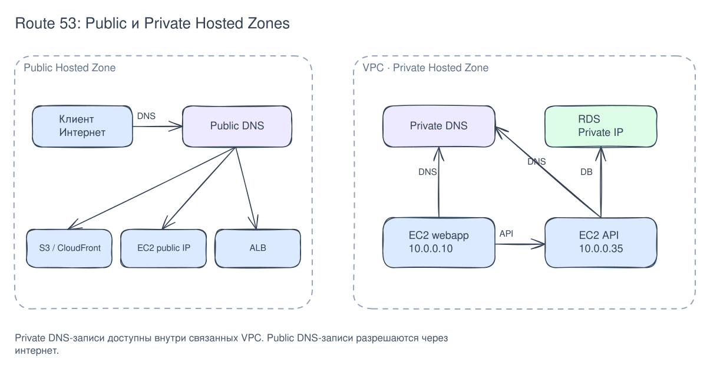

[Схема в Excalidraw](diagrams/route53-hosted-zones.excalidraw)

>## Чем Alias отличается от CNAME?

**CNAME** указывает на другое DNS-имя и не допускается на apex домена. **Alias** — возможность Route 53 направить запись на поддерживаемый AWS-ресурс или другую запись в той же hosted zone. Alias можно использовать на корне домена; за DNS-запросы к AWS-ресурсам через Alias Route 53 не взимает плату.

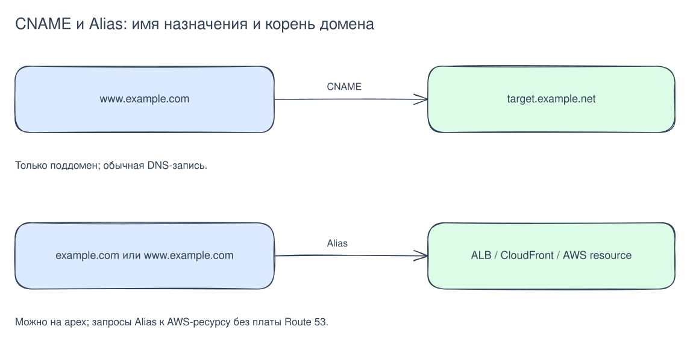

[Схема в Excalidraw](diagrams/route53-cname-vs-alias.excalidraw)

>## На какие ресурсы можно направить Alias record?

Например: ELB, CloudFront, API Gateway, Elastic Beanstalk, S3 website endpoint, VPC interface endpoint, Global Accelerator и поддерживаемую запись в той же hosted zone. Обычное DNS-имя EC2 не является Alias target — используют A-запись с IP или CNAME на поддомене.

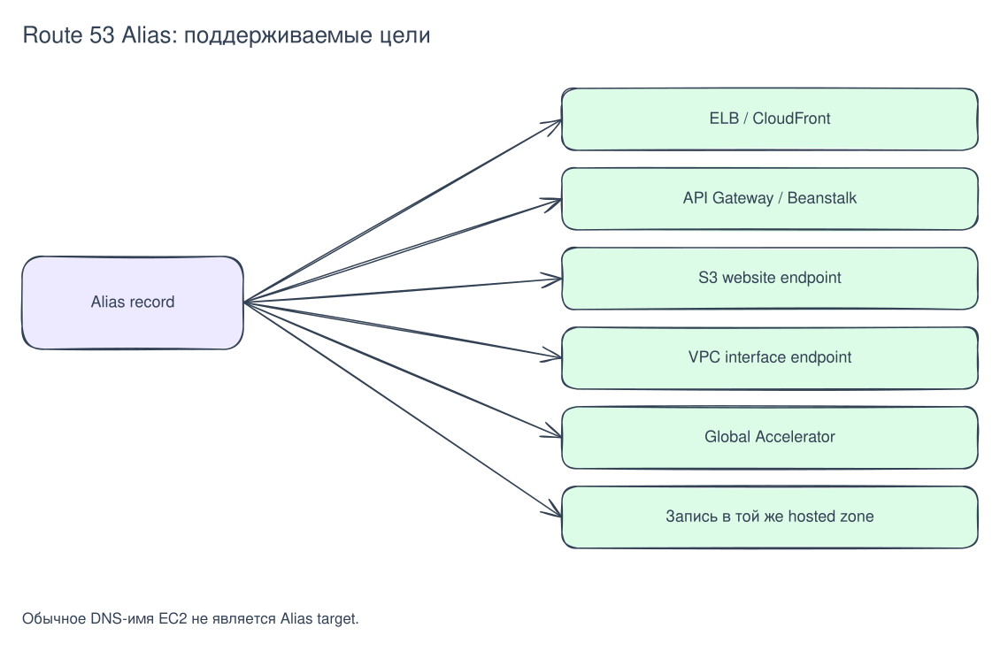

[Схема в Excalidraw](diagrams/route53-alias-targets.excalidraw)

>## Какие проверки здоровья поддерживает Route 53?

- Проверка endpoint по **HTTP / HTTPS / TCP**.
- **Calculated health check** — объединение результатов нескольких проверок.
- Проверка состояния **CloudWatch alarm**.

Health check связывают с DNS-записью, чтобы при маршрутизации учитывать доступность цели, например для failover.

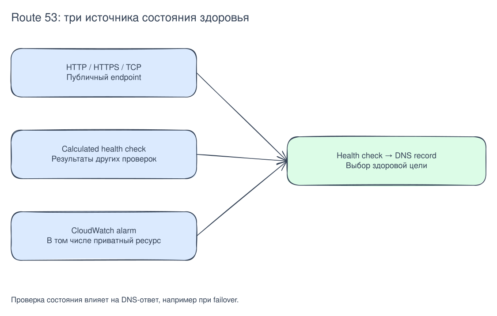

[Схема в Excalidraw](diagrams/route53-health-checks.excalidraw)

>## Как Route 53 проверяет публичный endpoint?

Распределённые health checkers отправляют запросы с обычным интервалом 30 секунд либо быстрым 10 секунд. Для HTTP успешны ответы 2xx/3xx; можно дополнительно искать строку в первых 5120 байтах тела ответа. Есть настраиваемый порог последовательных успешных/неуспешных проверок.

Endpoint должен быть доступен для адресов health checkers. Эти проверки не поддерживают HTTP/2. Итоговый статус определяется совокупностью проверок, а не одним запросом.

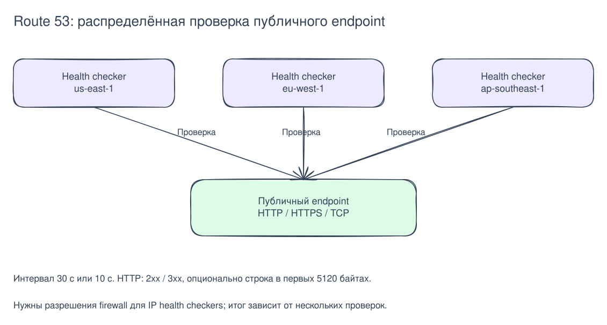

[Схема в Excalidraw](diagrams/route53-endpoint-health-checks.excalidraw)

>## Как проверять здоровье приватного ресурса?

Публичные Route 53 health checkers не могут обратиться к приватному IP. Можно публиковать метрику в **CloudWatch**, создать alarm и использовать его состояние в Route 53 health check.

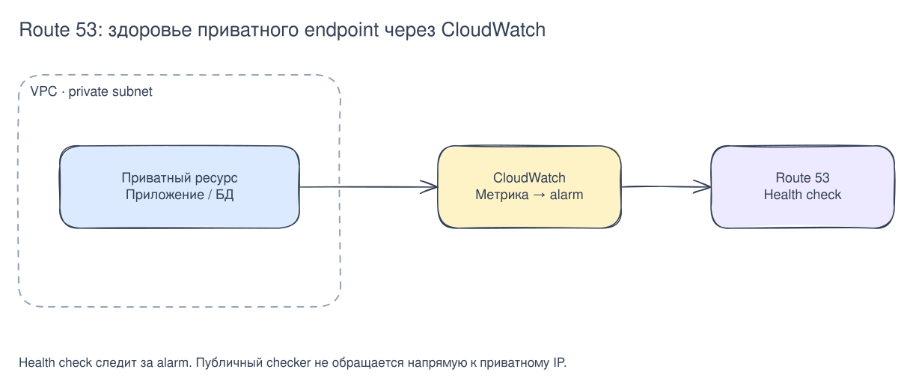

[Схема в Excalidraw](diagrams/route53-private-health-checks.excalidraw)

>## Как работает Weighted Routing?

Для записей с одинаковым именем и типом задают веса. Доля DNS-ответов приблизительно равна `вес / сумма весов`; сумма не обязана быть 100. Подходит для постепенного rollout и A/B-тестирования.

Вес 0 обычно исключает запись из выбора, но такие записи могут использоваться как fallback, если записи с положительным весом нездоровы. Если все веса равны 0, Route 53 рассматривает записи с равными долями. DNS-кеширование не позволяет гарантировать точное распределение HTTP-запросов.

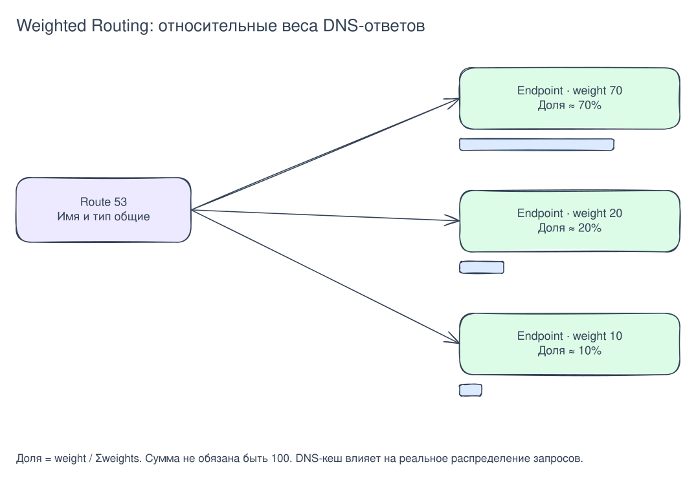

[Схема в Excalidraw](diagrams/route53-weighted-routing.excalidraw)

>## Как работает Latency-Based Routing?

**Latency Routing** выбирает регион с наименьшей измеренной сетевой задержкой для клиента/резолвера среди настроенных записей. Это не обязательно географически ближайший регион; результат зависит от маршрутов сети и меняется со временем.

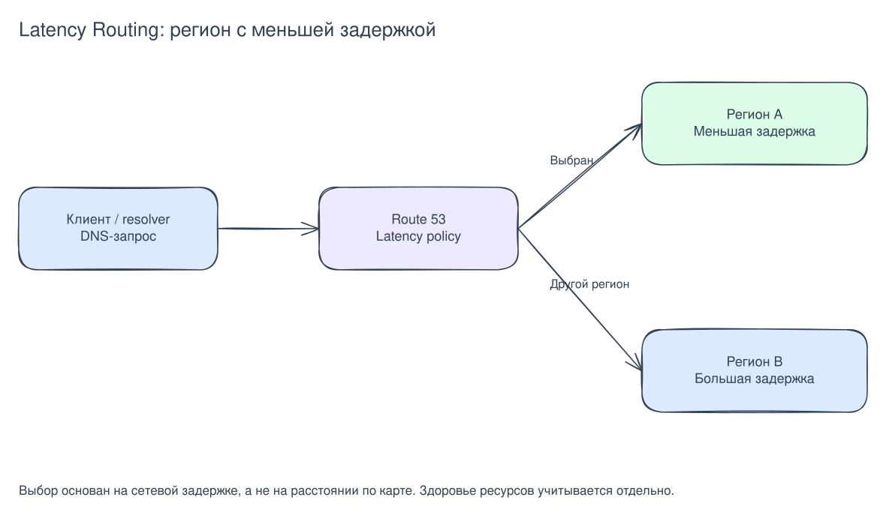

[Схема в Excalidraw](diagrams/route53-latency-routing.excalidraw)

>## Как работает Failover Routing?

**Active-passive**: основная запись **Primary** используется, пока её health check успешен. При отказе Route 53 возвращает **Secondary**. Переключение клиента зависит также от TTL и DNS-кеша.

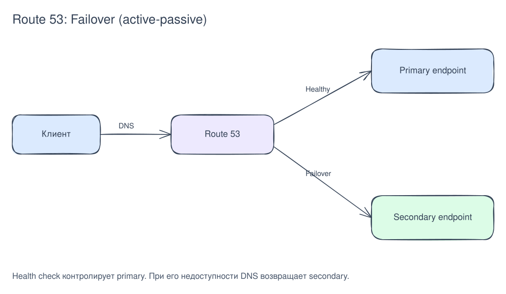

[Схема в Excalidraw](diagrams/route53-failover.excalidraw)

>## Чем отличаются Geolocation и Geoproximity Routing?

**Geolocation** выбирает запись по местоположению клиента: континент, страна, штат США. Более точное правило имеет приоритет; нужна default-запись для остальных или неопределённых местоположений.

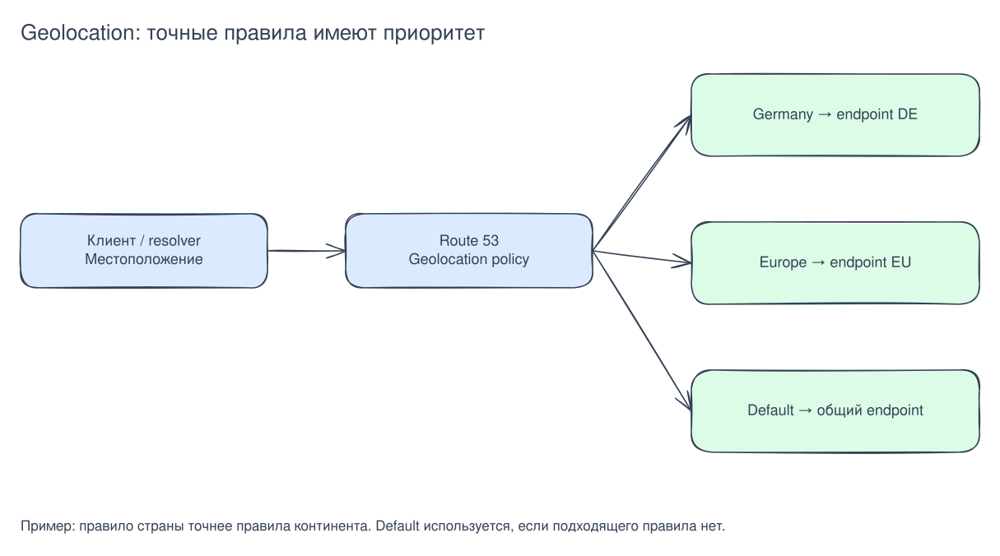

[Схема в Excalidraw](diagrams/route53-geolocation-routing.excalidraw)

**Geoproximity** выбирает ресурс по близости клиента к расположению ресурсов. Параметр **bias** расширяет или уменьшает географическую область, из которой трафик направляется к ресурсу.

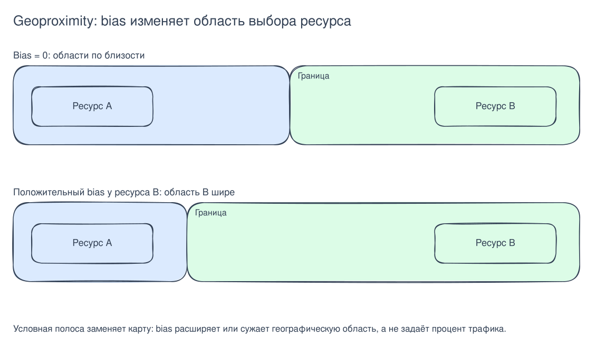

[Схема в Excalidraw](diagrams/route53-geoproximity-routing.excalidraw)

>## Для чего нужен Route 53 Traffic Flow?

**Traffic Flow** — визуальный редактор сложных политик маршрутизации: позволяет объединять правила, сохранять traffic policies и применять их к DNS-именам.

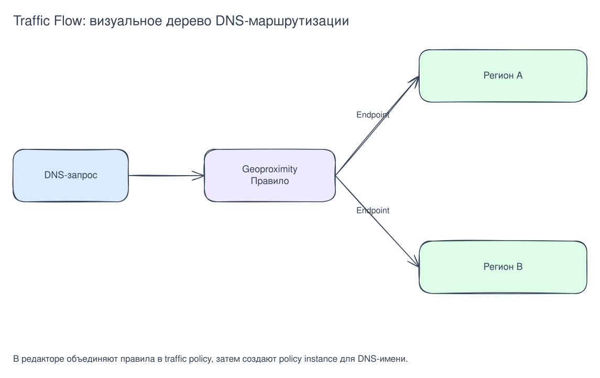

[Схема в Excalidraw](diagrams/route53-traffic-flow.excalidraw)

>## Как работает IP-Based Routing?

Выбор записи зависит от заданных диапазонов IP (**CIDR collections**). Например, клиентам конкретного провайдера или корпоративной сети можно возвращать определённый endpoint.

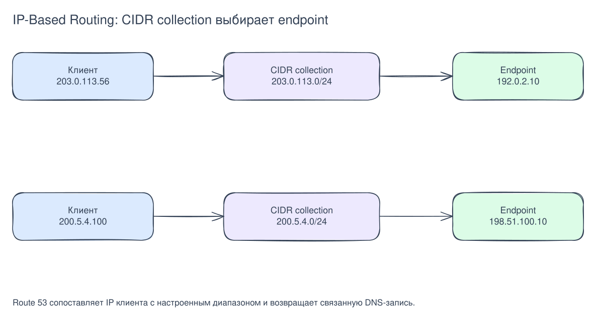

[Схема в Excalidraw](diagrams/route53-ip-based-routing.excalidraw)

>## Чем Multi-Value Answer Routing отличается от балансировщика?

**Multi-Value Answer** возвращает до 8 здоровых записей в одном DNS-ответе. Клиент выбирает адрес и может пробовать другой при ошибке. Route 53 не балансирует отдельные соединения и не заменяет ELB.

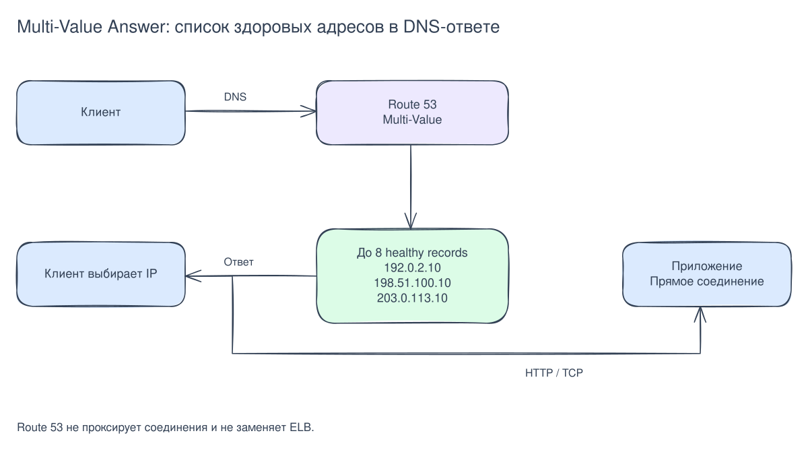

[Схема в Excalidraw](diagrams/route53-multivalue-routing.excalidraw)

## VPC

>## Как связаны VPC, subnet и Availability Zone?

**VPC (Virtual Private Cloud)** — сеть в пределах региона. **Subnet** находится в одной AZ; VPC может содержать подсети в нескольких AZ. Для отказоустойчивости приложение обычно разворачивают в нескольких зонах.

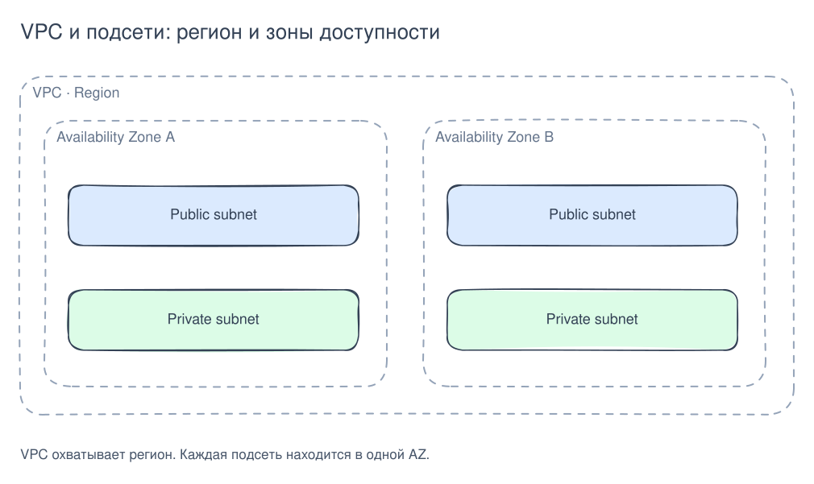

[Схема в Excalidraw](diagrams/vpc-subnets.excalidraw)

>## Чем отличаются Internet Gateway и NAT Gateway?

**Internet Gateway (IGW)** подключает VPC к интернету. Public subnet имеет маршрут к IGW; для прямого IPv4-доступа EC2 также нужен публичный IP и разрешающие правила безопасности.

**NAT Gateway** позволяет ресурсам private subnet инициировать IPv4-соединения с интернетом без входящих соединений извне. Public NAT Gateway размещают в public subnet с маршрутом к IGW и Elastic IP; private subnet направляет исходящий трафик в NAT.

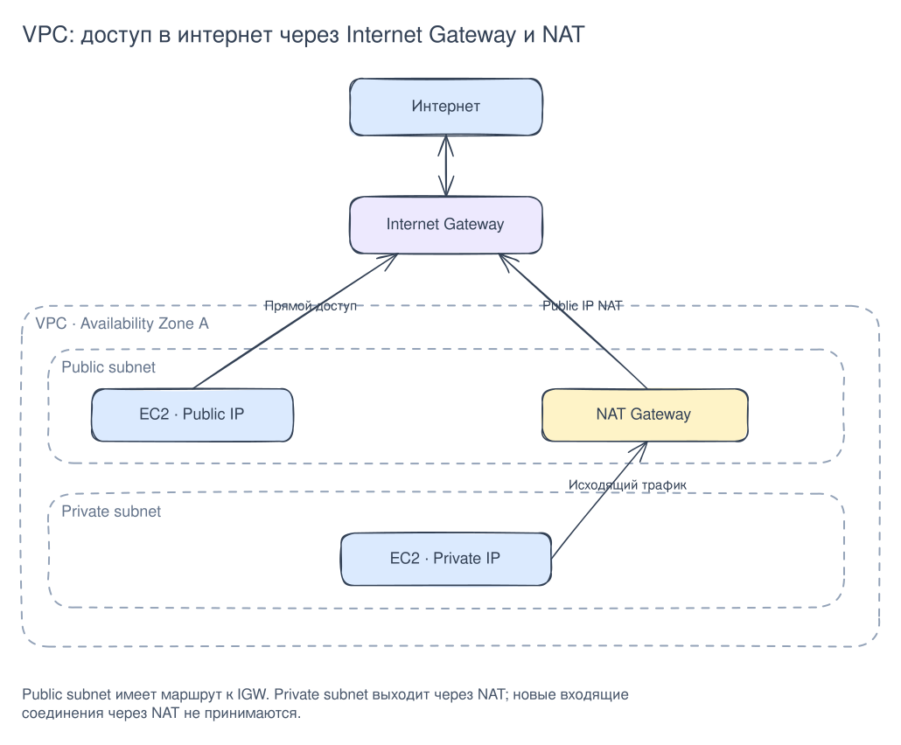

[Схема в Excalidraw](diagrams/vpc-internet-nat.excalidraw)

>## Чем Network ACL отличается от Security Group?

| | **Security Group** | **Network ACL** |
| --- | --- | --- |
| Область | Сетевой интерфейс ресурса. | Подсеть. |
| Правила | Только разрешения. | Разрешения и запреты. |
| Состояние | Stateful: ответный трафик разрешён автоматически. | Stateless: входящий и исходящий трафик проверяются отдельно. |
| Порядок | Все разрешающие правила рассматриваются вместе. | По возрастанию номера; применяется первое совпавшее правило. |

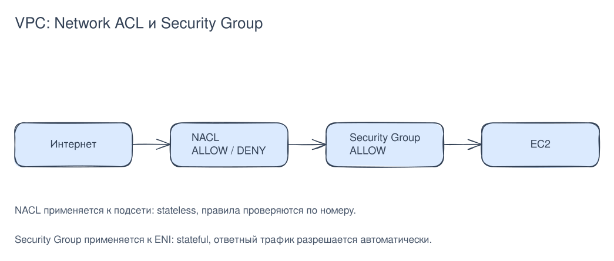

[Схема в Excalidraw](diagrams/vpc-security-layers.excalidraw)

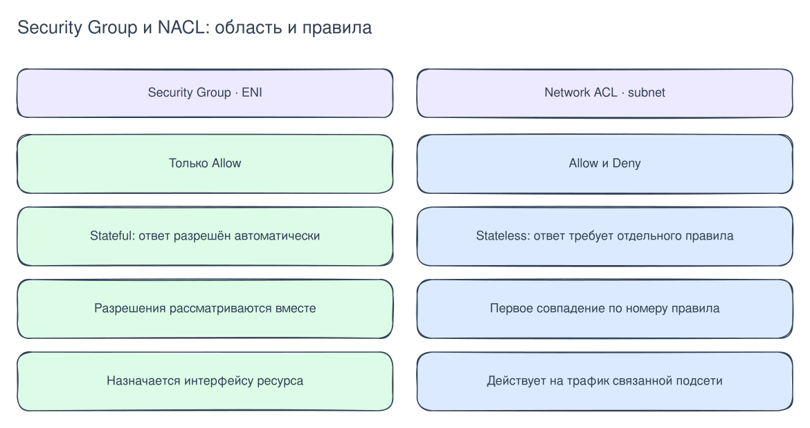

[Схема в Excalidraw](diagrams/vpc-nacl-vs-security-group.excalidraw)

>## Для чего нужны VPC Flow Logs?

**VPC Flow Logs** записывают сведения о потоках трафика через сетевые интерфейсы, включая IP, порты и результат `ACCEPT / REJECT`. Помогают диагностировать маршрутизацию и правила безопасности; не содержат payload пакетов.

>## Какие ограничения есть у VPC Peering?

**VPC Peering** соединяет две VPC для обмена трафиком по приватным адресам. Диапазоны CIDR не должны пересекаться, а маршруты и правила безопасности нужно настроить.

Peering **не транзитивен**: соединения A–B и B–C не дают A доступ к C. Для каждой пары нужна отдельная связь или другая архитектура, например Transit Gateway.

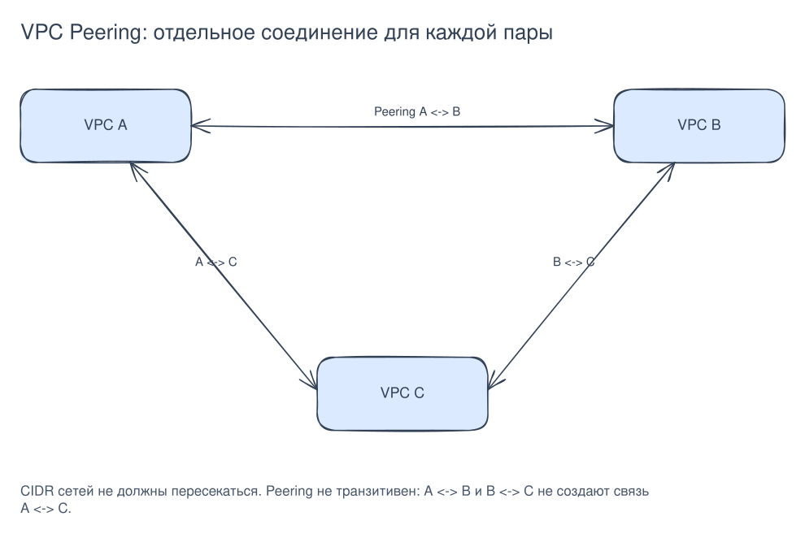

[Схема в Excalidraw](diagrams/vpc-peering.excalidraw)

## S3

>## Как устроены buckets и имена объектов S3?

**S3 (Simple Storage Service)** — объектное хранилище. **Bucket** создаётся в выбранном регионе, его имя в общем пространстве имён должно быть уникальным в пределах AWS partition. Для обычного bucket имя содержит 3–63 символа, строчные буквы, цифры, точки и дефисы; нельзя использовать `_` и формат IP-адреса.

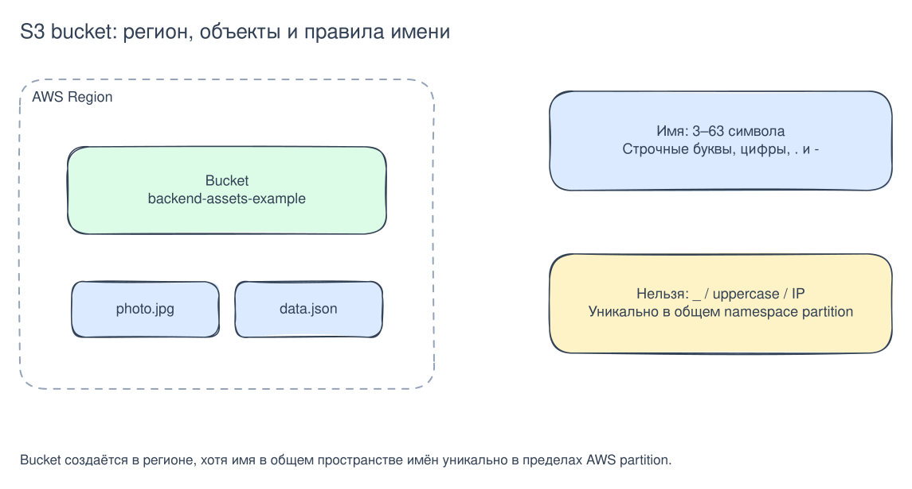

[Схема в Excalidraw](diagrams/s3-buckets.excalidraw)

**Object** хранит содержимое и метаданные. **Key** — полное имя объекта, например `reports/2026/result.json`. `reports/2026/` — префикс, а не настоящие директории; консоль имитирует папки.

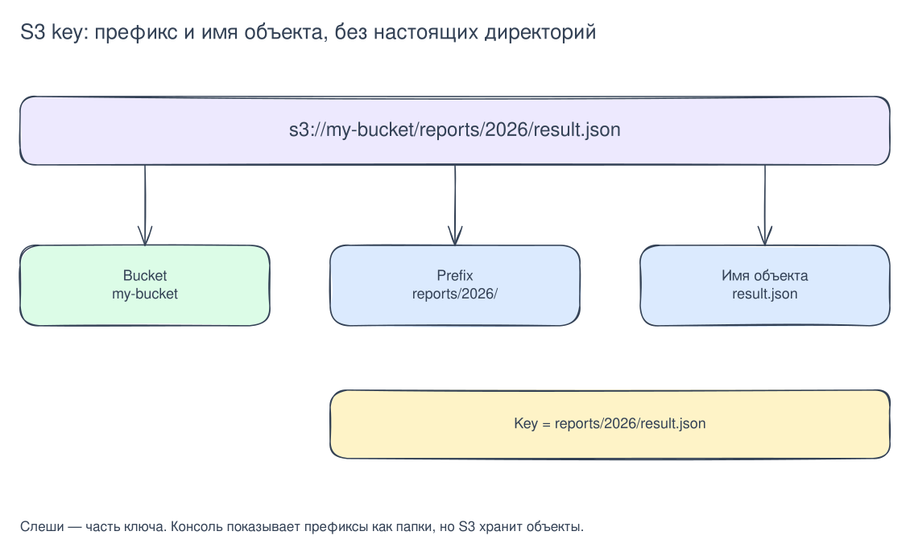

[Схема в Excalidraw](diagrams/s3-objects.excalidraw)

>## Как управлять доступом к S3?

- **IAM policies** — разрешения пользователя или роли.
- **Bucket policy** — resource-based policy на bucket, включая cross-account доступ.
- **ACL** — старый механизм доступа к bucket/объектам; в современных настройках обычно отключён.
- **Block Public Access** — ограничения публичного доступа.

В пределах одного аккаунта доступ может разрешить identity policy или resource policy, если нет явного запрета и других ограничивающих политик. Cross-account сценарии требуют разрешений с обеих сторон. **Шифрование** защищает данные, но не заменяет настройку доступа.

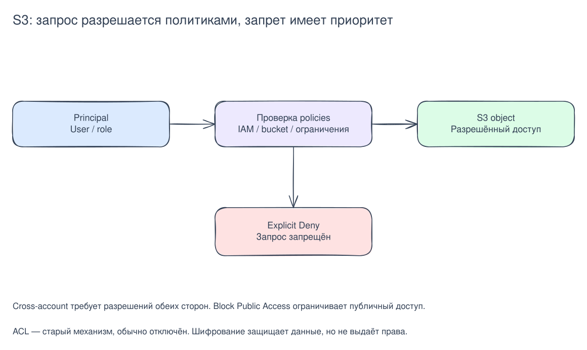

[Схема в Excalidraw](diagrams/s3-security.excalidraw)

>## Как дать EC2-приложению и IAM user доступ к S3?

Для EC2 назначают **IAM role через instance profile** с нужными S3-разрешениями; приложение получает временные credentials. Постоянные ключи не нужно сохранять на сервере.

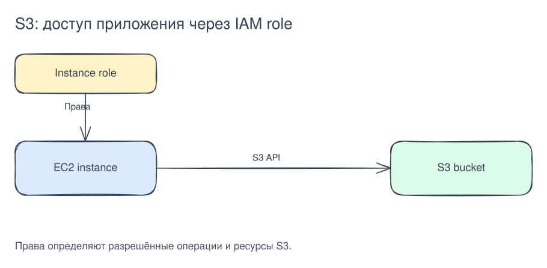

[Схема в Excalidraw](diagrams/s3-ec2-role.excalidraw)

Для IAM user назначают policy с нужными действиями и ресурсами. Для списка объектов нужен ресурс bucket, для `GetObject / PutObject` — ресурсы объектов.

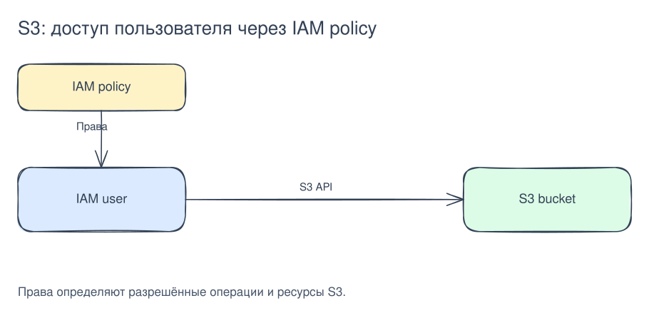

[Схема в Excalidraw](diagrams/s3-iam-user.excalidraw)

>## Как работает S3 Versioning?

Versioning включают на уровне bucket. Запись по существующему key создаёт новую версию вместо уничтожения предыдущей; можно восстановить прежнее содержимое.

Объекты, созданные до включения, имеют `null` version ID. Приостановка versioning не удаляет накопленные версии. Обычное удаление в versioned bucket создаёт delete marker; удаление конкретной версии возможно отдельно.

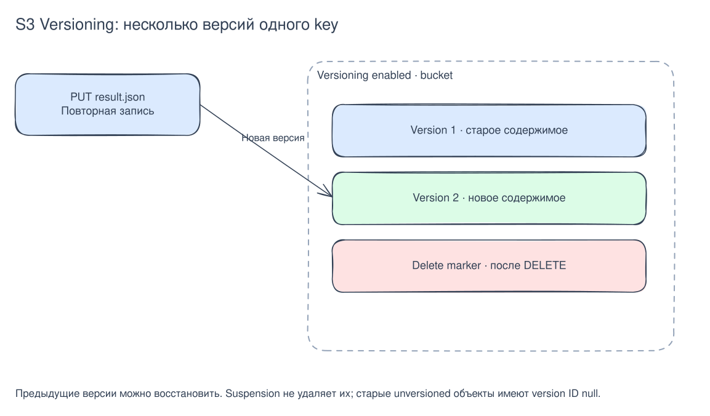

[Схема в Excalidraw](diagrams/s3-versioning.excalidraw)

>## Чем отличаются CRR и SRR в S3 Replication?

- **CRR (Cross-Region Replication)** — копирование в другой регион, например для восстановления после регионального сбоя или требований к размещению.
- **SRR (Same-Region Replication)** — копирование внутри региона, например для объединения логов или production/test.

Репликация асинхронна; versioning должен быть включён на обоих buckets, а IAM role должна иметь необходимые права. Buckets могут принадлежать разным аккаунтам. Для уже существовавших объектов используют S3 Batch Replication.

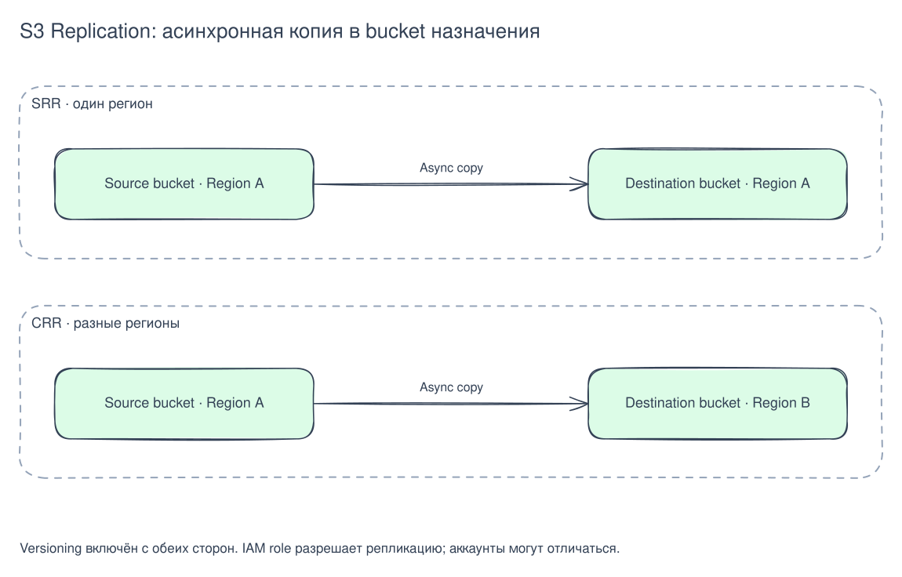

[Схема в Excalidraw](diagrams/s3-replication.excalidraw)

## Классы хранения S3

>## Когда использовать Standard и Infrequent Access?

**S3 Standard** предназначен для частого доступа: низкая задержка, размещение в нескольких AZ, расчётная доступность 99,99% и durability 99,999999999%.

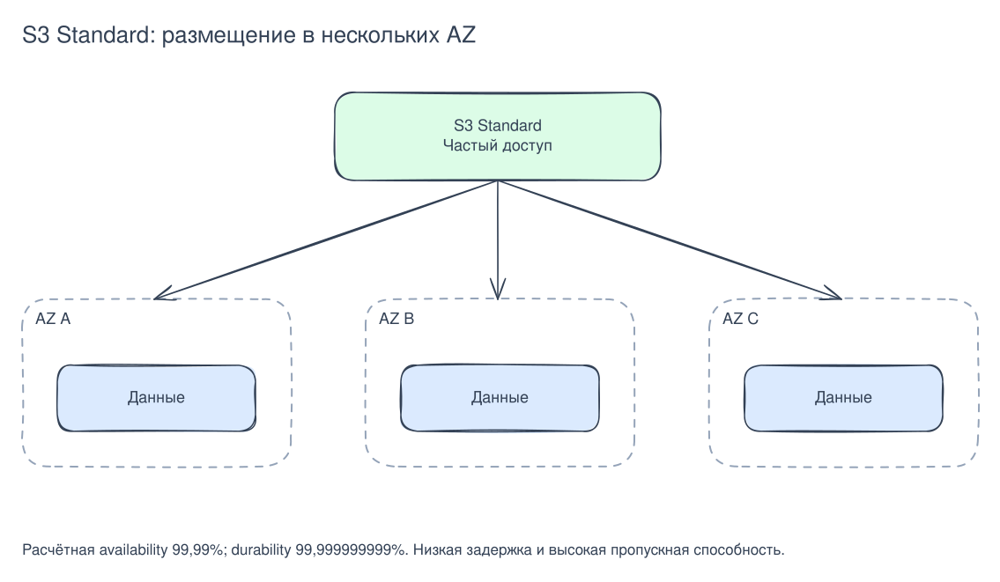

[Схема в Excalidraw](diagrams/s3-standard.excalidraw)

**Standard-IA** — редкий доступ с быстрым чтением; дешевле хранение, но оплачивается retrieval, расчётная доступность 99,9%. **One Zone-IA** хранит данные в одной AZ, расчётная доступность 99,5%; не защищает от потери всей зоны, поэтому подходит для восстанавливаемых данных.

**Durability** — вероятность сохранения данных, **availability** — доступность чтения/записи; это разные показатели.

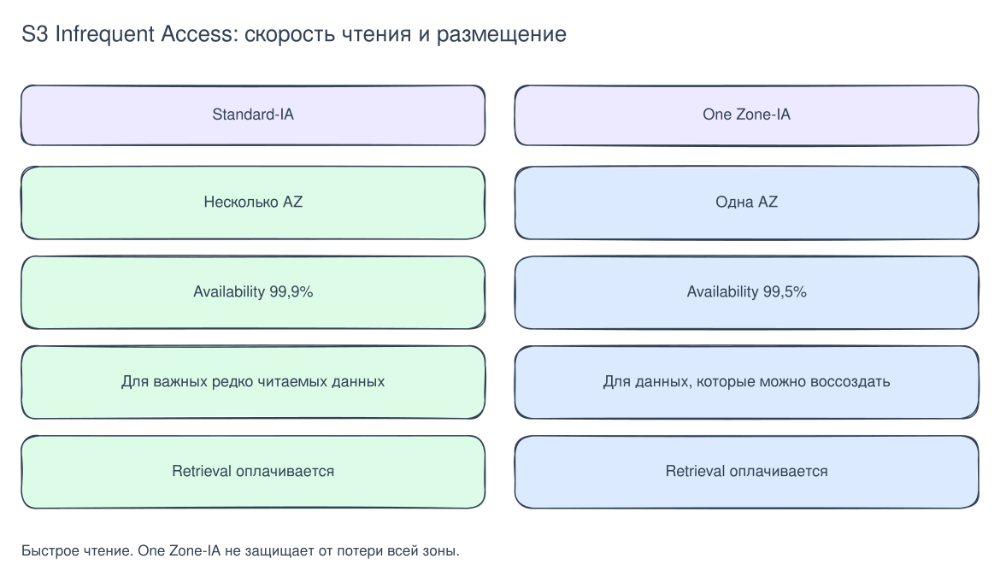

[Схема в Excalidraw](diagrams/s3-infrequent-access.excalidraw)

>## Чем отличаются классы S3 Glacier?

| Класс | Получение данных | Минимальный оплачиваемый срок хранения |
| --- | --- | --- |
| **Glacier Instant Retrieval** | Миллисекунды, редкий доступ. | 90 дней. |
| **Glacier Flexible Retrieval** | Expedited: 1–5 минут; Standard: 3–5 часов; Bulk: 5–12 часов. | 90 дней. |
| **Glacier Deep Archive** | Standard: около 12 часов; Bulk: около 48 часов. | 180 дней. |

Для Flexible Retrieval и Deep Archive перед чтением выполняют restore. Цена зависит от режима восстановления; класс выбирают по допустимому времени ожидания.

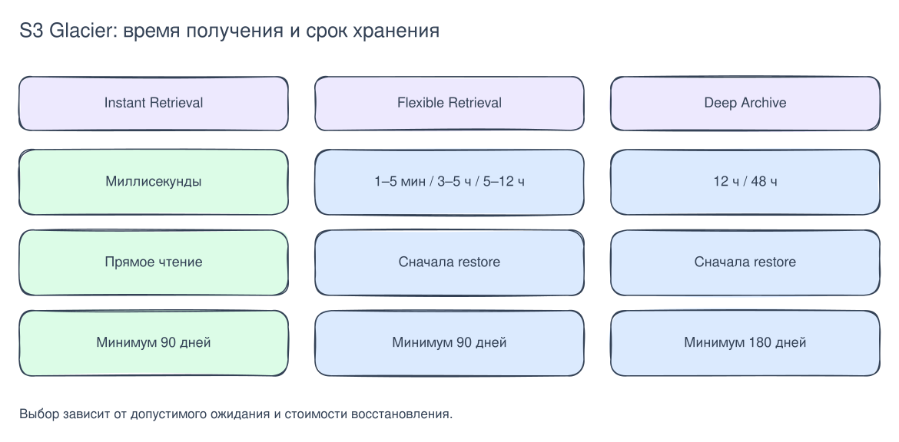

[Схема в Excalidraw](diagrams/s3-glacier.excalidraw)

>## Как работает S3 Intelligent-Tiering?

Автоматически переводит объекты между уровнями по фактическому доступу: **Frequent Access**, после 30 дней без доступа — **Infrequent Access**, после 90 — **Archive Instant Access**.

Можно включить архивные уровни **Archive Access** (от 90 дней) и **Deep Archive Access** (от 180 дней). Для них нужно восстановление перед чтением. Есть плата за мониторинг подходящих объектов; стандартные уровни не имеют платы за retrieval.

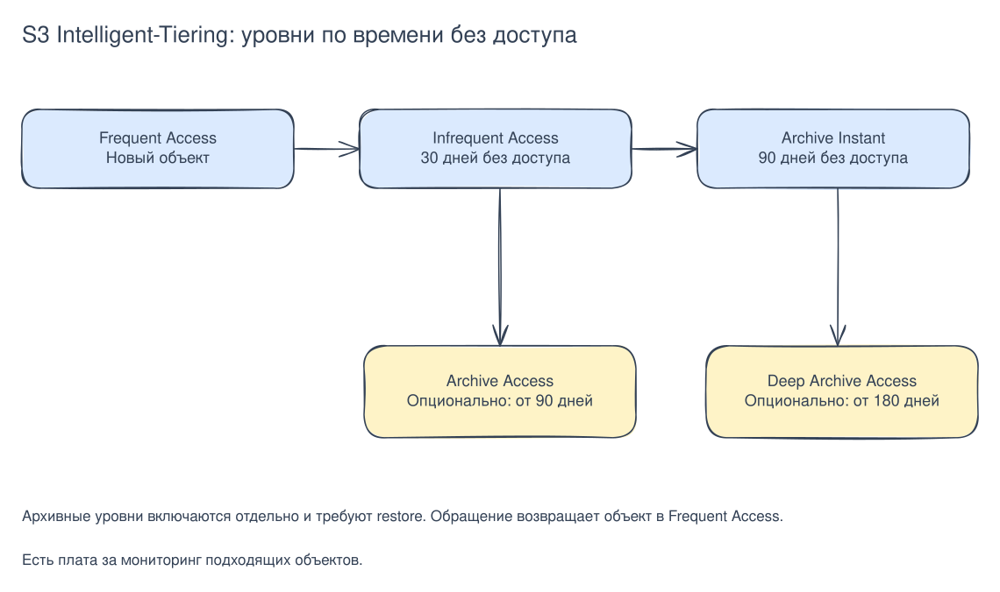

[Схема в Excalidraw](diagrams/s3-intelligent-tiering.excalidraw)

## События и производительность S3

>## Как реагировать на события S3?

**S3 Event Notifications** доставляют события в **SNS**, **SQS** или **Lambda**. Например: загрузка/удаление объекта, восстановление из архива и события репликации. Можно фильтровать по prefix/suffix ключа.

Обработчики должны учитывать возможные повторные события и быть идемпотентными.

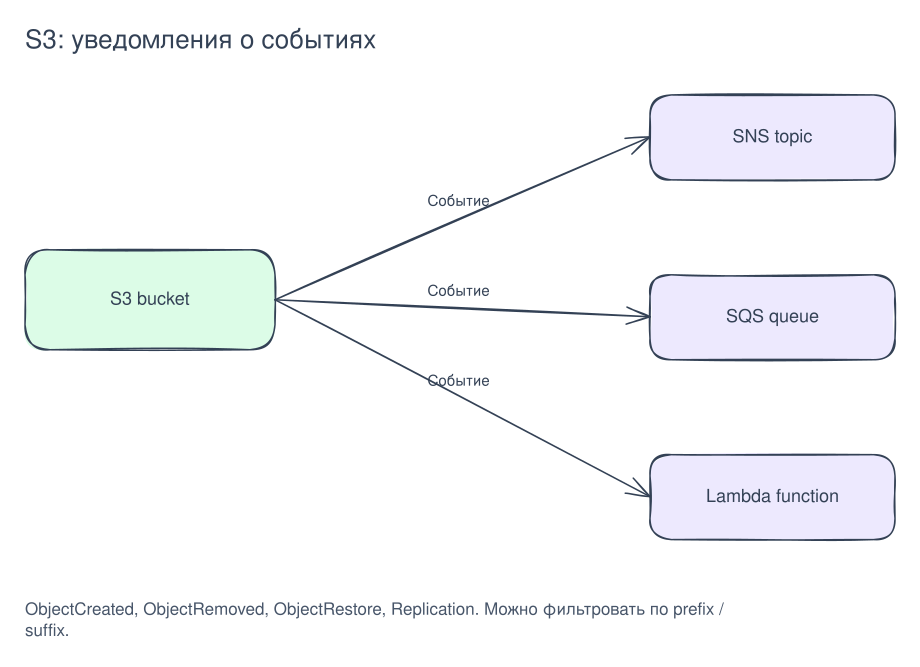

[Схема в Excalidraw](diagrams/s3-event-notifications.excalidraw)

>## От чего зависит производительность S3?

S3 масштабирует запросы: не менее 3500 операций записи (`PUT / COPY / POST / DELETE`) или 5500 чтений (`GET / HEAD`) в секунду на partitioned prefix. Несколько префиксов позволяют распараллелить нагрузку; рост производительности происходит постепенно.

Задержка зависит от операции и нагрузки; 100–200 мс — ориентир, а не гарантия для каждого запроса. При резком росте нагрузки возможен `503 Slow Down`, поэтому нужны retries.

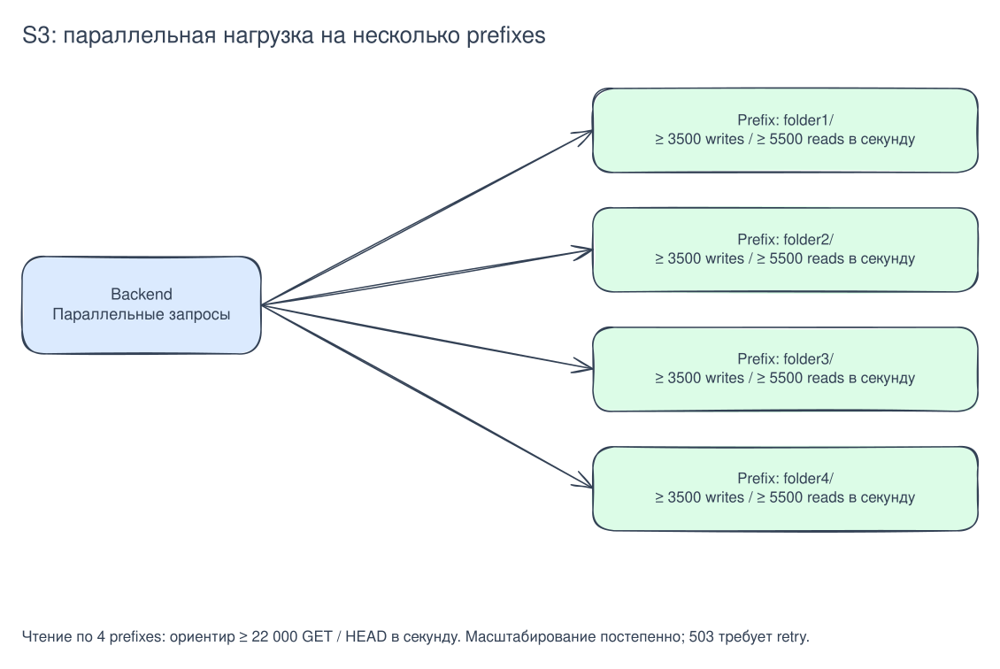

[Схема в Excalidraw](diagrams/s3-performance.excalidraw)

>## Для чего нужны Multipart Upload и Transfer Acceleration?

**Multipart Upload** разбивает файл на части: их можно загружать параллельно и повторять только неудачные части. Рекомендуется рассматривать с 100 MB, обязателен для объектов больше лимита одной операции PUT (5 GB).

**Transfer Acceleration** отправляет данные через ближайший AWS edge location и сеть AWS к S3 bucket. Полезен для клиентов далеко от региона bucket; совместим с multipart upload.

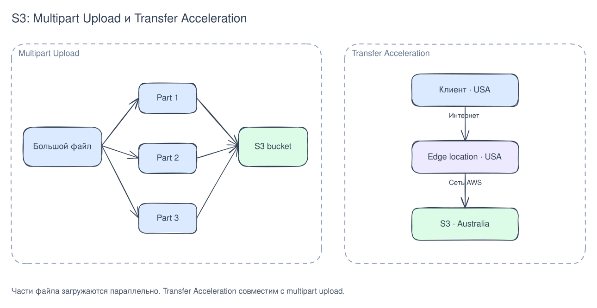

[Схема в Excalidraw](diagrams/s3-upload-performance.excalidraw)

>## Чем metadata отличаются от object tags и как искать по ним?

**User-defined metadata** передаются при загрузке в заголовках `x-amz-meta-*`; имена нормализуются в нижний регистр. **Object tags** — отдельные пары key/value, применимые для IAM-условий, lifecycle и аналитики; их можно менять без перезаписи содержимого объекта.

Обычный `ListObjects` не предоставляет поиск по произвольной metadata. Для своего индекса можно использовать DynamoDB. Также есть **S3 Metadata**: управляемые таблицы метаданных с запросами через Athena и другие аналитические инструменты. [Документация S3 Metadata](https://docs.aws.amazon.com/AmazonS3/latest/userguide/metadata-tables-configuring.html).

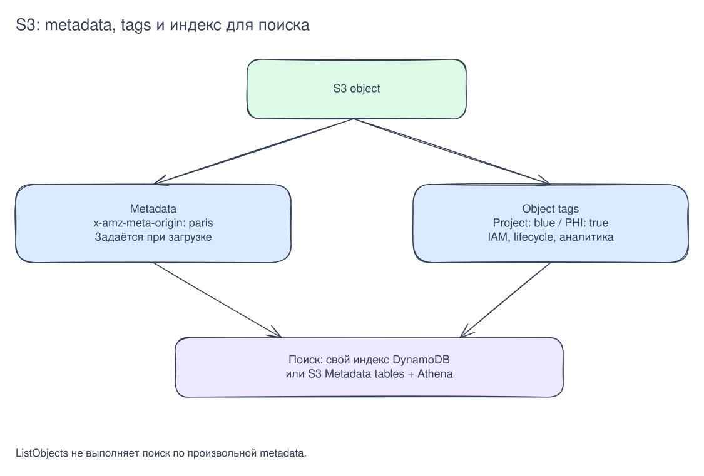

[Схема в Excalidraw](diagrams/s3-metadata-and-tags.excalidraw)

>## Для чего нужен S3 Presigned URL?

**Presigned URL** даёт временный доступ к конкретной операции с объектом от имени подписавшего principal. Подходит для скачивания приватного файла или прямой загрузки клиентом в S3 без выдачи AWS credentials.

В консоли срок — от 1 минуты до 12 часов; через CLI/SDK с долгосрочными credentials — до 7 дней. URL, подписанный временными credentials, истекает не позже самих credentials. Он не даёт больше прав, чем есть у подписавшей identity.

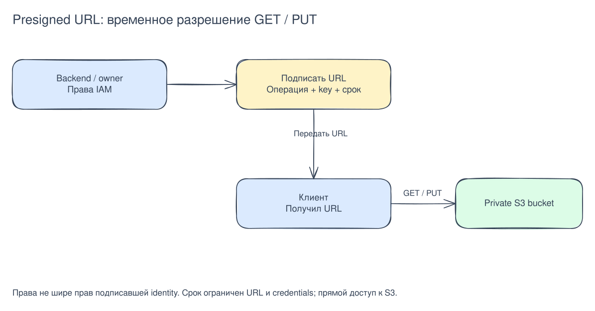

[Схема в Excalidraw](diagrams/s3-presigned-urls.excalidraw)

>## Почему S3 access logs нужно писать в отдельный bucket?

**Server Access Logging** записывает обращения к bucket для аудита и анализа. Если писать логи в тот же bucket, запись каждого лога создаёт новое событие для логирования — возникает цикл. Destination bucket должен быть отдельным, в том же регионе и аккаунте.

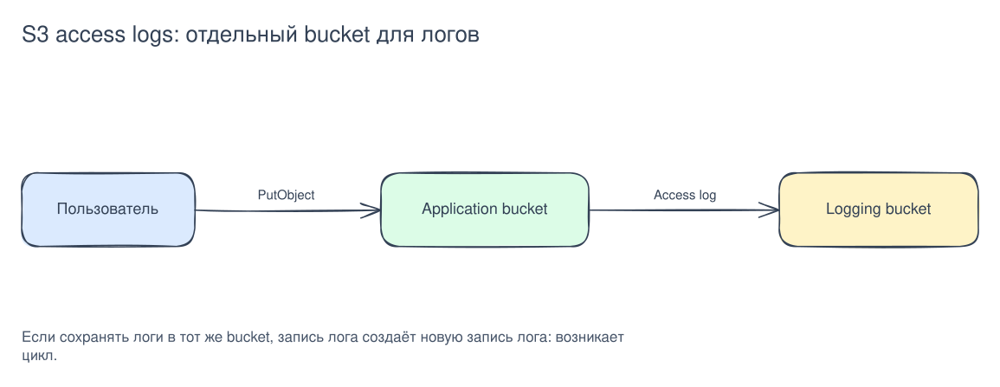

[Схема в Excalidraw](diagrams/s3-access-logs-loop.excalidraw)

>## Когда для S3 нужен CORS?

**CORS (Cross-Origin Resource Sharing)** нужен, когда браузерный JavaScript обращается к S3 с другого origin. Origin определяется схемой, hostname и портом. Правила задают разрешённые origins, методы и заголовки.

Для части запросов браузер сначала отправляет **preflight OPTIONS**, затем основной запрос. CORS определяет, может ли браузер отдать ответ JavaScript; не выдаёт S3-права и не заменяет IAM/bucket policy.

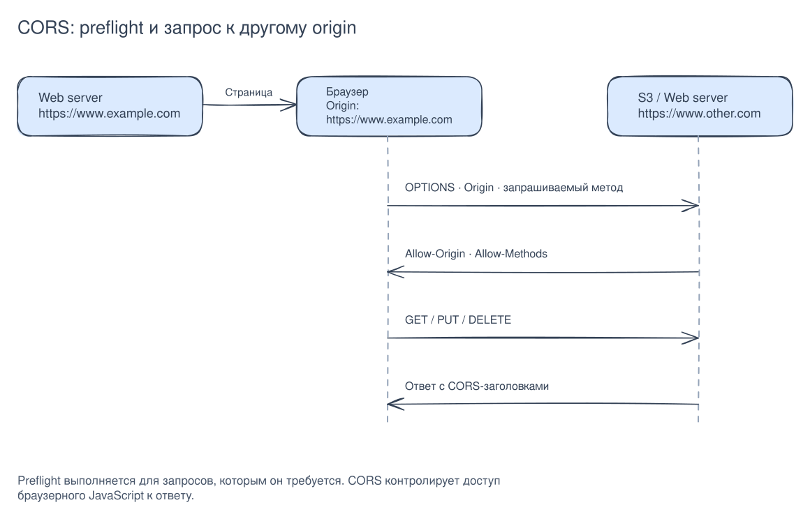

[Схема в Excalidraw](diagrams/s3-cors.excalidraw)

## Шифрование S3

>## Чем отличаются SSE-S3, SSE-KMS, SSE-C и client-side encryption?

**Server-Side Encryption (SSE)** выполняется на стороне S3; **client-side encryption** — до отправки данных.

- **SSE-S3** — ключами управляет S3, используется AES-256; базовое шифрование новых объектов включено по умолчанию. Для явного выбора: `x-amz-server-side-encryption: AES256`.
- **SSE-KMS** — ключами управляет KMS: контроль доступа к ключу и аудит через CloudTrail. Заголовок: `x-amz-server-side-encryption: aws:kms`; нужно учитывать KMS permissions и квоты.
- **SSE-C** — клиент передаёт ключ для шифрования/расшифровки в каждом соответствующем запросе по HTTPS; S3 не хранит сам ключ.
- **Client-side encryption** — клиент шифрует файл, управляет ключами и расшифровывает скачанные данные; S3 хранит шифротекст.

С апреля 2026 года **SSE-C отключён по умолчанию для новых general purpose buckets** и части существующих buckets. Для использования его нужно явно разрешить в настройках bucket. [Настройки безопасности S3](https://docs.aws.amazon.com/AmazonS3/latest/userguide/security.html).

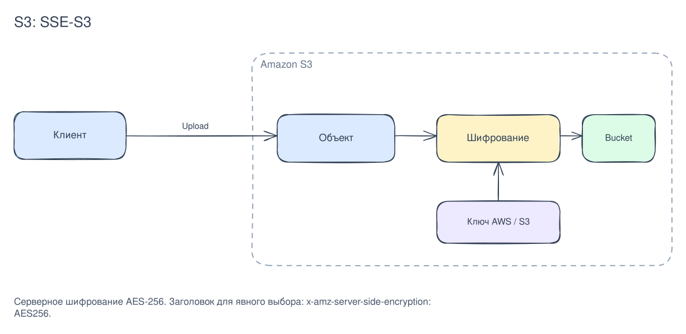

[Схема в Excalidraw](diagrams/s3-sse-s3.excalidraw)

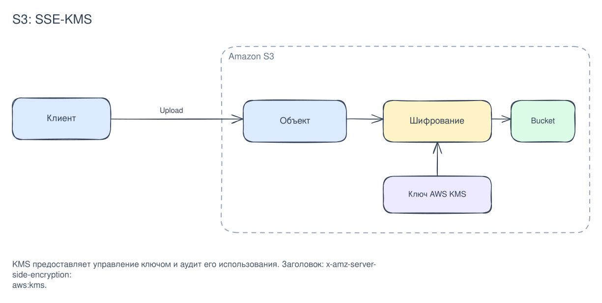

[Схема в Excalidraw](diagrams/s3-sse-kms.excalidraw)

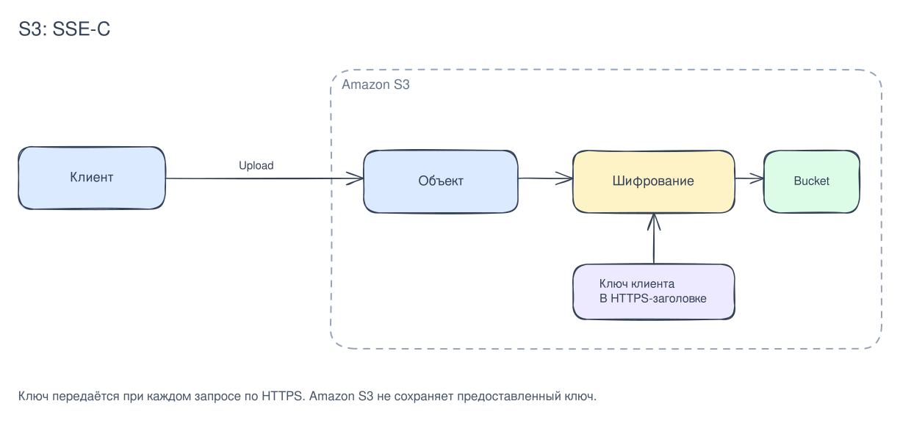

[Схема в Excalidraw](diagrams/s3-sse-c.excalidraw)

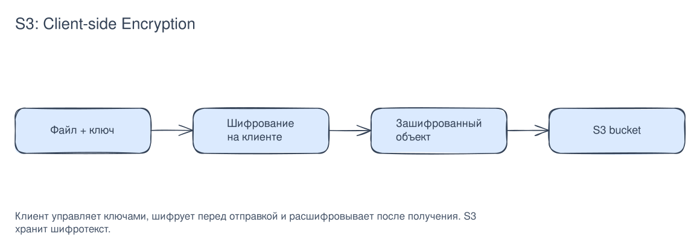

[Схема в Excalidraw](diagrams/s3-client-encryption.excalidraw)

## S3 Access Points

>## Какую проблему решают S3 Access Points?

**Access Point** — отдельная точка доступа к bucket со своим DNS-именем и policy. Упрощает права для разных приложений: finance получает доступ к `finance/`, sales — к `sales/`, analytics — только чтение.

Access Point policy и bucket policy должны быть согласованы; можно ограничить доступ через точку определённой VPC.

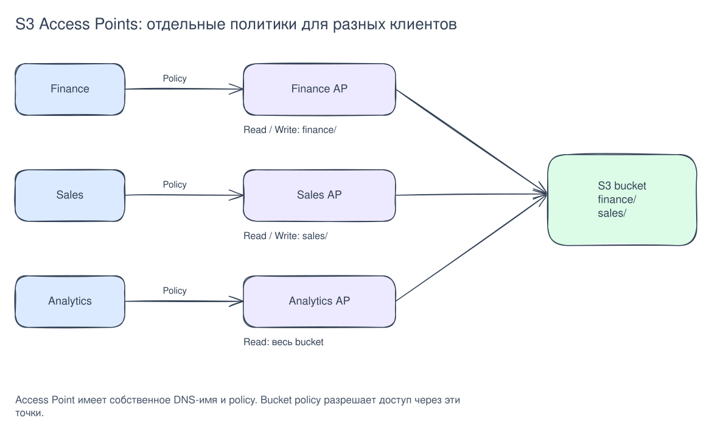

[Схема в Excalidraw](diagrams/s3-access-points.excalidraw)

>## Как настроить Access Point с доступом только из VPC?

Создать Access Point с **VPC origin**, а для соединения с S3 использовать **VPC endpoint**. Проверить IAM, endpoint policy, access point policy и bucket policy — ни одна не должна запрещать нужную операцию.

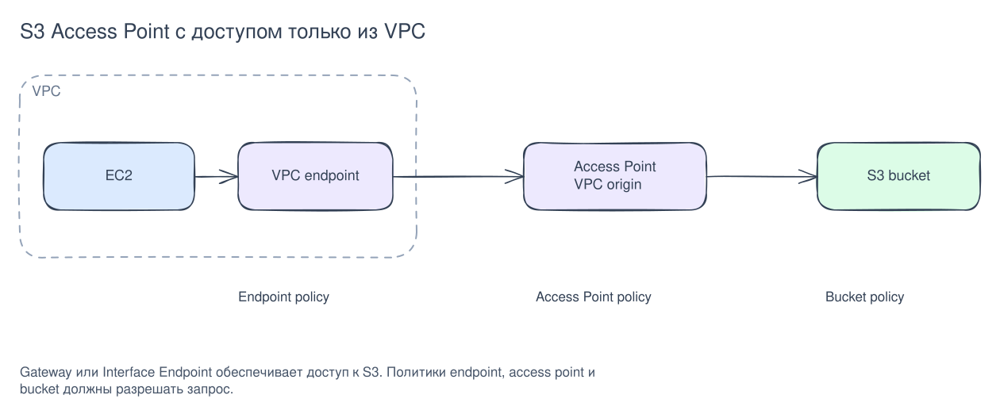

[Схема в Excalidraw](diagrams/s3-vpc-access-point.excalidraw)

>## Для чего предназначен S3 Object Lambda?

**S3 Object Lambda** добавляет Lambda-преобразование при получении объекта: скрытие персональных данных, преобразование XML в JSON, изменение изображения или watermark. Исходный объект в bucket не меняется.

С 7 ноября 2025 года сервис доступен только существующим пользователям Object Lambda и отдельным APN-партнёрам. Для нового проекта нужно учитывать это ограничение. [Изменение доступности Object Lambda](https://docs.aws.amazon.com/AmazonS3/latest/userguide/amazons3-ol-change.html).

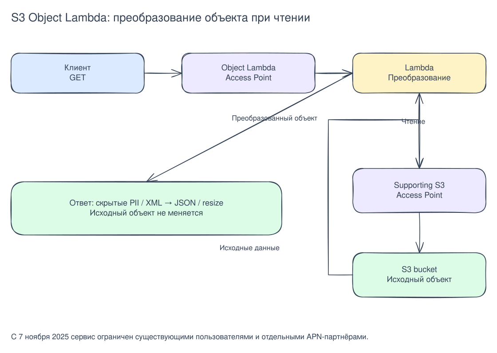

[Схема в Excalidraw](diagrams/s3-object-lambda.excalidraw)

## Лимиты и повторные запросы

>## Как обрабатывать throttling и временные ошибки AWS API?

**Exponential backoff** увеличивает паузу между попытками: например, 1, 2, 4, 8 единиц времени. **Jitter** добавляет случайность, чтобы множество клиентов не повторяло запросы одновременно. Нужны предел числа попыток и максимальная пауза.

AWS SDK содержит retry-механизмы. При прямых API-вызовах их реализуют в клиенте. Повторяют подходящие временные 5xx и throttling (включая 429 и некоторые service-specific ошибки с HTTP 400); обычные ошибки авторизации или неверного запроса не исправятся повтором. Для операций с побочными эффектами учитывают идемпотентность.

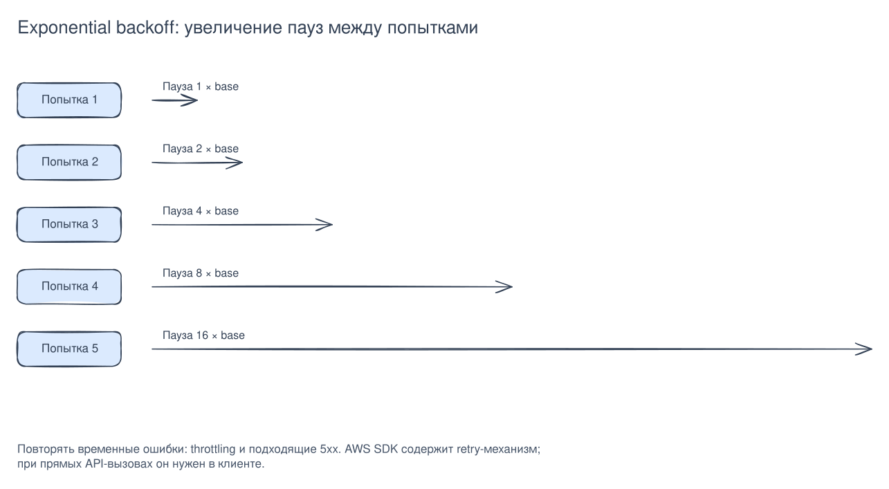

[Схема в Excalidraw](diagrams/aws-exponential-backoff.excalidraw)