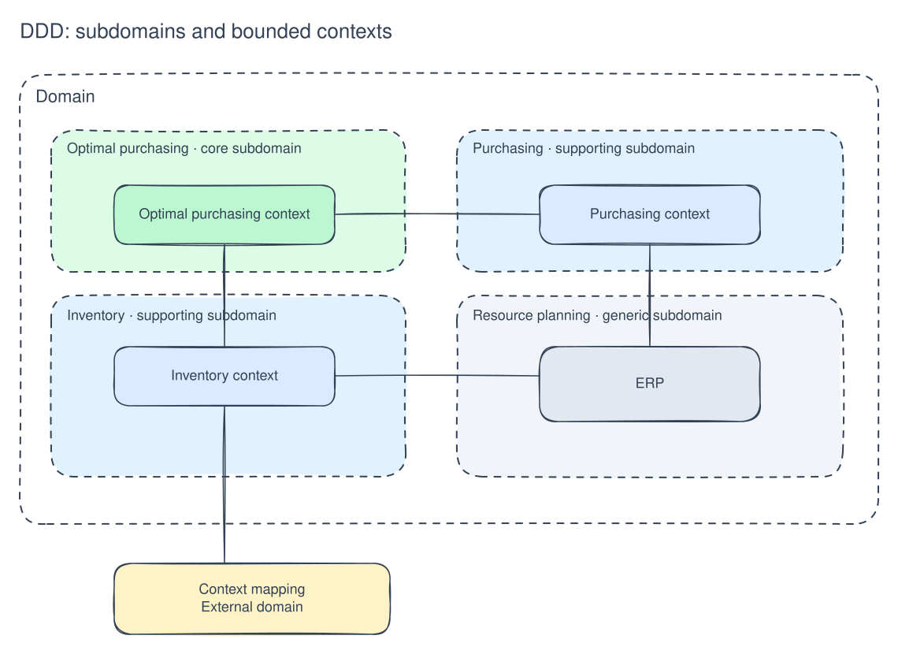
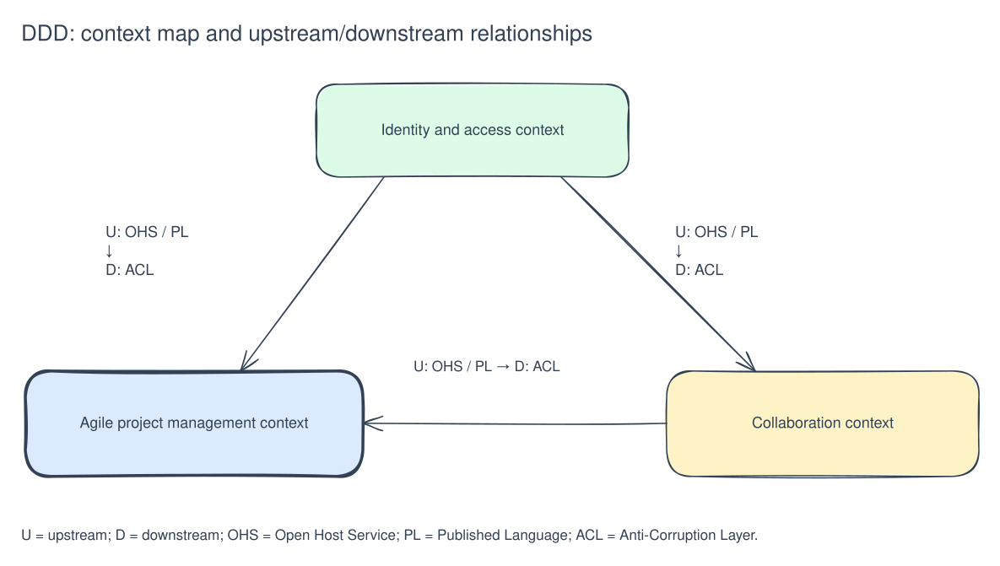
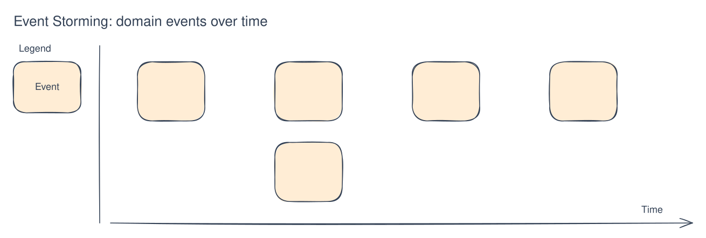
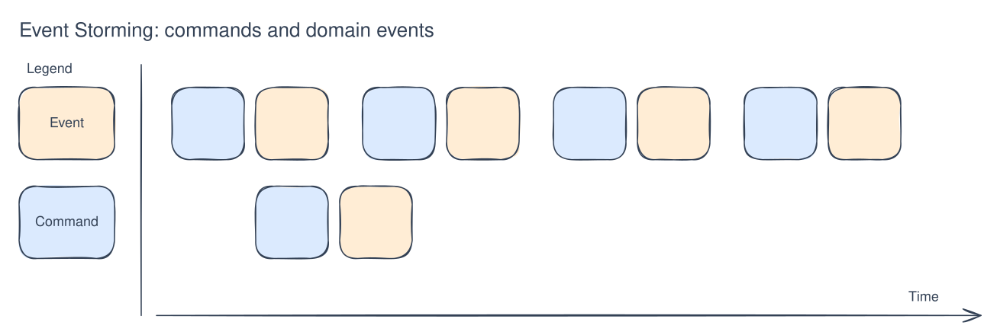

[Русский](ddd-strategic-modeling.md) | English

# Strategic modeling

The key concepts in strategic DDD modeling are bounded contexts, domains, subdomains, and context maps.

**Ubiquitous Language** — a carefully defined, consistent set of business terms shared by everyone participating in development.

For example, a video hosting service lets users create videos and leave comments. A user may appear to be a single concept, but here it exists in two contexts: commenter and creator, with substantially different business processes.

**Domain** — an area of interest or an area over which someone has control.

**Subdomain** — a division of a domain according to business concerns and tasks. There are three types:

- **Core subdomains** — the most important part of the business, which should remain under the control of the in-house team. For example, video playback on YouTube.
- **Supporting subdomains** — support the core domain, such as YouTube's recommendation system in this example.
- **Generic subdomains** — non-unique capabilities for which a solution can be purchased, such as billing or notifications.

**Bounded Context** — an explicit boundary dividing domain responsibilities according to business tasks. Each context has its own ubiquitous language, so terms are unambiguous within it. This is a useful check of whether the boundaries were drawn correctly.

The collection of bounded contexts and their relationships is a **context map**.

[Editable Excalidraw diagram](../images/ddd-strategic-modeling-1.en.excalidraw)

Relationships between contexts can take different forms:

- **Partnership** — two teams coordinate the evolution of their interfaces to meet both systems' needs. They jointly plan development and manage integration.
- **Shared Kernel** — a small shared portion of the model and related code. It has special status and should not change without consulting the teams.
- **Customer–Supplier** — an upstream/downstream relationship in which the upstream team's success depends on the downstream customer.
- **Conformist** — an upstream/downstream relationship in which the upstream team has no reason to accommodate the downstream team's needs.
- **Anti-Corruption Layer** — a translation layer that protects the downstream model. The downstream client isolates itself from the upstream system and exposes its capabilities in the terms of its own domain model.

[Editable Excalidraw diagram](../images/ddd-strategic-modeling-2.en.excalidraw)

U means upstream; D means downstream.

The core is shown in bold and is downstream of the other contexts.

- **Open Host Service** — a protocol exposing access to a system as a set of services.
- **Published Language** — a shared language for exchanging information between two bounded-context models.
- **Separate Ways** — no significant relationship exists between two capabilities, so integration can be omitted entirely.
- **Big Ball of Mud** — parts of the system where models are mixed and boundaries have disappeared.

Keep the number of physical connections between contexts small so their boundaries remain clear.

---

**What should this domain modeling achieve?**

- A more structured understanding of the domain and its parts.
- Identification of the system's most important capabilities to guide budget and effort, including buying or outsourcing non-core parts.
- Independent work within bounded contexts without requiring every team to understand the rest of the system.

## How do you model a system?

### Event storming

Event storming is a popular approach to domain modeling. The following process uses an online store as an example:

1. Technical and business specialists attend a session together. They arrange business **events chronologically**, clarify their meaning, and challenge assumptions about how the business works.

Example events:

- A user creates an order.
- A user adds a product.
- A user selects a payment method.
- An administrator processes an order.
- An order is delivered.

[Editable Excalidraw diagram](../images/ddd-strategic-modeling-3.en.excalidraw)

1. Add **commands** to the events: these initiate an action or event processing. A command usually originates outside the system, for example from a user.

- Create an order.
- Add a product to an order.
- Select a payment method.
- Process an order.
- Cancel an order.

[Editable Excalidraw diagram](../images/ddd-strategic-modeling-4.en.excalidraw)

1. Add other types of sticky notes:

- **Policy** — a rule for handling an event in a particular context.
  - An order total cannot be negative.
  - An order cannot be created without products.
  - An order must be delivered by a specified deadline.
- **External system** — an external system or service with which we interact.
  - An external payment system.
  - A shipping system.
- **Role** — describes participants' roles and the commands they can execute.

Other types of notes may be used, but these are the main ones.

1. Group the identified notes into **aggregates**: related entities that change together within a logical boundary. An aggregate has its own state and behavior and encapsulates related entities and operations. In this example, Order is an aggregate.
2. Define **bounded-context** boundaries through careful domain analysis, team discussion, and ongoing refactoring. Assign each note to a context.
   The following checks help establish and validate the boundaries:

   - Terms within a context do not contradict each other; their meanings are unambiguous, indicating a useful ubiquitous language.
   - Contexts are as independent as possible, with few connections, so separate teams can develop them.
   - Classify a context's subdomain as core, supporting, or generic. If it appears to cover several types at once, reconsider the boundaries.
