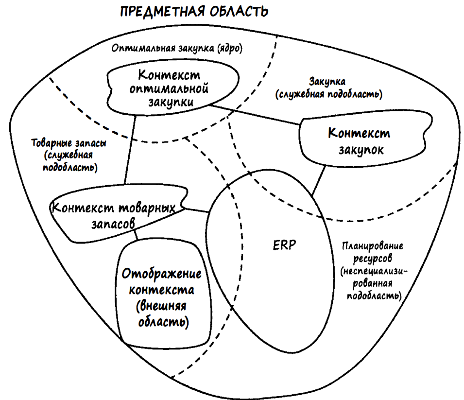
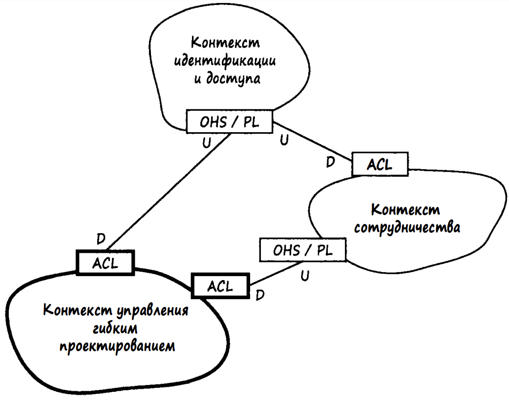
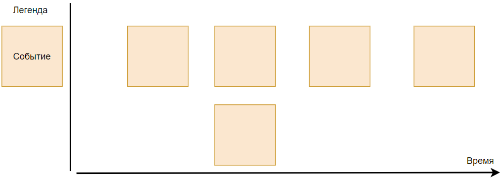
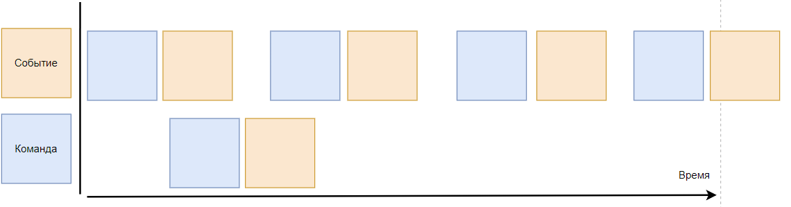

# Стратегическое моделирование

Самые важные понятие при стратегическом моделирование в DDD - это ограниченные контексты(Bounded Context), доменные область и подобласть(Domain, subdomain) и карты контекстов.

**Единый язык** (Ubiquitous Language) - выверенный набор непротиворечивых терминов из бизнес области, на котором общаются люди, принимающие частие в процессе разработки.

В какой ситуации это может быть полезно: у вас есть видеохостинг, где пользователи могут создавать и коментировать видеоролики. Вохможно вам покажется, что понятие пользователя здесь однозначно, но нас самом деле это не так. Пользователь здесь представлен в двух контекстах, как комментатор и как создатель и их бизнес процессы будут сильно отличаться.

**Домен** - область интересов или область, над которой человек имеет контроль.

**Доменная подобласть** - показывает разбиение домена с точки зрения бизнеса и его задач. Она может быть трех типов:

- Смысловое ядро (Core subdomains) - самая важная часть бизнеса, то что должно находится под контролем собственной команды. Например просмотр видеороликов в YouTube.
- Предметные подобласти (Supportive subdomains) - спомогательные домены для смыслового ядра. Например рекомендательная система YouTube.
- Служебные подобласти (Generic subdomains)  - такая подобласть, которая не является уникальной и её решение можно купить. Например выставление счетов или отправка уведомлений.

**Ограниченный контекст** - это явная граница, которая разделяет ответственности в домене на составние части с точки зрения решения бизнес задач. Каждый ограниченный контекст имеет свой единый язык, это означает, что терминология не имеет двухсмысленности в рамках одного конекста, это можно использовать, как проверку правильно установленных границ.

Совокупность ограниченных контекстов и свзяей между ними называется **картой контекстов**.

Связи между контекстами могут быть по разному устроены:

- Партнертсво (Partnership) - когда команды в двух контекстах должны сотрудничать в процессе эволюции своих интерфейсов, чтобы учитывать потребности обеих систем. Они устанавливают процесс координированного планирования разработки и совместного управления интеграцией.
- Общее ядро (Shared kernel) - общая часть модели и связанного с ней кода. Ядро должно быть маленьким. Оно имеет особый статус и не должно изменяться без консультаций с командами.
- Заказчик-поставщик (Customer-Supplier) - когда две команды находятся в отношении "нижестоящий-вышестоящий', причем успех вышестоящей команды зависит от нижестоящей команды.
- Конформист (Conformist) - когда две команды находятся в отношении "вышестоящий-нижестоящий': причем вышестоящая команда не имеет причин учитывать потребности нижестоящей команды.
- Предохранительный уровень (Anticorruption layer) - трансляция явлется сложной - уровень трансляции усиливает защиту. Нижестоящий клиент должен создать изолирующий слой, чтобы обеспечить свою систему функциональной возможностью вышестоящей системы в терминах своей модели предметной области.

U - вышестоящий, а D - нижестоящий.

Ядро выделено жирным и является нижестояжщим контекстом по отношению к остальным.

- Служба с открытым протоколом (Open host service)  - протокол, предоставляющий доступ к вашей системе, как к набору служб.
- Общедоступный язык (Published language) - общий язык требующийся между моделями двух ограниченных контекстов.
- Отдельное существование (Separate ways) - когда между двумя наборами функциональных возможностей нет важного отношения и его можно полностью исключить.
- Большой комок грязи (Big ball of mud) - счасти системы, в которых модели перемешаны, а границы стерты.

Но важно придерживаться минимального кол-ва физических связей между контекстами, чтобы их границы не размывались.

---

**Чего мы должны достигнуть таким моделированием домена?**

- Более структурированное представление о домене и его частях
- Выделение главных частей системы, над остальными, что может помочь с распределением бюджета, сил, приятия решения о покупке или отдаче на outsource не основных частей системы.
- Возможность работы различных команд в своем ограниченном контексте, не загружая их дополнительной информацией об остальных.

## Как все же смоделировать систему?

### Event storming

Это один из самых популярных способов моделирования доменной области, далее описан его процесс на примере интернет-магизина:

1. На сессию приходят и технические и бизнес-специалисты. Вместе они размещают происходящие в бизнесе **события в хронологическом порядке**, попутно уточняя их смысл и избавляясь от предположений о происходящем в бизнесе.

Примеры событий:

- Пользователь создает заказ
- Пользователь добавляет товар
- Пользователь выбирает способ оплаты
- Администратор обрабатывает заказ
- Заказ доставлен

1. Затем к этим событиям мы приписываем **команды** - это то, что запускает действие или обработку события. Команда обычно идет от внешнего источника, такого как пользователь.

- Создать заказ
- Добавить товар в заказ
- Выбрать способ оплаты
- Обработать заказ
- Отменить заказ

1. Далее мы можем дополнить модель и другими видами стикеров:

- **Политика (Policy)** - это правило, которое указывает, как обрабатывать определенное событие в определенном контексте.
  - Сумма заказа не может быть меньше нуля
  - Заказ не может быть создан без товаров
  - Заказ должен быть доставлен до определенного срока
- **Внешняя система** - внешняя система или сервис, с которыми мы взаимодействуем.
  - Внешняя система оплаты
  - Система отгрузки товаров
- **Роль (Role)** - в описывает роли, которые играют участники в системе, какие команды они могут выполнять.

На этом этапе могут быть и другие виды стикеров, но это основные.

1. Далее относим каждый из ранее выделенных стрикеров в **агрегаты** - это абстракция представляющая собой группу связанных сущностей, которые могут изменяться только в рамках этой группы. Это собая логическая единица, которая имеет своё состояние и поведение, а также инкапсулирует связанные между собой сущности и операции над ними. Исходя из придыдущих примеров стикеров можно выделить агрегат Заказ.
2. Далее определение границ **ограниченных контекстов** - это процесс, который требует внимательного анализа предметной области, обсуждения с командой проекта и необходимости постоянного рефакторинга. В нем каждый из стикеров будет определен в свой контекст.
   Вот несколько  приемов помогающих определить эти границы или проверить насколько верно они были проведены:

   - В ограниченном контексте нету противоречывых терминов, все определенно однозначно, т.е. у вас получился хорошый единый язык.
   - Контексты получились максимально независимые друг от друга, с минимальных кол-во связей. Их легко будет разрабатывать независимыми командами.
   - Так же с проверкой границ может помочь определение к какому виду подобласти (core, supportive, generic) он относится. Если складывается ощущение, что сразу к нескольким, то возможно стоит пересмотреть границы.
