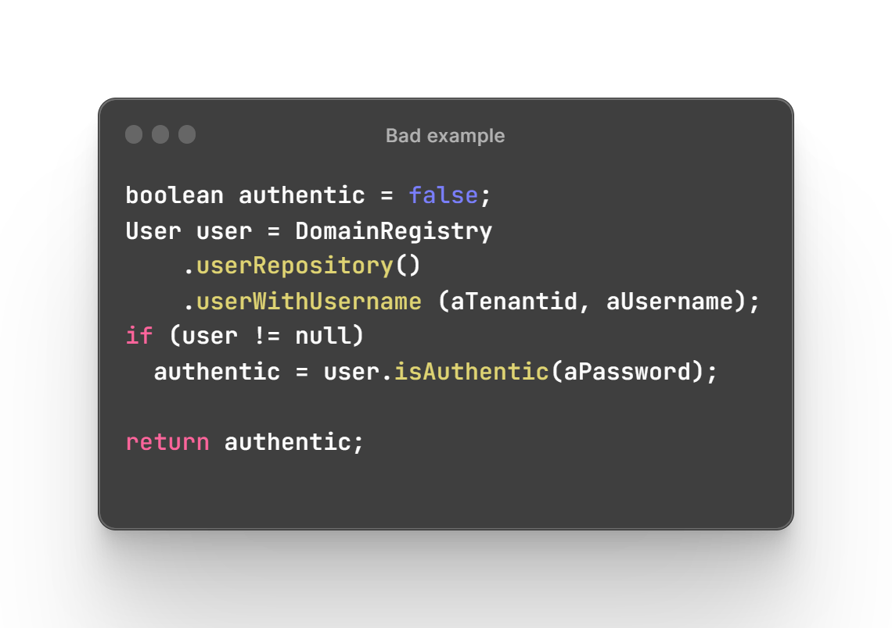
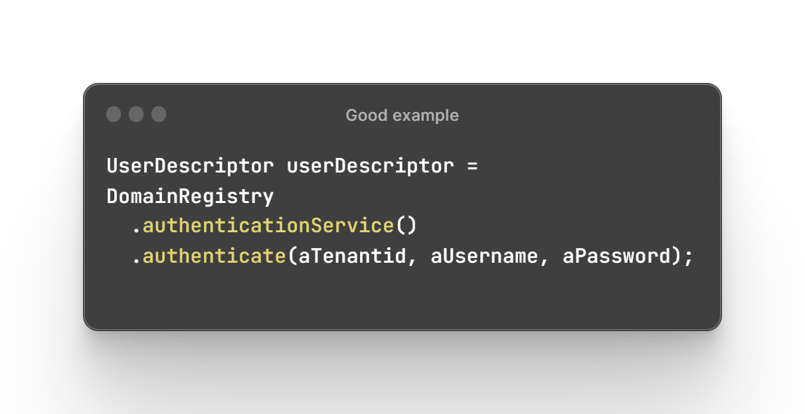

[Русский](ddd-tactical-modeling.md) | English

# Tactical modeling

Tactical modeling concerns code organization. Its main abstractions are entities, value objects, aggregates, events, services, and repositories. In DDD, these are called tactical patterns.

## Entity

Probably the most widely used pattern, including outside DDD. **An entity is an object distinguished by a unique identifier through which it is accessed.** It typically changes over a long lifetime.

**Example**: products added to an order in an online store can be entities. A product may have a GUID identifier, while its price changes over time.

## Value Object

This pattern is less common and often overshadowed by entities. **A value object represents a value or concept, has no identity of its own, and is immutable.**

**Example**: package dimensions in an online store, containing width, height, and length.

## Domain Service

**A stateless set of operations that performs a specific domain task.**

Domain services contain business logic that does not naturally belong to an *entity or value object*. Moving too much logic into services produces *anemic domain models*.

**Example**: the two illustrations below place authentication logic in a model and in a service. The first violates the User model's SRP and mixes business logic with substantial infrastructure code.

## Domain Events

**The result of a command that matters to other system components.** This resembles the Observer pattern: a publisher emits an event, and subscribers wait for and handle it. Existing tools such as RabbitMQ are commonly used for this communication.

Although an event belongs to a particular *bounded context*, other contexts may react to its publication.

**Example**: a command that creates an order publishes an event. The payment system subscribes and creates a request to pay for the order.

## **BELOW IN PROGRESS**

## Aggregates

When studying a use case or user story, ask whether keeping the data consistent is part of the user's task. 
If it is, try to make the operation transactionally consistent without violating the other aggregate rules.

When can you depart from the rule that one transaction changes one aggregate?

- User-interface convenience: one user action may change several aggregates. Updates through domain events may be delayed, leaving inconsistent UI data that may be unacceptable.
- Missing technical mechanisms —
- Global transactions —
- Query performance: optimization may require direct references between aggregates and access through those references within one transaction.

Principles that help design aggregates:

- Law of Demeter: a method should call methods only on its own object, its parameters, objects it creates, and objects to which it has direct access.
- **Tell, Don't Ask**: tell an object what to do rather than querying its state to perform the action elsewhere.
