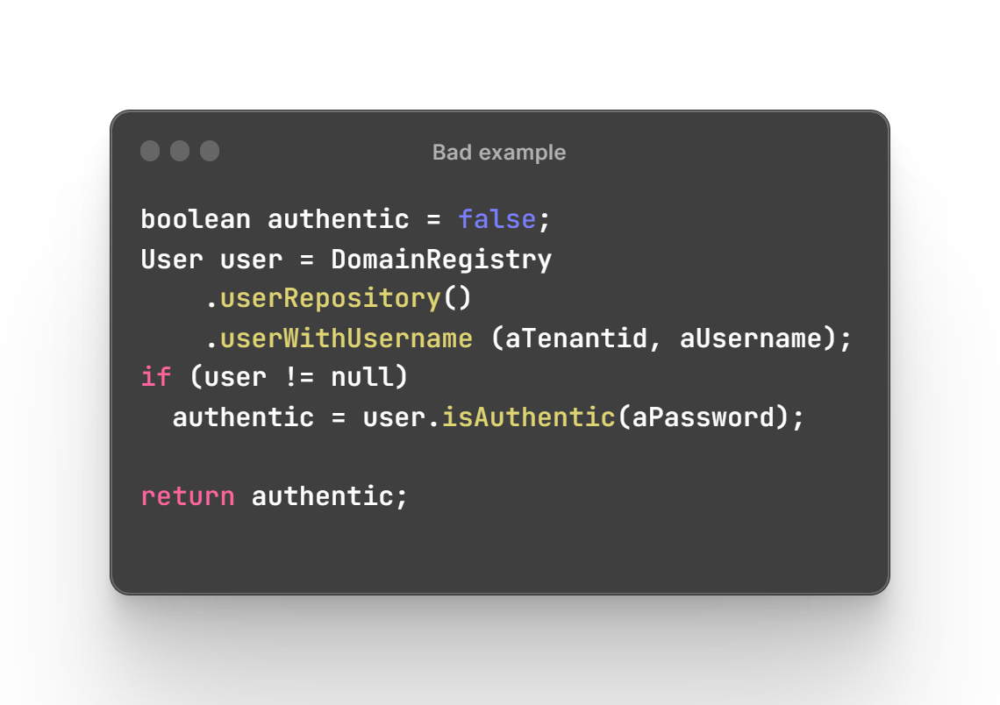
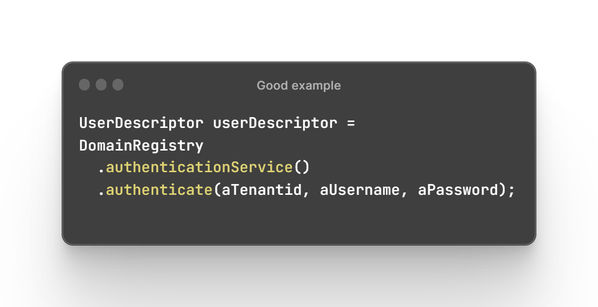

# Тактическое моделирование

Как и было сказано ранее тактическое моделирование про организацию кода. Для его организации используются различные абстракции, вот основные сущность, объекты-значения, агрегаты, события, сервисы и хранилища, в терминах DDD они зовутся тактическими шаблонами.

## Сущность (Entity)

Это пожалуй самый популярный шаблон, используемый и за пределами DDD. **По своей сути представляет из себя объект, главным отличительным свойством которого является уникальный идентификатор, по которому мы имеем к нему доступ**. При этом как правило он неприрывно изменяется в течении длительного времени.

**Пример**: в онлайн магазине,  сущностью могут быть товары, которые помещаются в заказ. Для него индетификатором может быть GUID и его цена может менятся со временем.

## Объект-значение (Value Object)

Этот шаблон менее поупулярен и часто остается в тени Сущности. **Это объект, который представляет собой некоторое значение или концепцию, не имеющую собственной идентичности и являющуюся неизменяемой.**

**Пример**: в онлайн магазине, объектом-значений может быть габариты груза, это будет объект, который содержит три поля - ширина, высота и длинна.

## Служба предметной области (Domain Service)

**Это на набор операций, не имеющих собственного состояния и выполняющие специфичное задание из предметной области.**

В такие службы попадает та бизнес логика, которая не может быть помещена в *сущность или объект-значения.* Но не стоит усердствовать с вынесением логики в сервисы, иначе у вас будут *анемичные модели предметной области*.

**Пример**: ниже два варианта реализации с помещением логики аутентификации в модель и в сервис. Первый вариант плох потому, что у модели User нарушается SRP, а еще бизнес логика содержит много инфраструктурного кода.

## События предметной области (Domain Events)

**Это результат выполнения команды, имеющий значение для других компонентов системы.** Принцип работы похож на паттерн Наблюдатель(Observer), где у вас есть кто-то, публикующий событие, и есть подписчики, которые ожидают и обрабатывают его. Обычно для  реализации такого взаимодействия импользуют уже готовые решения, например RabbitMQ.

Так важно упомянуть о том, что хоть и событие находится в своем *ограниченном контексте*, реакция на его публикацию может происходит и в других контекстах.

**Пример**: Команда создания заказа может публиковать об этом событие, подписчиком которого будет система оплаты, которая будет создавать запрос об небходимости внести деньги за заказ.

## **BELOW IN PROGRESS**

## Агрегаты

При исследовании сценария или истории использования спрашивайте, является ли это заданием пользователя, выполняющего сценарий 
использования, чтобы сделать данные согласованными. Если да, попытайтесь сделать его транзакционно согласованным, но не нарушайте другие правила работы с АГРЕГАТАМИ.

Когда можно отойти от правила одна транзакция = именение одного агрегата:

- Удобство пользовательского интерфейса - иногда одно пользовательское действие может менять сразу несколько агрегатов, из-за чего агрегаты обновляемые доменными событиями могут сделать это с задержкой и на UI данные разойдутся, что может быть не приемлимо.
- Отсутствие технических механизмов -
- Глобальные транзакции -
- Произваодительность запросов - для оптимизации запросов могут понадобится прямые ссылки между агрегатами и обращение по ним в рамках одной транзакции.

Принципы помогающие проектировать агрегаты.

- Закон Деметры: любой метод любого объекта может вызывать методы только из следующих объектов: из своего объекта; из переданных ему параметров; из любого созданного им объекта; из автономных объектов, к которым у него есть прямой доступ.
- Принцип совмещения данных и поведения(TELL, DON’T ASK) - принцип требует говорить, что нужно делать объекту, а не спрашивать его состояния ради действия.
