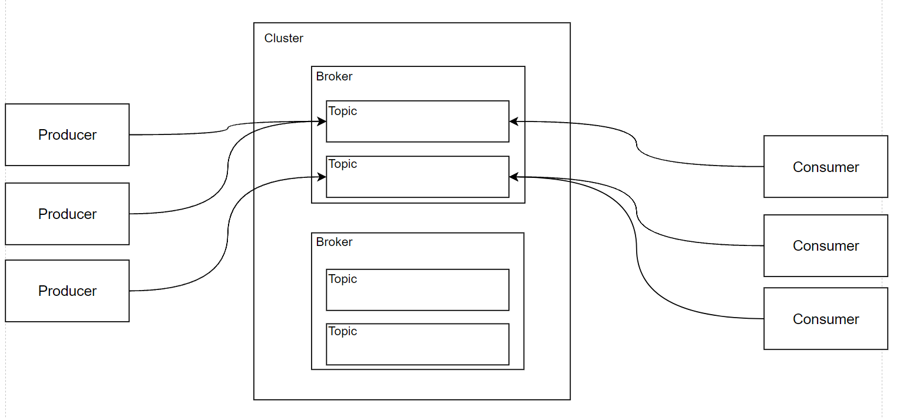
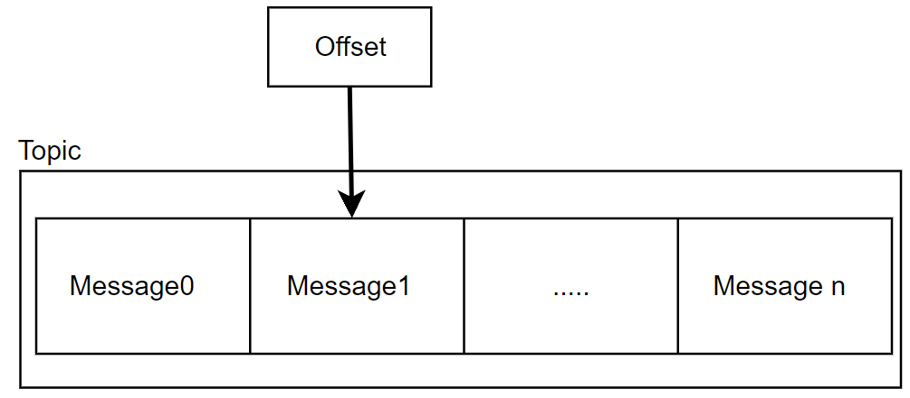
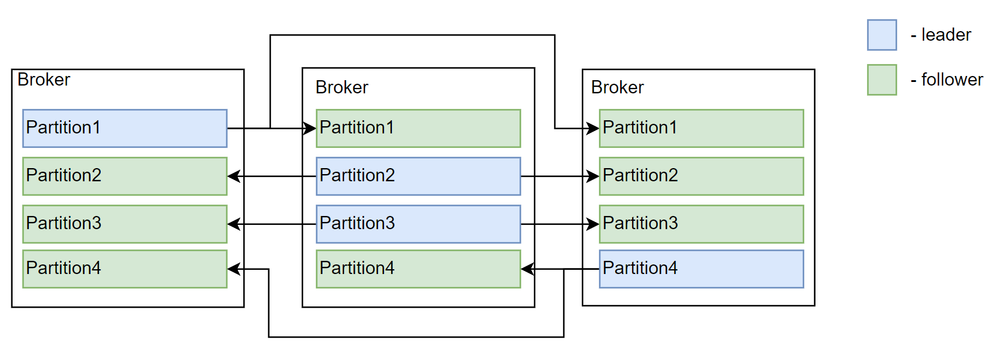

[Русский](kafka.md) | English

# Kafka

## Overall architecture



## Topic structure

**Segment** — a storage unit in Kafka containing a set of messages.

**Offset** — a position identifying a consumer's progress in reading messages.



## Parallel consumption

**Partition** — a unit of consumption parallelism: a subset of messages in a topic.<br>
**Messages** with the same key are sent to the same partition, distributing load while preserving their order.

**Partition selection can be based on:**

- A key: messages with the same key go to one partition, preserving their consumption order.
- Random selection: the message is assigned to a partition without a specific key.

Each partition has a leader on one broker and follower replicas on other brokers.<br>
The leader replicates data to the followers. Writes and reads go through the leader; followers hold replicated data.<br>
Leader reassignment occurs automatically after failure.



## Producer

**Producer acknowledgement options:**

- None — no delivery acknowledgement.
- Leader — acknowledgement after the leader receives the message.
- All — acknowledgement after replication to the required in-sync replicas. An unavailable required replica can cause a producer error.<br>
  **min.insync.replicas** configures the minimum number of in-sync replicas required for this guarantee.

**Performance** — a tradeoff between low delivery latency and high throughput.

**Producer batching settings:**

- BatchSize — total event size.
- BatchNumMessages — number of events.
- LingerMs — how long to wait for additional messages.

## Consumer (ADD DELIVERY GUARANTEES)

**Consumer Groups** distribute consumption across consumers.<br>
Each consumer in a group reads a distinct subset of partitions, allowing consumption to scale and balancing the load.

**Processing guarantees:**

- Mostly once

```csharp
ConsumeResult<string, string> result = consumer.Consume();
if(result != null)
{
	consumer.Commit(result);
	Process(result)
}
```

- At least once

```csharp
ConsumeResult<string, string> result = consumer.Consume();
if(result != null)
{
	var isSuccess = Process(result);
	if(isSuccess)
		consumer.Commit(result);
}
```

**Performance:**

- One commit per message, as in the examples above.
- One commit per N messages — higher throughput.
  ```csharp
  // EnableAutoCommit = true
  // AutoCommitIntervalMs = 5000;
  ConsumeResult<string, string> result = consumer.Consume();
  if(result != null)
  {
  	Process(result)
  	consumer.StoreOffset(result); // Or EnableAutoOffsetStore = true: automatically store the offset after consumption
  }
  ```

## Advantages

- Persistent data stored on disk.
- High throughput and efficient network processing.
- Independent processing pipelines.
- Ability to replay events.
- Flexible usage thanks to a simple model.

## Limitations

- Delayed messages.
- Dead-letter queues.
- AMQP / MQTT.
- Priority queues.
