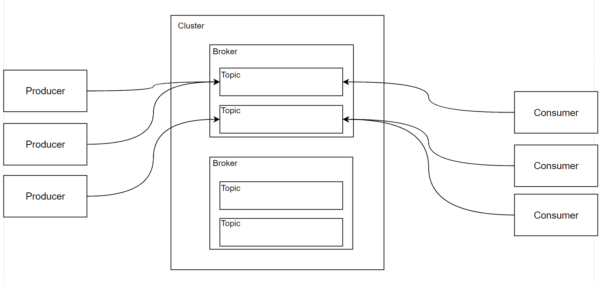
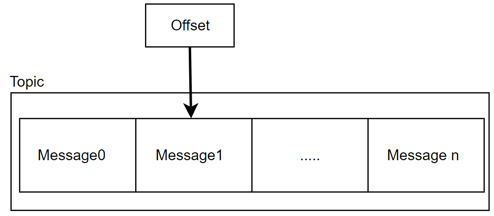
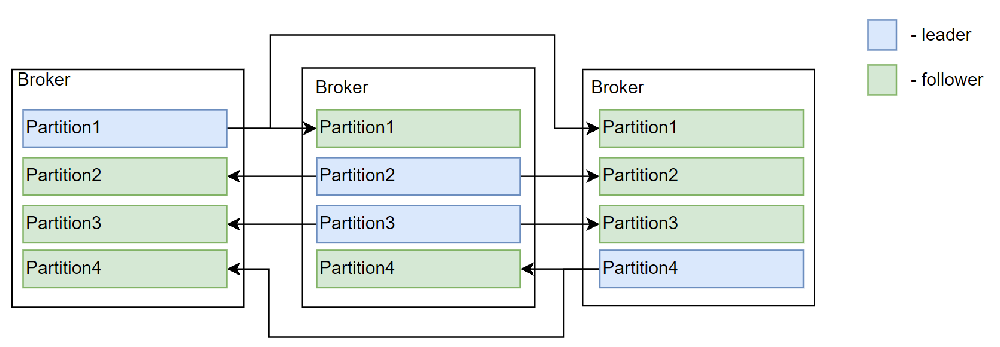

# Kafka

## Общая архитектурная схема



## Устройство топиков

**Сегмент** - эдиница хранения данных в кафка, набор сообщений.

**Офсет** -  указатель последнее на сообщение, которое прочитал консьюмер.



## Параллелизация чтения

**Партиция** - единица паралеллизации на чтение(подмножество сообщений из топика).<br>
**Сообщения** с одним и тем же ключом всегда будут отправлены в одну и ту же партицию. Таким образом можно распределить нагрузку между партициями, а так же упорядочить сообщения.

**Это подмножество определяется:**

- по ключу - все сообщения попадут в одну партцию и соответственно для них будет гарантирована верная последовательность при вычитке.
- случайно - партиция для сообщения определятся случайно.

У каждой партиции есть leader на одном из брокеров, на остальных брокерах эта партиция follower.<br>
Leader партиция реплицирует данные в follower партиции. Следовательно в leader данные пишуться и читаются, в follower только читаются.<br>
Балансировка лидеров происходит автоматически, при падении партиции.



## Producer

**Вариции доставки данных по партициям:**

- None - нету гарантии доставки.
- Leader - сообщение будет доставлено лидеру.
- All - сообщение будет доставлено лидеру, и реплицировано на фоловеров, если даже один из фоловеров будет не доступен, то от продюсера будет возвращена ошибка.<br>
  Этого можно избежать сконфигурировав параметр **min.insync.repicas**, он настраивает минимальное кол-во партиций, в которых будет гарантироваться находение сообщения.

**Производительность** - низкая задержка на доставку или высокая пропускная способность.

**Настройки отправки событий:**

- BatchSize - совокупный размер событий.
- BatchNumMessages - кол-во событий.
- LingerMs - ожидание до следующего сообщения.

## Consumer(ДОБАВИТЬ ГАРАНИТИИ ДОСТАВКИ)

**Consumer Group** - нужны для балансировки на чтение, консьюмеры объедененные в группы будут делить между собой сообщения.<br>
Каждый потребитель в группе читает уникальное подмножество партиций. Это помогает масштабировать чтение данных и балансировать нагрузку.

**Гарантии обработки:**

- Mostly once

```csharp
ConsumeResult<string, string> result = consumer.Consume();
if(result != null)
{
	consumer.Commit(result);
	Process(result)
}
```

- At least once

```csharp
ConsumeResult<string, string> result = consumer.Consume();
if(result != null)
{
	var isSuccess = Process(result);
	if(isSuccess)
		consumer.Commit(result);
}
```

**Производительность:**

- 1 коммит на 1 сообщение (примеры выше)
- 1 коммит на N сообщений - производительность выше
  ```csharp
  // EnableAutoCommit = true
  // AutoCommitIntervalMs = 5000;
  ConsumeResult<string, string> result = consumer.Consume();
  if(result != null)
  {
  	Process(result)
  	consumer.StoreOffset(result); // или EnableAutoOffsetStore = true - автоматический сдвиг после вычитки
  }
  ```

## Преймущества

- Персистентность данных - хранения на диске
- Высокая производительность - работа на уровни сети
- Независимость пайплайнов обработки
- Возможность проиграть все события
- Гибкость в использовании (благодаря простоте)

## Недостатки

- Отложенные сообщения
- DLQ
- AMQP / MQTT
- Очереди с приоритетами
