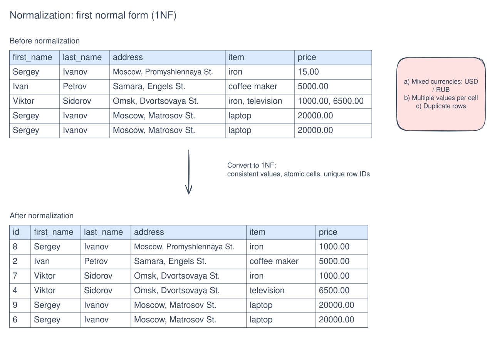
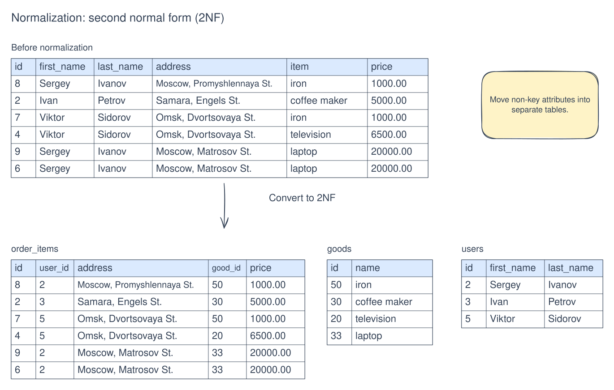
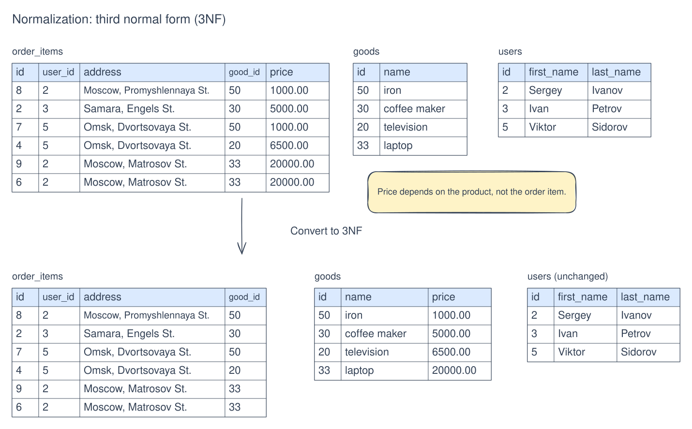

[Русский](normal-forms.md) | English

# Normal forms

1. **First normal form is summarized by three rules:**
   1. Each table cell contains a single value.
   2. Values in a column have the same type.
   3. Each row is uniquely distinguishable from the others.

1. **Second normal form** — all non-key attributes depend on the primary key.

1. **Third normal form** — columns depend on the primary key and do not depend on other non-key columns.

