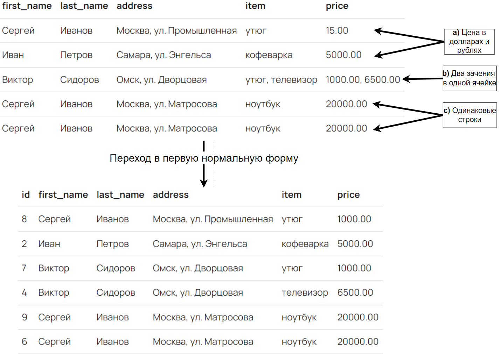
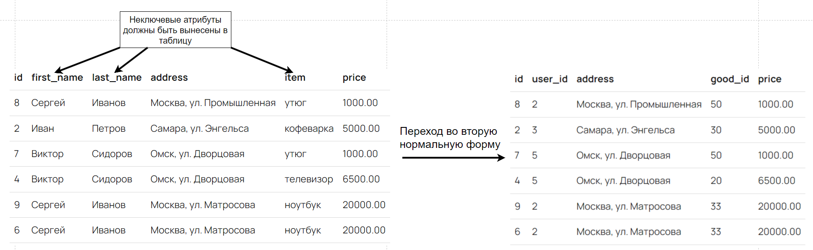
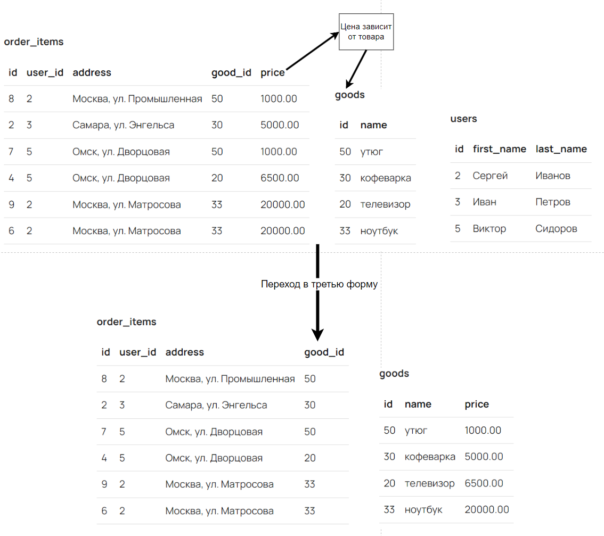

# Нормальные формы

1. **Первая нормальная форма сводится к трем правилам:**
   1. Каждая ячейка таблицы может хранить только одно значение
   2. Все данные в одной колонке могут быть только одного типа
   3. Каждая запись в таблице должна однозначно отличаться от других записей

1. **Условие второй нормальной формы** - все неключевые атрибуты таблицы должны зависеть от первичного ключа.

1. **Условие третьей формы** - все колонки в таблице зависят от первичного ключа и не зависят друг от друга.

