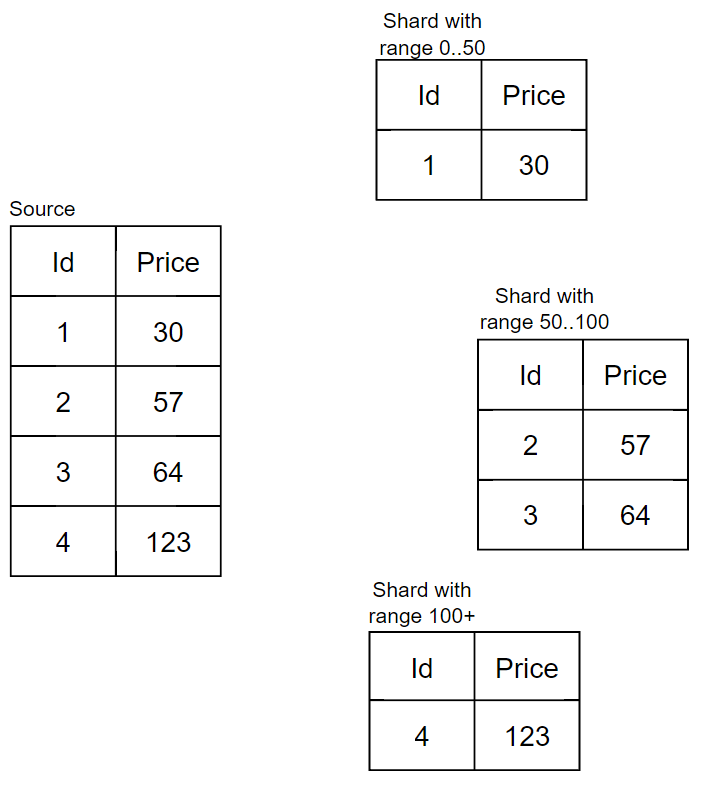
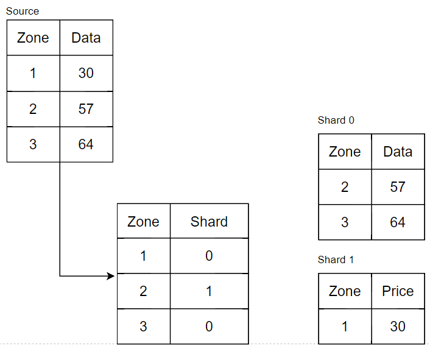
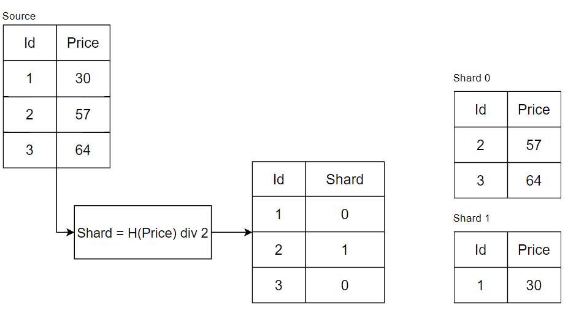
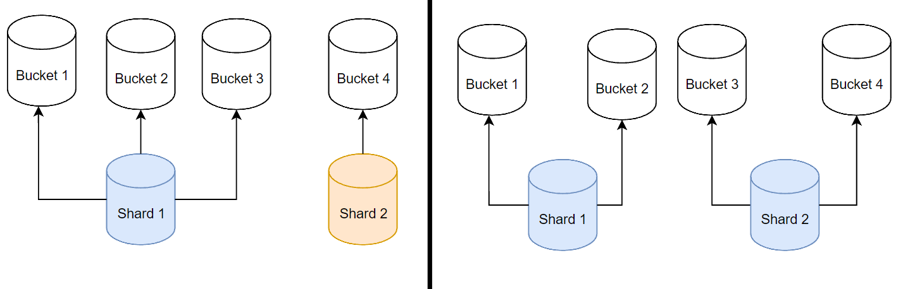
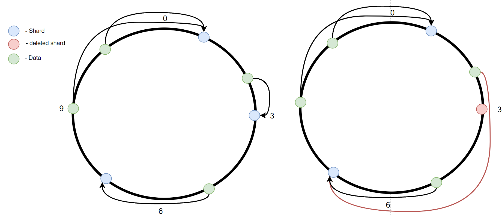
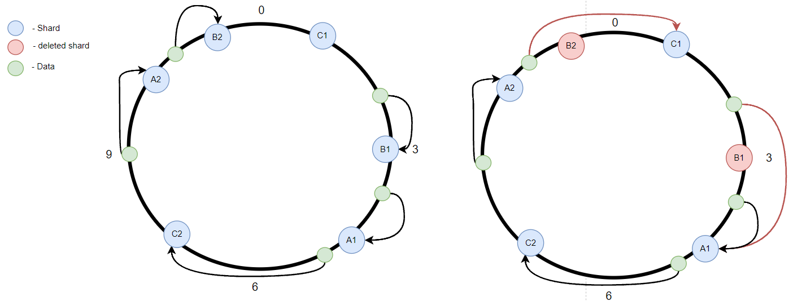
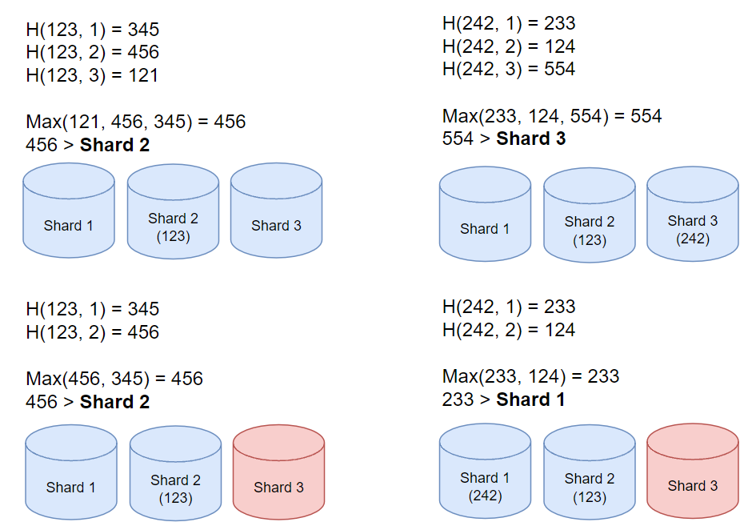
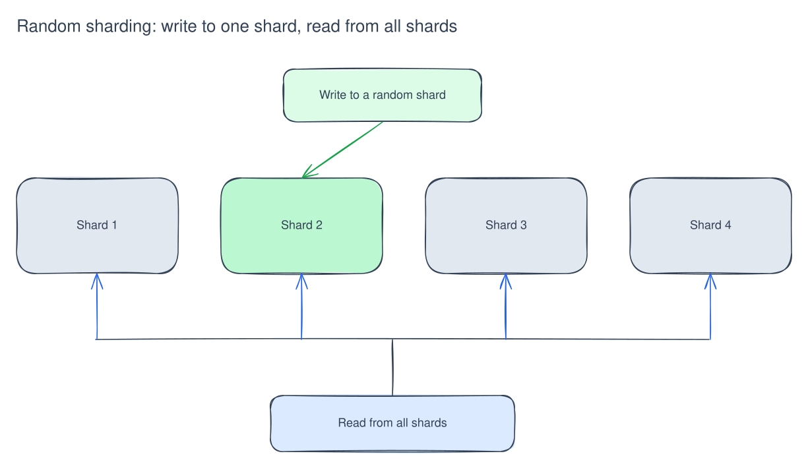

[Русский](partitioning-and-sharding.md) | English

# Partitioning and sharding

### Partitioning — **storing parts of one dataset or table separately within one database instance.**

**Partitioning types**

- Vertical — split a table by columns. This less common approach may help when a large table exceeds database constraints.
- Horizontal — split a table by rows, for example when grouped or ordered data ranges from frequently accessed to rarely accessed.

### Sharding — **storing separate subsets of data on different database instances.**

# Data distribution and routing

### Range based

Choose a column, divide its values into ranges, and assign each range to a shard.

**Considerations**

- Distribution may be uneven.
- Range queries remain possible.
- Expansion has moderate complexity.

### Directory based (manual)

Each record has a key, and there are relatively few distinct keys. Create a mapping table manually to assign each key or zone to a shard.

### Key based

Hash a column value and take the remainder after dividing by the number of shards; the result identifies the shard. 
***Shard = H(n) div k***, where k is the shard count, n is the column value, and H is the hash function.

**Considerations**

- Data is distributed without meaningful ordering.
- Adding or removing shards redistributes the entire dataset.

### vBuckets

Split all data into buckets, commonly 1024, and assign a set of buckets to each shard. Select a bucket using the same hash-based approach as key-based shard selection. Then look up its owning shard in configuration.

### Consistent hashing

Place shards on a ring from 0 to n. Calculate the data position as `P = H(data) mod n`, then move around the ring until reaching the first shard. 
If the shard near 3 fails or is removed, only part of the data needs to move, as shown in figure 1.

**Considerations:**

- Data has no meaningful ordering.
- If a shard fails due to overload, the added load can cause subsequent shards to fail.

### Consistent hashing with virtual nodes

This is similar to ordinary consistent hashing, but each physical node has several virtual nodes on the ring. The failed shard's load is distributed more evenly across surviving nodes, as illustrated.

**Considerations:**

- Data has no meaningful ordering.
- A failed shard's data is redistributed evenly.

### Rendezvous hashing

Calculate a hash for each combination of the data and a shard identifier. Choose the shard with the highest score. 
When a shard fails, only its data moves to other shards.

**Considerations:**

- Data has no meaningful ordering.
- A failed shard's data is redistributed evenly.

### Round Robin

Use this when write load is hundreds or thousands of times higher than read load.

# Client–shard communication

### Direct access

Advantages:

- No extra intermediary nodes.

Disadvantages:

- Additional client-side logic.
- Difficulty changing the number of shards.

### Through a coordinator

Advantages:

- The client does not need to know about sharding.
- Caching.

Disadvantages:

- A single point of failure.
- A potential bottleneck.
- Additional infrastructure.

# Moving data

1. **Condition:** writes can be paused. 
   **Simple solution with downtime:** block user writes to the shard while moving data between shards.
2. **Condition:** writes are append-only, with no updates. 
   **Simple solution:** write new data to the new shard and disable writes to the old one. Move existing data in the background. Reads consult both shards.
3. **Condition:** neither approach above is possible. 
   **Simple solution:** create a new shard, wait until it is synchronized with the old one, then disable the old shard.
