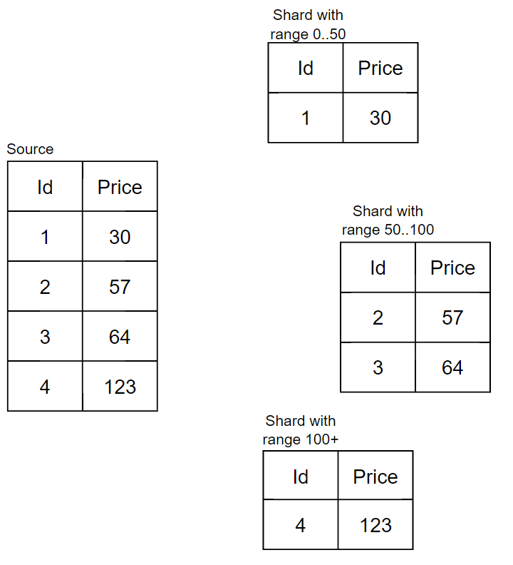
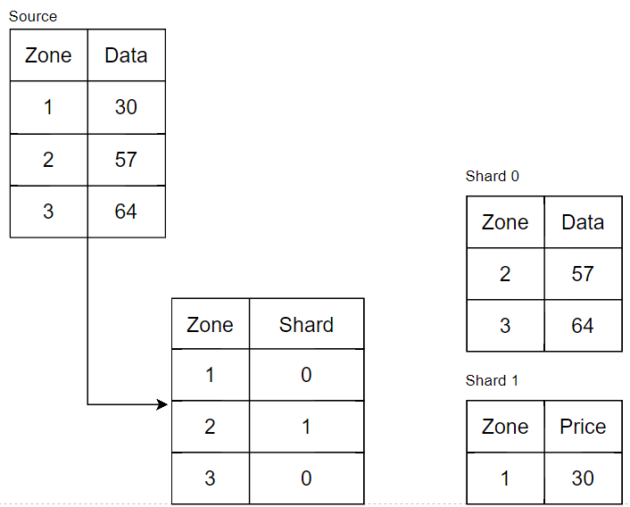
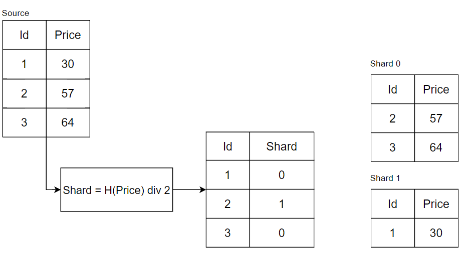
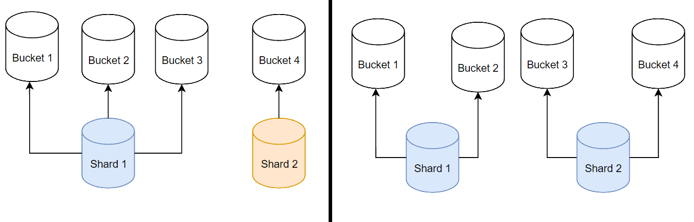
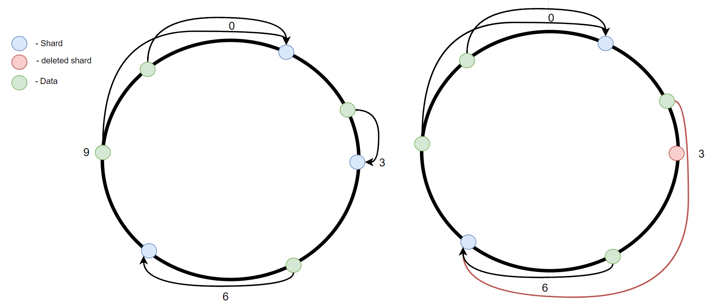
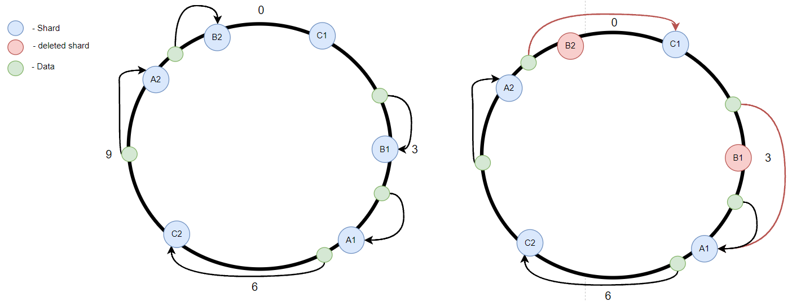
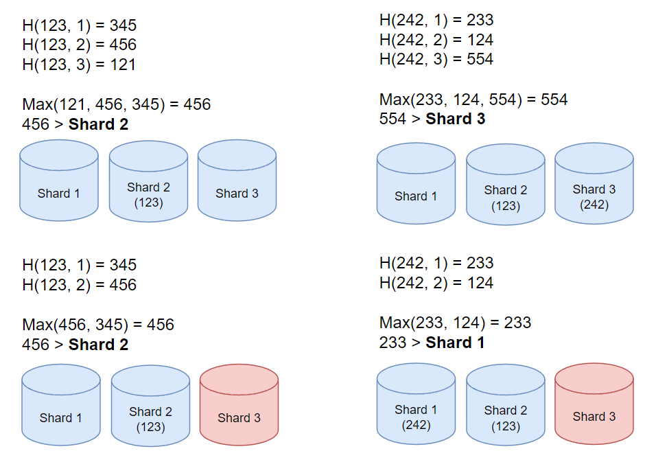
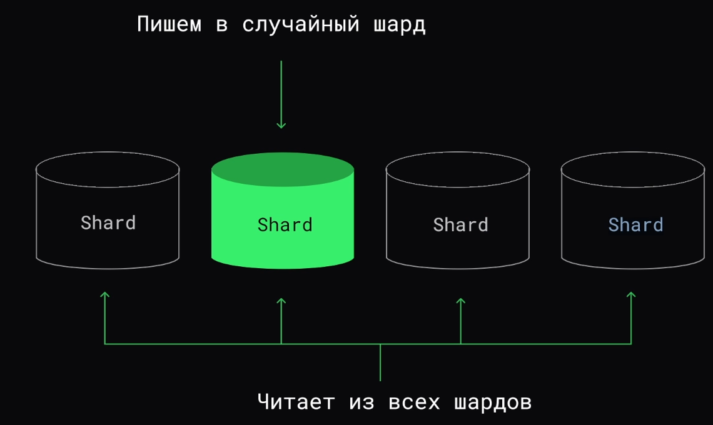

# Партиционирование и шардирование

### Партиционирование - **раздельное хранение одного набора данных(таблицы) в рамках одного истанса.**

**Виды партционирования**

- Вертикальное - разделение таблицы по столбцам, может пригодится, когда в таблице слишком много записей и она превышает ограничения БД (менее популярный).
- Горизонтальное - разделение таблицы по записям, нужно когда данные сортированные/сгруппированные по какому-то критерию вариаруются от часто используемых до менее.

### Шаридирование - **раздельное хранение разных наборов данных, каждый в отдельном инстансе.**

# Разделение данных и routing

### Range based

берем какую-то колонку, делем на диапазоны, каждый диапазон на отдельный шурд.

**Нюансы**

- Распределение может быть не равномерным.
- Есть возможность выбирать данные по дипазону значений.
- Средняя сложность расширения.

### Directory based(manual)

у каждой записи есть свой ключ, таких ключей не много, далее мы создает талбицу(в ручную), с маппингом зоны на шард и по ней разделяем данные.

### Key based

берем колонку, значение из неё проганяем через хэш-функцию, берем остаток от деления результа хэш-функции на кол-во шардов, получение число будет номер шарда . 
***Shard = H(n) div k***, где k - кол-во шардов, n значение колонки, H - хэш-функция.

**Нюансы**

- Данные располагаются в случайном порядке
- При добавлении/удалении шардов, будет происходить полное перераспределение данных

### vBuckets

Все данные разбиты на бакеты(обычно 1024), в каждом шарде набор бакетов. Чтобы прочитать или записать нужно выбрать бакет, таким же способом, как в **key based** выбирается шард.  Когда мы знаем бакет мы можем глянуть какому шарду он принадлежит исходя из настроек например.

### Consistent hashing

Определение шарда для данных делается так: берем окружность от 0 до n, распологаем на ней шарды, вычисляем позицию данных на окружности `P = H(data) mod n` , далее движемся от точки P по кругу пока не найдем первый шард. 
И если шард около 3-ки упадет или будет удален, нам нужно будет перенести лишь часть данных(рис. 1).

**Нюансы:**

- Данные будут распологаться в случайном порядке
- Если шард падает из-за нагрузки, последующие шарды так же упадут

### Consistent hashing with vNods

Похоже на обычный Consistent Hashing за исключением, того что на каждую физическю ноду есть несколько виртуальных, которые уже располагаются на окружности, это позволяет более равномерно распределять нагрузку от упавшего шарда между остальными, как на рисунке.

**Нюансы:**

- Данные будут распологаться в случайном порядке.
- Данные распределяются равномерно при падении шарда.

### Randezvous hashing

Как вычисляется шард: берутся хеши от данных и номеров шардов, из них выбирается максимальное число и соответствующий шард и будет подходящим. 
При выходе из строя одного из шардов только данные из него будут перемещены в другие шарды.

**Нюансы:**

- Данные будут распологаться в случайном порядке.
- Данные распределяются равномерно при падении шарда.

### Round Robin

Используем когда нагрузка на запись в сотни-тысячи раз выше, чем на чтение.

# Взимодействие клиентов и шардов

### Напрямую

Плюсы:

- нет лишных узлов

Минусы:

- дополнительная логика в клиенте
- трудности при изменении кол-ва шардов

### Через координатор

Плюсы:

- клиент не знает о шардировании
- кэширование

Минусы:

- единая точка отказа
- возможно станет bottleneck
- дополнительная инфраструктура

# Перенос данных

1. **Условие:** есть возможность остановить операции записи в БД. 
   **Простое решение(с простоем)**: запрещаем делать запись в шард для пользователя, пока данные переносятся из одного шарда в другой.
2. **Условие**: операции записи в БД имеет только append характер, без изменений. 
   **Простое решение**: начинаем запись данных в новый шард, отключаем запись для старого. Запускам процесс переноса данных из старого шарда в новый. Чтение работает основываясь на старом и новом шардах.
3. **Условие:** если все вышеописанное сделать нельзя. 
   **Простое решение**: создаем новый шард, дожидаемся синхронизации нового и старого, отключаем старый шард.
