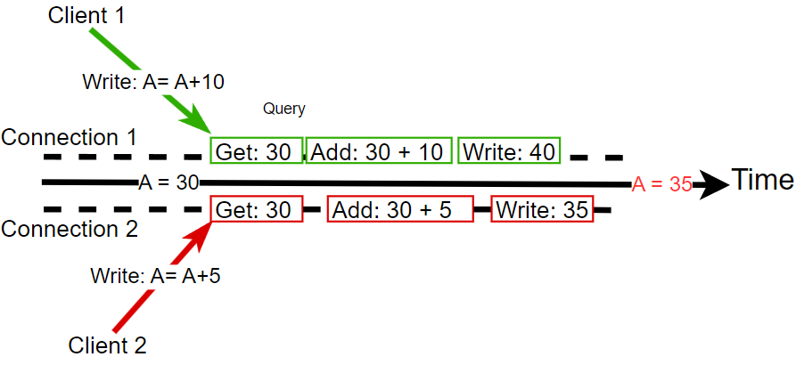
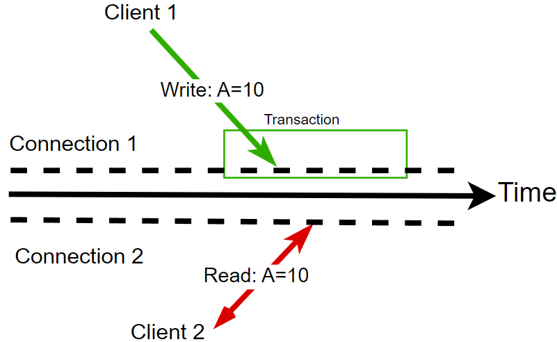
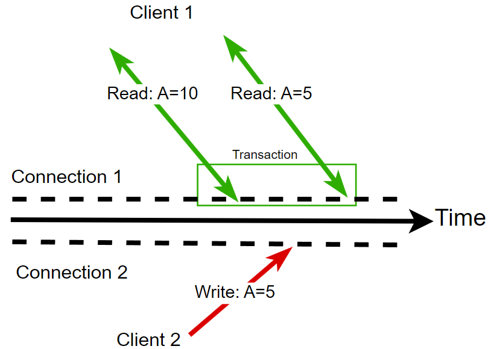
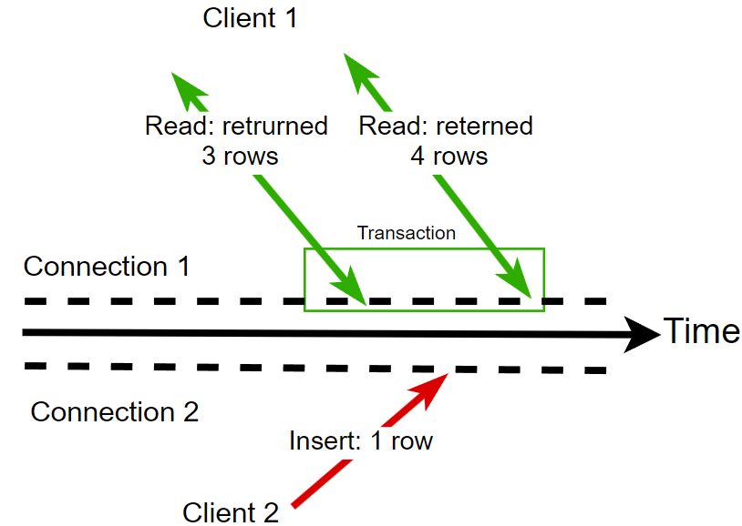

[Русский](transaction-isolation.md) | English

# Transaction isolation levels

## Introduction

**Transaction isolation levels** describe database guarantees for concurrent access. Choosing a level defines which inconsistencies are acceptable. Stronger guarantees generally require more work and can reduce performance. The choice is a **tradeoff between operation throughput and data consistency**.

## Anomalies

Stronger isolation levels address additional anomalies, described below.

1. **Lost updates**
   Two requests change the same data using the same initial value, and one result overwrites the other. *Both clients below read A=30 and calculate new values. Client 2 is slower, so A=40 is written first and then overwritten with A=35.*

   

   **Problem**: an operation was performed, but its result was lost, potentially contradicting other system data.
2. **Dirty reads** 
   A transaction reads data that another transaction has not committed. 
   *One transaction writes A=10 and continues running, while another request can already read A=10.*
   

   **Problem**: the data may represent an invalid state. If the writer rolls back, the reader has observed data that never became committed.
3. **Non-repeatable reads**
   Reading the same row twice within one transaction returns different values. *Another transaction updates the row between the two reads, so the second result differs.*

   

   *Note: the row can also be deleted rather than updated.*

   **Problem**: transaction logic can depend on a value that changes and produce an invalid system state.
4. **Phantom reads**
   Repeating a query for rows matching a condition within one transaction returns a different set. *The query initially returns three rows and later four because the matching range changed.*

   

   *Note: changes or deletions can also alter the matching set.*

   **Problem**: transaction logic can depend on a result that changes and produce an invalid system state.

## Transaction isolation levels

The following table maps the anomalies to isolation levels: ➕ means prevention, while ➖ means the anomaly is allowed.

| Isolation level | **Phantom read** | **Non-repeatable read** | **Dirty read** | **Lost update** |
| --- | --- | --- | --- | --- |
| **Read uncommitted** | **➖** | **➖** | **➖** | ➕ |
| **Read committed** | **➖** | **➖** | ➕ | ➕ |
| **Repeatable read** | ➖ | ➕ | ➕ | ➕ |
| **Serializable** | ➕ | ➕ | ➕ | ➕ |

### Key differences:

- **Dirty reads**: a transaction reads data that **has not been committed** and may be rolled back.
- **Non-repeatable reads**: another transaction **commits** a change between two reads of the same row, changing the result.

## Further topics to add or study:

- How do isolation levels prevent their respective anomalies?
- How do you choose the required isolation level?
