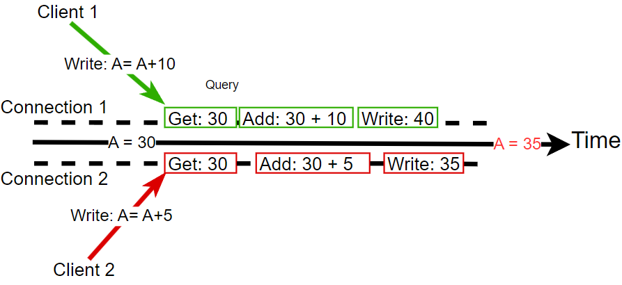
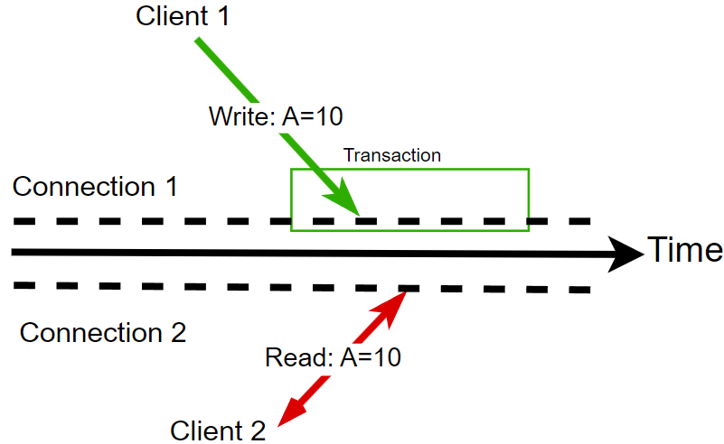
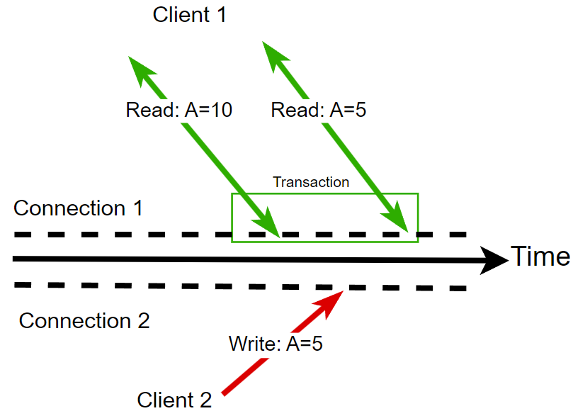
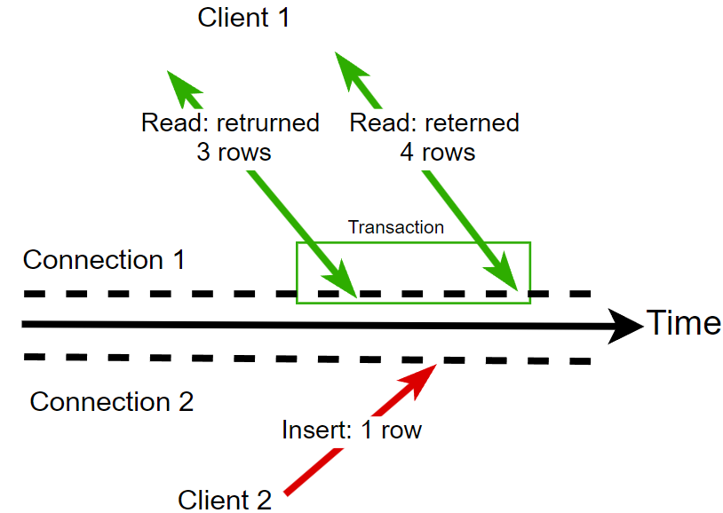

# Уровни изоляции транзакций

## Предисловие

**Уровни изоляции транзакций** - это гарантии о согласованности данных при конкурентом доступе к ним, которые дает нам база данных. Их выбор позволяет установить границу, после который мы допускаем, что данные могут стать не согласованными. Также важно понимать, что для поддержки каждого следующего уровня, требуется произвести все больше и больше работы, а значит производительность падает. То есть выбор уровня изоляции транзакций - **это выбор мужду производительностью операций и согласованностью данных**.

## Проблемы

Каждый следующий уровень решает новую проблему изоляции, ниже все они описаны.

1. **Потерянные изменения (lost updates)**
   Затерянные изменения возникают, когда два запроса одновременно изменяют один блок данных, при том каждый опирается на одно и тоже значение, в следствие чего результат одной из них терается при записи. *На картинке ниже видно, что два запроса выполняют чтение одного блока данных(A=30), производят вычисление, но запрос клиента 2 оказывается медленее и поэтому сначала записывается значение A=40, а потом перезаписывается значением A=35.*

   

   **Проблема**: Операция была выполнена, но ничего не изменилось, что может противоречить другим данным из системы.
2. **Грязные чтения (dirty reads)** 
   Грязное чтение - это чтение данных, которые еще не были зафиксированы транзакцией. 
   *На карт инке ниже видно, что одна транзакция записала A=10 и продолжает выполнятся, а другой запрос в это время уже может получить запись A=10.*
   

   **Проблема**: есть возможность получить данные, соответствующие не валидному состоянию системы; в случае отката транзакции, есть возможность получить несуществующие данные.
3. **Неповторяемые чтения (non-repeatable reads)**
   Неповторяемое чтение возникает, когда чтение одной строки дважды возвращает разные значания в рамках одной транзакции. *На картинке ниже видно, что пока выполнялась транзакция, была совершена запись из-за чего повторное чтение выдало другой результат.*

   

   *Примечание: кроме изменения значения может быть и удаление.*

   **Проблема**: есть возможность основывать логику транзакции на значении, которое было изменено, что приведет к не валидному состоянию системы.
4. **Фантомные чтения (phantom reads)**
   Фантомное чтение возникает, когда при повторном чтении диапазона строк по критерию в рамках одной транзакции, мы получаем разные данные. *На картинке ниже видно, что сначала запрос возвращает 3 строки по запросу, а в конце уже 4 из-за изменения захватываемого диапазона строк.*

   

   *Примечание: кроме добавления строки может быть и её изменение или удаление.*

   **Проблема**: есть возможность основывать логику транзакции на значении, которое было изменено, что приведет к не валидному состоянию системы.

## Уровни изоляции транзакций

Когда вы знаете возможные проблемы, их можно соотнести с соответствующими уровнями, где ➕ - это предотвращение проблемы, а ➖ - нет.

| Уровень изоляции | **Фантомное чтение** | **Неповторяющееся чтение** | **«Грязное» чтение** | **Потерянное обновление** |
| --- | --- | --- | --- | --- |
| **Read uncommitted** | **➖** | **➖** | **➖** | ➕ |
| **Read committed** | **➖** | **➖** | ➕ | ➕ |
| **Repeatable read** | ➖ | ➕ | ➕ | ➕ |
| **Serializable** | ➕ | ➕ | ➕ | ➕ |

### Ключевые отличия:

- **Dirty Reads**: Транзакция читает данные, которые **еще не были зафиксированы**, и существует риск, что эти данные будут откатаны.
- **Non-repeatable Reads**: Транзакция читает данные, которые **были зафиксированы** другой транзакцией, но это происходит между двумя чтениями одной и той же записи, что приводит к тому, что результат чтения меняется.

## Что можно дополнить или изучить самостоятельно:

- Как уровни изоляции решают свои проблемы?
- Как выбрать необходимый уровень изоляции?
