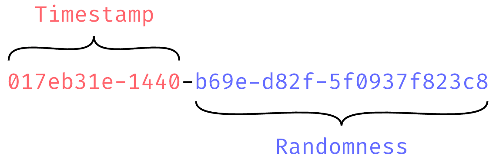
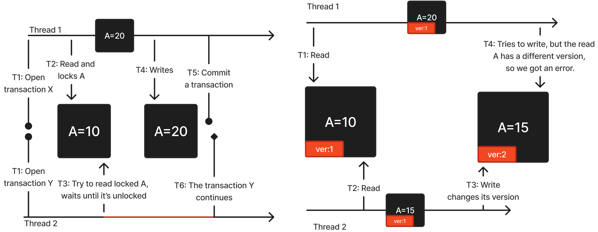
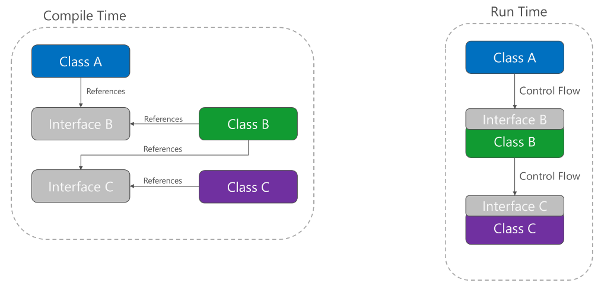
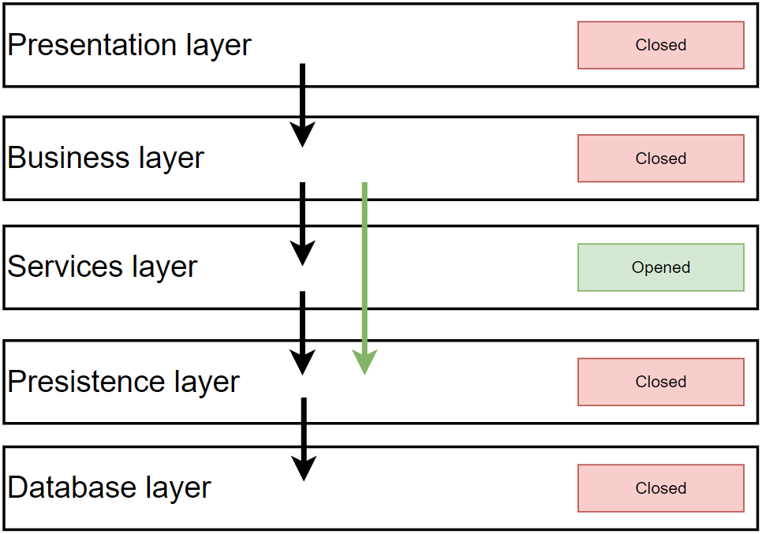
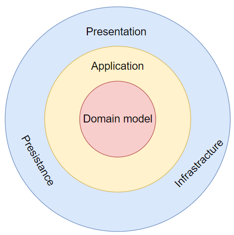
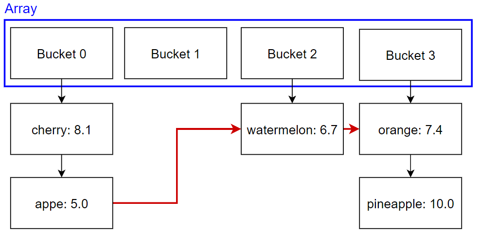
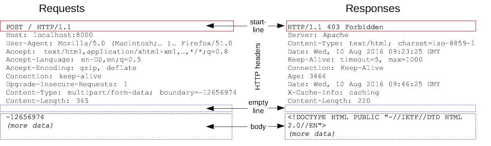
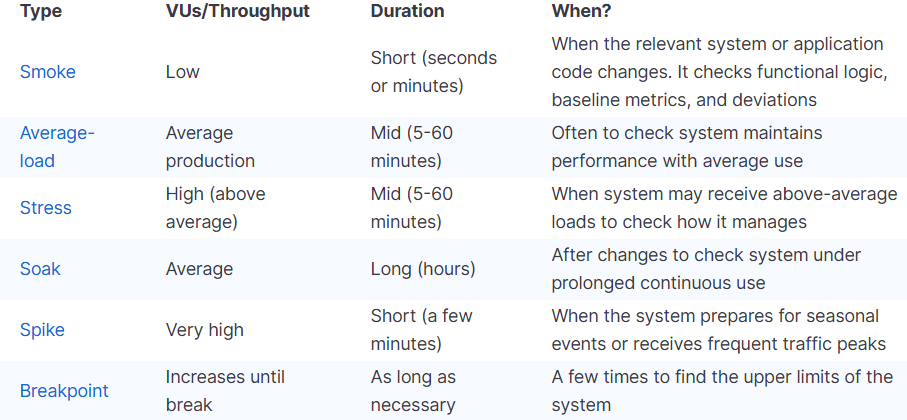
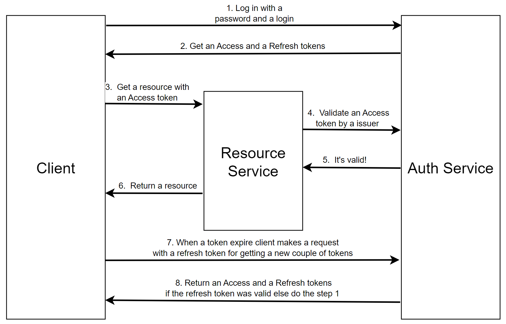

[Русский](questions.md) | English

>## Types of keys in relational databases
> Frequency: rarely

**Foreign key** – a column that establishes a relationship between two tables.  
**Primary key** – a column or group of columns that uniquely identifies a row in a table and can be referenced by a **foreign key**. A table has one primary key, which cannot contain `NULL`.

>## What is UNION?
> Frequency: rarely

**UNION** is an SQL keyword that combines the results of two queries. The corresponding columns selected from both tables must have compatible types.

>## How does HAVING differ from WHERE?
> Frequency: often

**WHERE** filters individual rows, while **HAVING** filters grouped results. Aggregate functions such as SUM, COUNT, and MAX can be used in **HAVING** conditions.

>## What types of primary keys are there? What are their advantages and disadvantages?
> Frequency: rarely

**Characteristics of UUID v4:**
- **Inserts**. When the primary key has a clustered index, inserting records at random locations can significantly slow down writes.
- **Reads**. UUID values are generated randomly, so their order in memory is also random, which can slow down reads.
- **Distributed generation**. Values can be generated independently without coordinating a sequence, for example on the client or in different databases, and then used together.
- **Anonymity**. A user who knows a UUID cannot infer the size of the table.
- **Size**. Uses 16 bytes, providing enough identifier space even for very large datasets.

**Characteristics of auto-incrementing keys (int, long):**
- **Inserts**. Even with a clustered primary-key index, inserts are fast because the database can append records to the end.
- **Reads**. Keys are generated in chronological order, so their order in memory can improve sequential reads.
- **Chronology**. The key contains information about the order in which records were created.
- **Size**. Uses 4 or 8 bytes. Once the corresponding numeric range is exhausted, you must take action.


>## Is there an identifier type that addresses the problems of UUID v4 and int/long keys?
> Frequency: rarely

**UUID v6 or ULID** preserve the main advantages of both approaches. Their first part contains a creation timestamp,
so identifiers are sorted chronologically in the database. The remaining part provides independent generation, as with UUID v4.  


>## What is ACID?
> Frequency: sometimes

**ACID** is a set of properties that ensure predictable transaction behavior.

There are four properties:
- **Atomicity** – all operations in a transaction complete together, or none of them do.
- **Consistency** – after a transaction completes, the data must remain in a consistent state.
- **Isolation** – concurrent transactions should not interfere with one another or see intermediate results.
- **Durability** – once a transaction has been reported as successful, its changes remain available even if a failure occurs immediately afterward.

>## What are transaction isolation levels? What concurrency anomalies can occur in a database?
> Frequency: often

**Transaction isolation levels** define the consistency guarantees a database provides for concurrent access.  
Choosing a level involves a trade-off between performance and consistency. Different levels prevent different anomalies.  

**1. Dirty Read**  
    **Problem**: A transaction reads data that another transaction has not committed. If the other transaction rolls back, the read data never actually existed in the committed state.
    **Prevented by**: Read Committed  
**2. Non-repeatable Read**  
    **Problem**: Running the same SELECT twice within a transaction can produce different results because another transaction changed or deleted rows between the queries.  
    **Prevented by**: Repeatable Read  
**3. Phantom Read**  
    **Problem**: Previously read rows remain stable, but another transaction inserts new rows matching the WHERE condition. A repeated query returns additional phantom rows.  
    **Prevented by**: Serializable  
**4. Write Skew**  
    **Problem**: Two transactions read overlapping data and make changes that are individually valid but together violate an invariant. For example, two doctors simultaneously remove themselves from a shift, leaving it unstaffed.  
    **Prevented by**: Serializable  

[Detailed explanation of transaction isolation levels](details/transaction-isolation.en.md).

>## How do NoSQL and SQL databases differ?
> Frequency: sometimes

**Relational databases (SQL)** store data in clearly defined tables linked through keys.  
**NoSQL databases** cover a variety of data models, including document databases (*MongoDB*), graph databases (*Dgraph*), key-value stores (*Redis*), append-only storage models (Cassandra), and others.

Comparison:

| **SQL** | **NoSQL** |
| --- | --- |
| A defined storage format makes complex data relationships easier to express | Flexible formats make unstructured data easier to store |
| A powerful query language supports complex queries | Simpler query interfaces can process unstructured data efficiently |
| Stricter enforcement of ACID properties | Often designed for easy scaling and expansion |

>## How do pessimistic and optimistic locking differ? What types of locking are there?
> Frequency: sometimes

**Optimistic locking** assumes that data used by a transaction will not be changed by another transaction while it runs.
If a conflict occurs, the transaction fails and usually needs to be retried. PostgreSQL row-version metadata includes `xmin`, `xmax`, and `ctid`.  
**Pessimistic locking** explicitly blocks conflicting reads or writes at the database level, for example using `SELECT FOR UPDATE` in PostgreSQL.

**Conclusion**: If concurrency conflicts are frequent, **pessimistic locking** may be preferable because aborting and restarting transactions with **optimistic locking** is costly. Otherwise, optimistic locking can avoid the overhead of database locks.  


>## What are indexes? What are their disadvantages?
> Frequency: often

An **index** is a data structure a database uses to access data more efficiently.

**Disadvantages of indexes:**

- Additional overhead when writing data.
- Storage space required for the index.
- Index usage must be monitored to ensure it actually provides a benefit.

>## What index types are commonly used in PostgreSQL?
> Frequency: sometimes

- **B-tree** (Balanced Tree) – the standard index for =, &gt;, &lt;, BETWEEN, and ORDER BY.
- **GiST** (Generalized Search Tree) – geospatial data (PostGIS), full-text search, and ranges.
- **GIN** (Generalized Inverted Index) – composite values such as arrays, JSONB, and full-text search.
- **Partial indexes** – index only a subset of the data.
- **Multicolumn indexes** – index several columns; column order matters.

>## How does GIN work?
> Frequency: rarely

**GIN (Generalized Inverted Index)** is an **inverted index** in PostgreSQL.

It stores a **key → list of documents mapping**.<br>
Like a search engine mapping a word to the pages where it appears.

**Example with** `pg_trgm` **(which splits words into trigrams)**

Example: the string `"telegram"`

**1. Split into trigrams: ␣te, tel, ele, leg, egr, gra, ram, am␣**

How GIN stores them:

```text
"tel" → {id=42}
"ele" → {id=42}
"leg" → {id=42}
"egr" → {id=42}
"gra" → {id=42}
"ram" → {id=42}
```

If the table contains more rows, each key has a list of `row_id` values.

**2. Query** `%gram%`

When we write:

```sql
SELECT * FROM docs WHERE content ILIKE '%gram%';
```

The substring `"gram"` is split into its trigrams: "gra" and "ram".

**3. GIN intersects the lists of rows containing** `"gra"` **and** `"ram"`**.**

```javascript
"gra" → { id=10, id=42, id=99 }
"ram" → { id=42, id=77 }
Intersection = { id=42 }
```

**4. GIN returns candidate rows. PostgreSQL then performs a recheck:**

- Retrieves the row `id=42 = "telegram"`.
- Checks it using the original `ILIKE '%gram%'` condition.
- Confirms the match.

This step is necessary because trigram search produces candidates rather than guaranteed exact matches. It can return false positives because the index does not preserve the order of the trigrams.

>## How can you implement fast string search?
> Frequency: rarely

### 1. **GIN/GiST index with the** `pg_trgm` **extension**

This is the most common approach for substring search.

```sql
CREATE EXTENSION IF NOT EXISTS pg_trgm;

CREATE INDEX idx_users_name_trgm ON users USING gin (LOWER(name) gin_trgm_ops);

SELECT * FROM users WHERE LOWER(name) LIKE '%lex%';
SELECT * FROM users WHERE name ILIKE '%lex%';
```

will use the trigram index.

---

### 2. **Full-Text Search (for word searches)**

If you need to search for **words** rather than substrings, use the built-in full-text search:

```sql
CREATE INDEX idx_users_name_fts ON users USING gin (to_tsvector('simple', LOWER(name)));

SELECT * FROM users
WHERE to_tsvector('simple', LOWER(name)) @@ to_tsquery('alex');
```

This approach searches for **words**, rather than arbitrary substrings.

>## How do clustered and nonclustered indexes differ?
> Frequency: often

A **clustered index** stores the actual data rows sorted by a specified key, so a table can have only one. Without a clustered index, data rows are stored in a heap. PostgreSQL does not have this type of index.

A **nonclustered index** is a separate structure that provides ordered access to data rows. It references rows in the heap or uses their clustered-index keys. A table can have multiple nonclustered indexes.

**Detail 1**: Updating the clustering key also requires updating nonclustered indexes that store that key.<br>
**Detail 2**: Clustered indexes benefit from data locality, making sequential reads of several rows faster.

>## What is index selectivity?
> Frequency: sometimes

**Selectivity** describes how many distinct groups a column's values divide the rows into. More distinct groups mean higher selectivity, a greater likelihood of the database using an available index, and typically more efficient index access.

>## What is a query execution plan / EXPLAIN?
> Frequency: often

TODO: the answer has not yet been added to the source knowledge base.

>## What are normal forms?
> Frequency: sometimes

Normal forms define levels of redundancy and inconsistent dependencies in database tables.

[Explanation of the first three normal forms, with examples.](details/normal-forms.en.md)

**Why normalize a database?**

- To create a clearer, more readable structure with explicit relationships.

**Why denormalize a database?**

- Fewer relationships can reduce the number of subqueries and joins, simplifying queries and improving performance.

>## What is an ORM? What data-loading strategies are available?
> Frequency: rarely

An **ORM** maps database tables to objects in a programming language.

Data-loading strategies:

- **Eager Loading** – retrieve all required data upfront in one query.
- **Lazy Loading** – retrieve data when it is accessed.

>## How can you insert 10,000 rows quickly?
> Frequency: rarely

In PostgreSQL, **COPY** loads data directly from a file into a table. It is faster than ordinary **INSERT** operations, which have more overhead related to WAL, indexes, triggers, nonbinary data transfer, and other work.

This is how bulk inserts work in [popular libraries](https://github.com/borisdj/EFCore.BulkExtensions/blob/master/EFCore.BulkExtensions.PostgreSql/SqlAdapters/PostgreSql/PostgreSqlAdapter.cs).

>## What is Kafka?
> Frequency: rarely

[Detailed explanation](details/kafka.en.md).

>## When are message queues used?
> Frequency: rarely

- A message bus reduces coupling between components.
- Scaling the number of consumers adjusts processing throughput, with a trade-off in strong consistency. Queues also smooth out producer traffic spikes.
- Delivery guarantees ensure that an enqueued message eventually reaches a consumer.
- Queues support asynchronous processing when a request takes too long to handle interactively.

>## How does a choreographed SAGA work?
> Frequency: sometimes

A sequence of local transactions, each updating its database and publishing a message that initiates the next local transaction.<br>
If a local transaction fails, compensating messages are published. All operations run asynchronously.

This approach gives up the isolation property of ACID.

>## How does an orchestrated SAGA work?
> Frequency: sometimes

The orchestrator contacts the participants and checks whether they are ready to execute a transaction. If any participant is not ready, the transaction is aborted. If all are ready, each participant commits its changes. If an operation cannot commit, compensating operations run for the transactions that have already completed. All operations run asynchronously.

>## What is 2PC (two-phase commit)?
> Frequency: rarely

Before executing the transaction, the coordinator locks the resources and then attempts to complete it. If it fails, the transaction is rolled back and the locks are released. All operations run synchronously.

>## What is DDD?
> Frequency: rarely

[Detailed explanation](details/ddd.en.md).

>## What is SOLID?
> Frequency: rarely

[Detailed explanation](details/solid.en.md).

>## What is GRASP?
> Frequency: rarely

TODO: the answer has not yet been added to the source knowledge base.

>## How do IoC and DI differ?
> Frequency: often

**Inversion of Control (IoC)** is a design principle that delegates execution to another component instead of controlling it directly. **It reduces coupling in the code.**



**Example**: IoC distinguishes a library from a framework. Your code calls a library's logic; a framework invokes the logic you provide.

An **IoC container** is a library or framework that implements this approach and reduces the amount of code written manually.

**Dependency Injection (DI)** automates object creation by supplying the required dependencies.

>## What is RPC?
> Frequency: sometimes

**RPC (Remote Procedure Call)** describes API interactions in terms of functions.

>## What is REST?
> Frequency: often

**Representational State Transfer (REST)** is an architectural style that defines constraints for an API. It describes interactions in terms of resources and operations on them.

Five mandatory constraints make a system **RESTful:**

1. **Client–server model** – separate the client's interface concerns from the server's data-storage concerns.
2. **Statelessness** – the server does not store client session state between requests. Each request contains enough information to process it.
3. **Caching** – clients and intermediate nodes can cache server responses to improve performance.
4. **Uniform interface** – the interface follows these rules:
   - Each resource is identified by a URI.
   - A representation describes a resource's current or desired state and is used to perform operations on it.
   - Requests and responses contain all information required to process them.
   - Resource state is communicated through the body, query parameters, headers, and requested URI.
5. **Layers** – a system can contain multiple layers, with each component aware only of the next layer.

**Idempotency** – a REST method is idempotent when repeating the same request has the same effect on server state as making it once.

**PUT** and **DELETE** are idempotent. Idempotency is determined by their effect on state, independently of response content or status codes.

**GET**, **OPTIONS**, **HEAD**, and **TRACE** are idempotent and safe: they should not change state.

>## How do RPC and REST differ?
> Frequency: often

REST is a broader architectural concept with defined constraints. When comparing requests, RPC focuses on functions or actions, while REST focuses on resources or objects.

REST APIs are commonly used for web clients, while RPC APIs are often used for communication between services.

>## What is gRPC?
> Frequency: sometimes

**gRPC** is a framework from Google that implements RPC using **Protocol Buffers**.

**Protocol Buffers (protobuf)** is a cross-platform, language-neutral data-serialization format with its own schema language and support for generating source code.

>## What are the main advantages of Protocol Buffers?
> Frequency: rarely

- Small requests and responses due to compact encoding.
- Support for backward compatibility through protobuf type definitions.
- Cross-platform support.

>## Why can gRPC be faster than REST?
> Frequency: rarely

- **HTTP/2 multiplexing** – multiple requests and responses share one TCP connection through independent streams. This supports concurrent RPC calls: unlike HTTP/1.1 pipelining, responses do not need to arrive in request order.
- **HTTP/2 binary frames** – data is transferred in structured binary frames rather than the textual HTTP/1.1 format, simplifying protocol parsing.
- **Protocol Buffers** – a compact binary message format that usually reduces data size and serialization/deserialization costs compared with JSON.

**Clarification**: HTTP/2 removes head-of-line blocking at the HTTP layer, but TCP-level blocking caused by packet loss remains. REST APIs can also use HTTP/2, so any gRPC performance advantage depends on implementation and workload.

[More about gRPC over HTTP/2](https://grpc.io/blog/grpc-on-http2/).

>## What is the CAP theorem?
> Frequency: rarely

Brewer's theorem describes three distributed-system properties: consistency, availability, and partition tolerance. A system cannot fully guarantee all three simultaneously.

**Consistency** – data across nodes does not contradict itself at a given point in time.

**Availability** – every request to the distributed system receives a valid response, although that response may not contain the latest data.

**Partition tolerance** – the system continues to operate when it is split into isolated groups of nodes by network failures.

**Database examples:**

- CA: PostgreSQL, MSSQL
- AP: Cassandra, DynamoDB
- CP: MongoDB, Redis

>## What message-delivery guarantees are there?
> Frequency: sometimes

From easiest to hardest to implement:

- **At-most-once** – a message may be delivered zero or one time.
- **At-least-once** – a message is delivered one or more times, so duplicates are possible.
- **Exactly-once** – a message is delivered exactly once.

>## How can you ensure exactly-once processing when retrying HTTP requests?
> Frequency: often

Use an **idempotency key**:<br>
Store each request in the database with a key sent alongside the request. The receiver records the key when it first processes the operation and ignores subsequent requests with that key.

>## How do microservices differ from a monolith?
> Frequency: often

**Microservices have lower coupling than a monolith.**

**Consequences, from more to less significant:**

- **Development process**. Each microservice can usually be developed independently.
- **Fault tolerance**. A monolith failure can make the entire service unavailable, while a microservice failure may affect only part of the functionality.
- **Infrastructure**. Testing, logging, tracing, monitoring, and deployment are more complex and require a more experienced team.
- **Scaling**. Individual microservices can be scaled by running additional instances.
- **Technology**. Each service can use suitable technologies that might be difficult to combine in a monolith. Technology updates can also be applied independently.

>## How do you extract microservices from a monolith? How do you define service boundaries?
> Frequency: often

- Event Storming.
- High cohesion and low coupling.

>## What does basic service monitoring include?
> Frequency: rarely

- Hardware utilization: CPU, RAM, and disk space.
- Service load: requests per second (RPS).
- Service health checks.
- Number of failed requests.

>## What is CQRS?
> Frequency: sometimes

**CQRS** separates interactions with a system into **queries** and **commands**, often followed by physically separating read and write storage.<br>
Commands change state; queries retrieve data.

**Implementation considerations:**

- Commands follow the Command pattern (GoF).
- Commands can return errors or results directly related to their execution.
- Queries do not change state.
- Queries return DTOs rather than domain models.
- Queries should not be used inside commands.

**Advantages:**

- Improved performance.
- Simpler queries: a read model can be more convenient than a write model.

**Disadvantages:**

- Eventual consistency, depending on implementation: updates may appear in the read model after a delay.
- Complexity: another abstraction to implement and maintain.

>## How does CQRS improve performance?
> Frequency: sometimes

- **Scaling** – one command-processing endpoint can publish results to multiple read replicas, allowing users to read from any replica.
- **Different read structures** – read models can be optimized for faster or simpler access, for example through denormalization.
- **Asynchronous updates** – command results can be applied to read stores asynchronously.
- **Fewer locks** – reads take place in separate storage and do not introduce read-related locks during command execution.

>## What is N-layered architecture?
> Frequency: rarely

An architecture that divides an application vertically into layers, each responsible for a specific set of internal functions.

Each layer directly depends on the next lower layer if it is closed, or can access deeper layers if all intervening layers are open.



- **Advantages:**
  - Easy to implement.
  - Easy for new team members to understand.
- **Disadvantages:**
  - Difficult to test and maintain.
  - Difficult to scale.

>## What is Onion architecture?
> Frequency: rarely

An architecture that divides an application vertically into layers, each responsible for a specific set of internal functions.



>## What is OOP?
> Frequency: rarely

**Object-oriented programming (OOP)** organizes programs around objects, which typically combine data and behavior, and interactions between those objects.

An **interface** is a type that defines an interaction contract.

A **class** describes its instances.

**OOP principles:**

**Encapsulation** protects an object's internal state from invalid interactions.

**Inheritance** creates a new class based on an existing one.

**Subtype polymorphism** allows behavior to vary according to an object's subtype.

- *At runtime, derived-class objects can be treated as instances of their base class.*
- *Base classes can define and implement virtual methods, while derived classes override them with their own definitions and implementations.*

**Abstraction** identifies an object's essential characteristics while ignoring irrelevant details. The resulting abstraction is the set of those characteristics.

> **Q**: Why create an abstract class without abstract methods?
> **A**: It may define common behavior or properties shared by its subclasses, while instantiating the base class itself would make no sense.

>## How does a hash table work?
> Frequency: rarely

A **hash table** is a key-value data structure based on an array and a hash function. An entry's location is found by taking the hash value modulo the array length.

If two different keys map to the same array index, a **collision** occurs. Two common ways to handle collisions are:

- **Separate chaining** – each array cell (bucket) contains another data structure, such as a linked list or tree, that stores and locates colliding keys. The example below uses linked lists.



On insertion, a colliding entry is appended to the bucket's linked list. For lookup, find the bucket and compare keys while traversing its entries. Iteration over the entire table can follow links from the last entry in one bucket to the first entry in the next nonempty bucket (red arrows).

- **Open addressing (probing)**.<br>
  TODO

>## What are the operation costs of different data structures?
> Frequency: sometimes

| **Data Structure** | **Time Complexity** |  |  |  |  |  |  |  | **Space Complexity** |
| --- | --- | --- | --- | --- | --- | --- | --- | --- | --- |
|  | **Average** |  |  |  | **Worst** |  |  |  |  |
|  | **Access** | **Search** | **Insertion** | **Deletion** | **Access** | **Search** | **Insertion** | **Deletion** |  |
| [**Array**](http://en.wikipedia.org/wiki/Array_data_structure) | `Θ(1)` | `Θ(n)` | `Θ(n)` | `Θ(n)` | `O(1)` | `O(n)` | `O(n)` | `O(n)` | `O(n)` |
| [**Stack**](http://en.wikipedia.org/wiki/Stack_%28abstract_data_type%29) | `Θ(n)` | `Θ(n)` | `Θ(1)` | `Θ(1)` | `O(n)` | `O(n)` | `O(1)` | `O(1)` | `O(n)` |
| [**Queue**](http://en.wikipedia.org/wiki/Queue_%28abstract_data_type%29) | `Θ(n)` | `Θ(n)` | `Θ(1)` | `Θ(1)` | `O(n)` | `O(n)` | `O(1)` | `O(1)` | `O(n)` |
| [**Linked List**](http://en.wikipedia.org/wiki/Singly_linked_list#Singly_linked_lists) | `Θ(n)` | `Θ(n)` | `Θ(1)` | `Θ(1)` | `O(n)` | `O(n)` | `O(1)` | `O(1)` | `O(n)` |
| [**Hash Table**](http://en.wikipedia.org/wiki/Hash_table) | `N/A` | `Θ(1)` | `Θ(1)` | `Θ(1)` | `N/A` | `O(n)` | `O(n)` | `O(n)` | `O(n)` |
| [**Binary Search Tree**](http://en.wikipedia.org/wiki/Binary_search_tree) | `Θ(log(n))` | `Θ(log(n))` | `Θ(log(n))` | `Θ(log(n))` | `O(n)` | `O(n)` | `O(n)` | `O(n)` | `O(n)` |
| [**B-Tree**](http://en.wikipedia.org/wiki/B_tree) | `Θ(log(n))` | `Θ(log(n))` | `Θ(log(n))` | `Θ(log(n))` | `O(log(n))` | `O(log(n))` | `O(log(n))` | `O(log(n))` | `O(n)` |

>## How do you investigate performance problems?
> Frequency: sometimes

**Databases:**

- Inspect query execution plans, for example with **EXPLAIN** in PostgreSQL.
- Inspect the SQL generated by the ORM.

**.NET applications:**

- **dotMemory** shows how much memory different parts of an application allocate and how it is reclaimed.
- **dotTrace** shows how much time different parts of an application take to execute.

>## How can you improve database performance?
> Frequency: sometimes

**One instance:**

- **Add indexes**. Index columns frequently used in queries to speed up access.
- **Remove indexes**. For write-heavy tables, removing unnecessary indexes can make writes faster.
- **Queries**. Optimize their implementation.
- **Transaction isolation levels**. Consider lowering the isolation level.
- **Locking**. Reevaluate the choice between pessimistic and optimistic locking.
- **Data compression**. Compression can reduce transferred data volume.
- **CQRS**. Separate reads and writes.
- **Hardware**. Use a more powerful database machine.
- **Cache**. A cache in front of the database reduces the number of queries.
- **Another database**. Choose a database suited to the data and workload (**OLAP/OLTP**).
- [**Partitioning**](details/partitioning-and-sharding.en.md). Store a table in separate partitions within one instance.

**Multiple instances:**

- **Replication**. Copies of the same data on different instances can improve read throughput.
- [**Sharding**](details/partitioning-and-sharding.en.md). Distribute a dataset across instances to improve write throughput.

>## What is the OSI model?
> Frequency: rarely

The **OSI model** defines abstraction layers used in network communication.

1. **Application layer** – provides network access to user applications (**HTTP, SMTP, WebSocket**).
2. **Presentation layer** – handles protocol conversion and data encoding/decoding (**SSL**).
3. **Session layer** – maintains communication sessions so applications can interact over time.
4. **Transport layer** – provides end-to-end communication and transport reliability (**TCP, UDP**).
5. **Network layer** – determines the route for transmitting data.
6. **Data link layer** – supports communication over physical networks and detects errors.
7. **Physical layer** – defines how binary data is transmitted between devices.

>## How do TCP and UDP differ?
> Frequency: rarely

TCP emphasizes reliable data transfer, while UDP emphasizes speed. TCP includes additional mechanisms such as establishing a connection, retransmitting packets, and checking errors, which introduce overhead.

>## What is HTTP?
> Frequency: rarely

**HTTP** is an application-layer protocol originally designed for transferring hypertext and later adopted for many other purposes.

Structure of an HTTP message:



>## How do HTTP and HTTPS differ?
> Frequency: rarely

HTTPS is HTTP protected by TLS encryption. SSL is the older, obsolete predecessor. Enabling HTTPS requires a certificate, for example from Let's Encrypt.

>## What types of functional testing are there?
> Frequency: rarely

**Functional testing** verifies the specified business behavior.

Examples:

- **Unit testing** – checks that an individual component works correctly; performed during development.
- **Integration testing** – checks interactions between application components.
- **End-to-end testing** – checks that all components work together as a complete application.
- **Acceptance testing** – validates the application with customers or clients.

>## What types of nonfunctional testing are there?
> Frequency: rarely

**Nonfunctional testing** checks system characteristics such as availability, performance, and security.

Examples:



# Miscellaneous

>## What vulnerabilities are common in web development?
> Frequency: rarely

- **MITM (man in the middle)** – a third party intercepts network traffic between a client and server.<br>
  **Mitigation**: TLS encryption.
- **SQL injection** – user input changes the intended behavior of an SQL query.<br>
  **Mitigation**: parameterized queries and input validation.
- **XSS (Cross-Site Scripting)** – malicious code is injected into a web page and runs on the user's computer when the page opens.<br>
  **Mitigation**: input validation, escaping, and isolated domains.
- [Catastrophic backtracking in regular expressions](https://habr.com/ru/companies/pvs-studio/articles/697294/)

>## How does JWT authentication work?
> Frequency: sometimes

A **JWT (JSON Web Token)** is a string consisting of three dot-separated parts:

- **Header** – contains the algorithm and token type.
- **Payload** – contains claims such as creation time, expiration, user ID, and roles.
- **Signature** – calculated using a one-way hash function as follows:<br>
  `SHA256(base64(header) + ”.” + base64(payload), your_secret_key)`

Verifying a JWT signature confirms that a trusted source signed the data and that it has not been altered since signing.

The example below uses JWT authentication with access and refresh tokens.

An **access token** grants authorized access to a resource. In a browser, **store it in application memory**.

A **refresh token** is used to request a new access/refresh token pair. In a browser, **store it only in an HttpOnly cookie**; on the backend, **store it in Redis**.



**Security considerations:**

- Possessing a JWT does not let an attacker forge it or create a valid replacement without the signing key.
- A stolen access token grants access only until it expires. A refresh token is harder to steal and is used only with the authentication service.

>## How do JWTs and cookies differ?
> Frequency: rarely

- Browsers automatically store cookies and attach them to requests. JWTs do not have that built-in behavior.
- JWTs are convenient for backend API calls where the token is part of configuration.
- HttpOnly and Secure flags can improve cookie security, but cookies are susceptible to CSRF attacks. JWT usage is less exposed to CSRF when tokens are sent explicitly, but tokens must be protected from XSS attacks.
