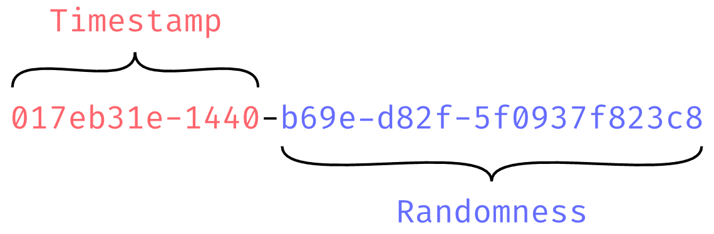
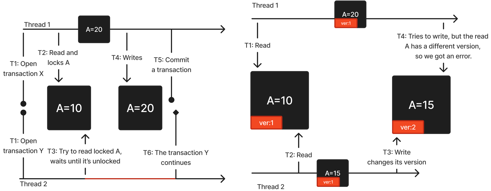
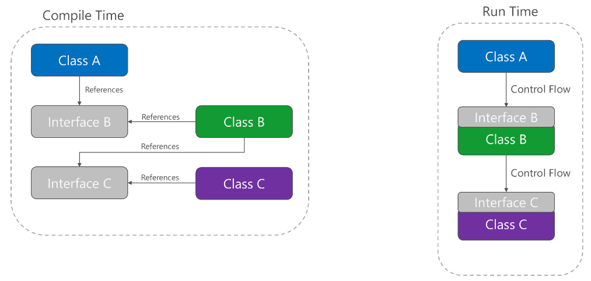
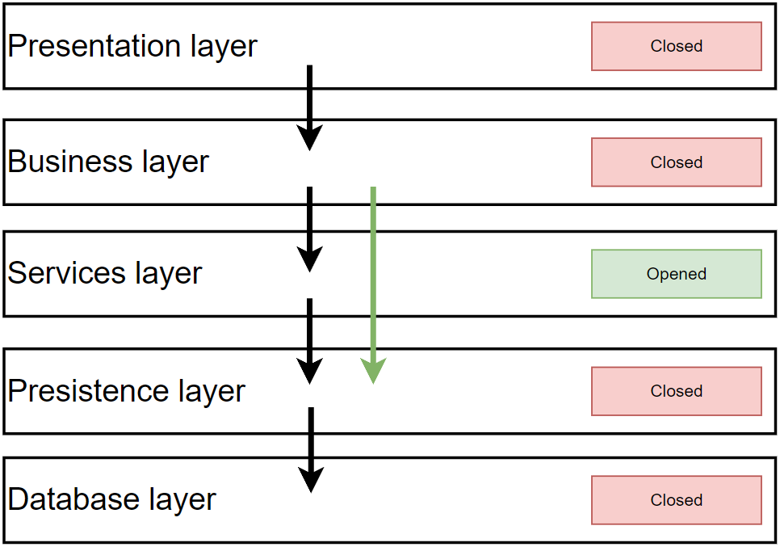
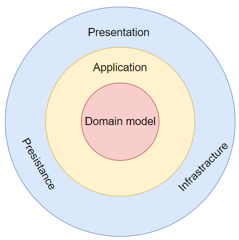
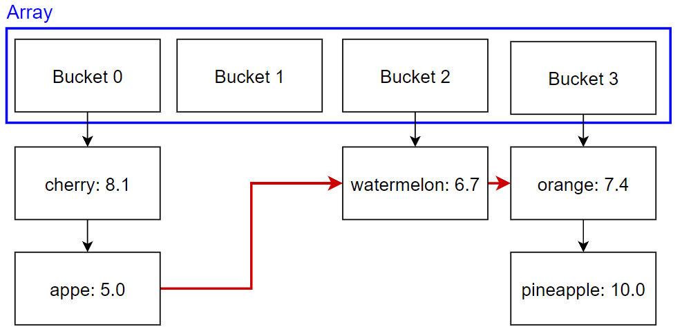
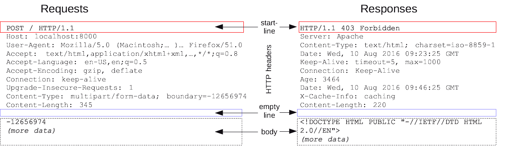
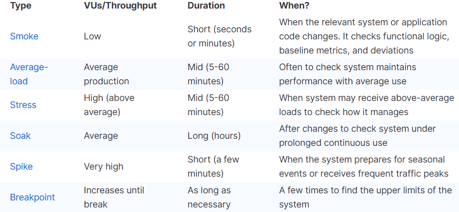
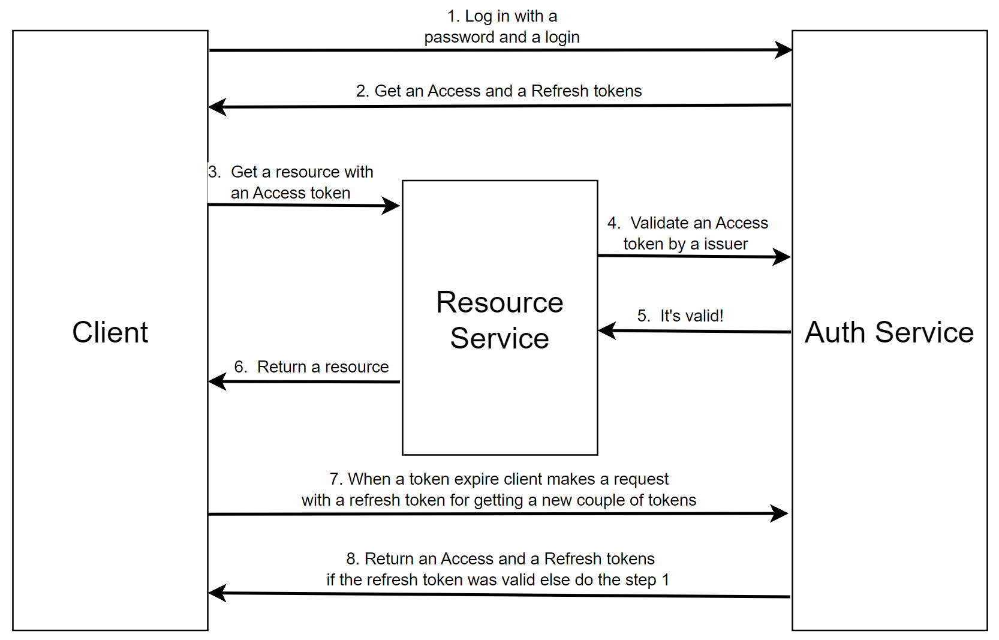

>## Виды ключей в реляционных БД
> Частота: редко

**Внешний ключ (foreign key)** – это столбец, который создает связь между двумя таблицами.  
**Первичный ключ (primary key)** – это столбец или группа столбцов в таблице, которые уникально идентифицируют строку в таблице, а так же используються для создания связи primary - **foreign key**. Один на всю таблицу, не может быть `NULL`.

>## Что такое UNION?
> Частота: редко

**UNION** - ключевое слово в SQL, которое позволяет конкатенировать  значения с двух таблиц. При этом выбираемые с двух таблиц типы должны иметь одинаковые типы.

>## Отличие HAVING от WHERE
> Частота: часто

**WHERE** фильтрует исходные записи таблицы, а **HAVING** сгрупированные записи. А еще в только в **HAVING** допускается использование агрегатных функций(SUM, COUNT, MAX и тд.).

>## Типы первичныйх ключей? Их плюсы и минусы?
> Частота: редко

**Особенности** **UUID v4:**
- **Вставка**. Так как на первичном ключе есть кластерный индекс, вставка будет сильно замедленна из-за того, что БД будет вставлять записи в случайное место.
- **Чтение**. Так как набор UUID ключей создается случайно, их последовательность в памяти будет так же случайной из-за чего чтение будет замедленно.
- **Распределенность**. Так как мы всегда получаем новое значение и нам не нужно следить  за последовательность, мы можем генерировать UUID в разных местах, например на клиенте или в разных базах данных, а потом использовать данные вместе.
- **Анонимность**. Пользователь имееющий UUID не может определить размер таблицы.
- **Вес**. Занимает 16 байт, благодаря чему его не прийдется расширять в случае хранения очень большого кол-ва данных.

**Особенности автоинкремента(int, long)**:
- **Вставка**. Хоть и на первичном ключе есть кластерный индекс, вставка будет выполняться быстро, так как БД достаточно дописать запись в конец области памяти.
- **Чтение**. Так как набор автоинкриментных ключей создается в историчной последовательности, их последовательность в памяти будет так же исторической из-за чего чтение может происходить быстрее.
- **Историчность**. Хранит в себе информацию о последовательности создания данных.
- **Вес**. Занимает 4 или 8 байт, если вы привысите соответствующее число по кол-ву записей, то прийдется что-то предпринять.


>## Есть ли вид идентификатора, который решает проблемы UUID v4, int-long?
> Частота: редко

Решения, которые сохраняют главные приймущества обоих подходов - это **UUID v6 или ULID**. Их первая часть хранит время создания ключа, 
а значит они будут остортированы в БД исторически, вторая их часть случайна, а значит они такие же независимые как и UUID v4.  


>## Что такое ACID?
> Частота: средне

**Аббревиатура ACID** - это набора условий для того, чтобы обеспечить предсказуемое поведение транзакции.

Таких условий всего 4:
- **Атомарность (Atomic)** - все операции транзакции могут быть выполнены полностью или не выполнены вовсе.
- **Согласованность (Consistency)** - после выполнения транзакции, данные должны оставаться в согласованном состоянии.
- **Изолированность (Isolation)** - при выполнении транзакции, другие транзакции не должны оказывать на неё влияния, а так же видеть промежуточные результаты её работы.
- **Устойчивость (Durability)** - если пользователь получил успешный результат выполнения транзакции, значит изменившиеся данные будут доступны, даже если сразу после ответа произошел сбой.

>## Что такое уровни изоляции БД? Какие  аномалии параллельного доступа к БД вы знаете?
> Частота: часто

**Уровни изоляции транзакций** - это гарантии о согласованности данных при конкурентом доступе к ним, которые дает нам база данных.  
Выбор уровня - это выбор между производительностью и согласованностью. Каждый уровень решает аномаллию.  

**1. Dirty Read (грязное чтение)**  
    **Проблема**: Транзакция читает данные, которые другая транзакция ещё не закоммитила - если та откатится, мы получим несуществующие данные.
    **Решает**: Read Committed  
**2. Non-repeatable Read (неповторяющееся чтение)**  
    **Проблема**: Если в рамках одной транзакции дважды выполнить один и тот же SELECT, результаты могут отличаться - другая транзакция успела изменить или удалить строки между запросами.  
    **Решает**: Repeatable Read  
**3. Phantom Read (фантомное чтение)**  
    **Проблема**: Повторное чтение тех же строк стабильно, но другая транзакция может вставить новые строки, попадающие под условие WHERE — повторный запрос вернёт «фантомные» строки, которых раньше не было.  
    **Решает**: Serializable  
**4. Write Skew (перекос записи)**  
    **Проблема**: Две транзакции читают пересекающиеся данные и на их основе делают записи, которые по отдельности валидны, но вместе нарушают инвариант (например, два врача одновременно снимают себя со смены, оставляя её пустой).  
    **Решает**: Serializable  

[Подробное объяснение уровней изоляции транзакций](details/transaction-isolation.md).

>## Отличие NoSQL и SQL баз данный?
> Частота: средне

**В Реляционной базе данных(SQL)** - данные имеют четко определенную структуру в виде таблиц, которые связаны между собой при помощи ключей.  
**В noSQL базах данных** -  данные не имеют четкой структуры, в эту категорию входят документоориентированные(*MongoDB*), графовые(*Dgraph*), key-value(*Redis*), append-only(Сassandra) базы данных и многие другие.

Особенности в сравнении:

| **SQL** | **noSQL** |
| --- | --- |
| Определённый формат хранения данных, позволяет проще выстраивать сложные свзязи в данных | Данные не имеют определенного формата, проще хранить неструктурированные данные  |
| Мощный язык запросов, который позволяет обрабатывать сложные запросы | Простой язык запросов, позволяющий быстро обрабатывать неструктурированные данные |
| Более жестко исполнение ACID | Можно быстро масштабировать и расширять базу данных |

>## Отличия пессимистичной и оптимистичной блокировки? Какие виды блокировок есть?
> Частота: средне

**Оптимистичная блокировка** - механизм этой блокировки рассчитан на то, что во время  выполнения тразакции используемые ей данные не будут изменены другой транзакцией, 
в противном случае транзакция прервется с исключением и скорей всего её прийдется повторить. Реализуется например через версионирование строк `xmin, xmax и ctid` в PostgreSQL.  
**Пессимистичная блокировка** - это блокировка ни на что не расчитывает и просто блокирует доступ транзакций на запись или чтение на уровне базы данных. Например `SELECT FOR UPDATE` в PostgreSQL.

**Итог**: Если проблема конкурентного доступа просходит часто, то лучше выбрать **пессимистичную блокировку** из-за стоимости прирывания и перезапуска транзакции при **оптимистичной блокировки**, если нет, то наоборот из-за стоимости установки блокировки на уровне базы данных.  


>## Что такое индексы? Какие у них недостатки?
> Частота: часто

**Индекс** - структура данных, используемая базой данных для повышения эффективности доступа к данных.

**Минусы индексов:**

- Дополнительные расходы при записи данных
- Затрата памяти на хранение индекса
- За идексом необходимо следить, чтобы быть уверенным в том, что он приносит пользу.

>## Какие виды индексов популярны в PostgreSQL?
> Частота: средне

- **B-tree** (Balanced Tree) - cтандартный индекс для операций =, &gt;, &lt;, BETWEEN, ORDER BY.
- **GiST** (Generalized Search Tree) - геоданные (PostGIS), полнотекстовый поиск, диапазоны.
- **GIN** (Generalized Inverted Index) - составные данные (массивы, JSONB, полнотекстовый поиск).
- **Частичные индексы** - индексируйте только подмножество данных.
- **Многоколоночные индексы** - индекс по нескольким колонкам, порядок важен.

>## Как работает GIN?
> Частота: редко

**GIN (Generalized Inverted Index)** - это **обратный индекс** в PostgreSQL.

Он хранит **соответствие “ключ → список документов”**.<br>
(Прямо как в поисковиках: слово → список страниц, где оно встречается.

**Пример для** `pg_trgm`**(разбиает слова на триграммы)**

Пример: строка `"telegram"`

**1. Разбитое на триграммы: ␣te, tel, ele, leg, egr, gra, ram, am␣**

Как хранит GIN:

```text
"tel" → {id=42}
"ele" → {id=42}
"leg" → {id=42}
"egr" → {id=42}
"gra" → {id=42}
"ram" → {id=42}
```

(если в таблице ещё строки, то у каждого ключа будет список `row_id`).

**2. Запрос** `%gram%`

Когда мы пишем:

```sql
SELECT * FROM docs WHERE content ILIKE '%gram%';
```

Подстрока `"gram"` превращается в свои триграммы: "gra", "ram"

**3. GIN берёт пересечение списков строк, где встречается** `"gra"` **и** `"ram"`**.**

```javascript
"gra" → { id=10, id=42, id=99 }
"ram" → { id=42, id=77 }
Пересечение = { id=42 }
```

**4. GIN возвращает кандидатов. Дальше Postgres делает recheck:**

- Берёт строку `id=42 = "telegram"`,
- Проверяет обычным `ILIKE '%gram%'`.
- Подтверждает, что совпадение есть.

(Этот шаг нужен, потому что триграммный поиск даёт кандидатов, но не всегда гарантирует полное совпадение - бывают ложноположительные из-за отсутствия учета последовательности анаграм).

>## Как сделать быстрый поиск по строке?
> Частота: редко

### 1. **GIN/ GiST индекс с** `pg_trgm` **(расширение** `pg_trgm`**)**

Это самый популярный способ для поиска по подстроке.

```sql
CREATE EXTENSION IF NOT EXISTS pg_trgm;

CREATE INDEX idx_users_name_trgm ON users USING gin (LOWER(name) gin_trgm_ops);

SELECT * FROM users WHERE LOWER(name) LIKE '%lex%';
SELECT * FROM users WHERE name ILIKE '%lex%';
```

будут использовать триграммный индекс.

---

### 2. **Full-Text Search (если поиск по словам)**

Если нужно искать **слова**, а не просто подстроки, лучше использовать встроенный полнотекстовый поиск:

```sql
CREATE INDEX idx_users_name_fts ON users USING gin (to_tsvector('simple', LOWER(name)));

SELECT * FROM users
WHERE to_tsvector('simple', LOWER(name)) @@ to_tsquery('alex');
```

Но это подходит только для поиска **по словам**, а не произвольных подстрок.

>## Чем отличаются кластерный и некластерный индексы?
> Частота: часто

**Кластеризированный индекс** - хранит непосредственно строки данных в отсортированном виде по заданному параметру, поэтому он можен быть только один. Если у таблицы нет кластеризованного индекса, то строки данных хранятся в куче. (Нет в PostgreSQL)

**Некластеризированный индекс** - отдельная от строк данных структура, которая упорядычивает доступ к ним. Так как досуп происходит по ссылке на строку в куче или ключ кластеризованного индекса, таких индексов может быть несколько.

**Нюанс 1**: Каждый раз, когда ключ кластеризации обновляется, требуется соответствующее обновление для некластеризованного индекса, поскольку он хранит ключ кластеризации.<br>
**Нюанс 2**: При кластеризованном идексе, нам наруку играет локальность данных, что позволяет быстрее читать несколько строк из-за последовательной структуры памяти.

>## Что такое селективность индекса?
> Частота: средне

**Селективность** - свойство колонки таблицы, которые показывает на сколько групп разбиваются все её записи. Чем больше групп, тем выше селективность и тем выше вероятность того, что при поиске по этой колонке будет использован индекс, если он есть, и тем эффективней он будет.

>## Что такое план запроса/EXPLAIN?
> Частота: часто

TODO: ответ пока не добавлен в исходной базе.

>## Что такое нормальные формы?
> Частота: средне

Нормальные формы - уровни определяющие степень избыточности и несогласованной зависимости в таблицах БД.

[Описание первых трех форм с примерами.](details/normal-forms.md)

**Для чего нужно нормализововать БД?**

- Более понятная и человекочитаемая структура со связями.

**Для чего нужно денормализововать БД?**

- Уменьшение кол-ва связей, поможет уменьшить кол-во подзапросов/джоинов, что упростит запросы и повысит функциональность.

>## Что такое ORM? Какие есть способы загрузки данных?
> Частота: редко

**ORM** - технология программирования, которая позволяет связать таблицы базы данных с объектами в самом языке.

Способы запроса данных:

- **Eager Loading** - запрашиваем все необходимые сразу, один запросом.
- **Lazy Loading** - запрашиваем данные по мере обращения к ним.

>## Как вставить 10к строк быстро?
> Частота: редко

Если говорить на примере PostgreSQL, то там есть команда **COPY**, которая загружает данные в таблицу напрямую из файла. Она быстрее обычного **INSERT**, так как он имеет больше оверхеда - это касается WAL, индексов, триггеров,  передача данных не в бинарном формате и прочее.

Таким образом Bulk Insert работает в [популярных библиотеках](https://github.com/borisdj/EFCore.BulkExtensions/blob/master/EFCore.BulkExtensions.PostgreSql/SqlAdapters/PostgreSql/PostgreSqlAdapter.cs).

>## Что такое Kafka?
> Частота: редко

[Подробное объяснение](details/kafka.md).

>## Когда используют очереди сообщений?
> Частота: редко

- Шина данных - позволяет уменьшить связанность в системе.
- Маштабирование - позволяет регурировать кол-во консьюмеров, регулируя в скорость обработки сообщений, жертвуя strong consistency. Так же происходит сглаживание нагрузки, при пиках про продюсерах.
- Гарантия доставки - положив сообщение в очередь, мы можем гарантировать, что оно  будет доставлено консьюмеру в конечном счете.
- Запрос слишком долго обрабатывается для асинхронного взаимодействия.

>## Как работает SAGA с хореографией?
> Частота: средне

Набор локальных транзакций, каждая из которых обновляет базу данных и публикует сообщение, инициируя следующую локальную транзакцию.<br>
Если одна из локальных транзакций завершается неудачей, то публикуются компенсационные сообщения. Все операции выполняются асинхронно.

При использовании теряем Isolated из ACID

>## Как работает SAGA с оркестрацией?
> Частота: средне

Орекстратор обращается к узлам и проверяет готовы ли они совершить транзакцию, если хотя бы один не готов, то транзакция прирывается, если все готовы, то каждый узел выполняет комит изменений. Если одной из операций не удасться закомититься, то для всех выполненых транзакций будут запущены компенсаторные операции. Все операции выполняются асинхронно.

>## Что такое 2PC (two-phase commit)?
> Частота: редко

Перед выполнением транзакции координатор блокирует ресурсы, после чего пытается выполнить транзакцию, если ему это не удается, то транзакция откатывается и блокировки снимаются. Все операции выполняются синхронно.

>## Что такое DDD?
> Частота: редко

[Подробное объяснение](details/ddd.md).

>## Что такое SOLID?
> Частота: редко

[Подробное объяснение](details/solid.md).

>## Что такое GRASP?
> Частота: редко

TODO: ответ пока не добавлен в исходной базе.

>## Чем отличаются IoC и DI?
> Частота: часто

**Инверсия управления(Inversion of Control)** - принцип проектирование, который предлагает перейти от прямого выполнения кода к передачи его другому компоненту системы, который будет заниматься его исполнением. **Позволяет сделать код менее связанным.**



**Пример**: IoC это то, что отличает библиотеку и фреймворка. Логику библиотки мы вызываем в своем коде, а в фреймворк мы встраиваем свою логику, чтобы он её исполнял.

**IoC-контейнер** — это библиотека или фреймворк, которые реализуют данный подход и позволят сократить кол-во вручную написанного кода.

**DI** - механизм, позволяющий автоматизировать создание объектов, передавая в них необходимые зависимости.

>## Что такое RPC?
> Частота: средне

**RPC (Remote procedure call)** - описывает взаимодействие с API в терминах функций.

>## Что такое REST?
> Частота: часто

**Representational State Transfer (REST) -** это архитектурный стиль, который определяет условия работы API. Описывает взаимодействие с API в терминах ресурсов и операций над ними.

Существует пять обязательных огранечений для системы, которые делают её **RESTful:**

1. **Модель клиент-сервер** - отделение потребности интерфейса клиента от потребностей сервера, хранящего данные.
2. **Отсутствие состояния** - при взаимодействии сервер не должен хранить состояние клиента, то есть данные, которые содержатся в запросе клиента должны быть достаточны для его выполения.
3. **Кэширование** - клиент, а так же промежуточные узлы могут выполнять кэширование ответов сервера для повышения производительности.
4. **Единообразие интерфейса** - интерфейс должен быть унифицирован следующими правилами:
   - Каждый ресурс должен быть инденифицирован с помощью URI.
   - Представление используется для выполнения действий над ресурсом и является его текущим или желаемым состоянием.
   - Запрос и ответ должны хранить в себе всю необходимую информацию для их обработки.
   - Состояние ресурса передается через содержимое body, параметры строки запроса, заголовки запросов и запрашиваемый URI.
5. **Слои** - cистема может состоять из множеста узлов с условием, что каждый компонент может видеть компоненты только следующего слоя.

**Иденпотентность** - в рамках REST метод считается иденпотентным, если вне зависмости от кол-ва его вызовов состояние на сервере остается одним и тем же.

Методы **PUT**, **DELETE** - иденпотенты. Важно, что инденпотентость не определяется контентом ответа или статусом кода.

Методы **GET**, **OPTIONS**, **HEAD**, **TRACE** - иденпотенты и безопасны - это означает, что они вовсе не должны изменять состояния.

>## Чем отличаются RPC и REST?
> Частота: часто

Понтятие REST куда шире, чем RPC, и является стандартизованным. Но если говорить к контексте выполнения запросов, то разница в том, что RPC фокусируется на функциях или действиях, а REST – на ресурсах или объектах.

Обычно REST API создают для веб-клиента, а RPC API для взимодействия сервисов.

>## Что такое gRPC?
> Частота: средне

**gRPC -** фреймворк от Google, который реализует RPC с собстенным протоколом **protobuf**.

**protobuff** - простокол сериализации данных, кросс-платформенный, кросс-языковой, с собственный языком для описания моделей и поддержкой генерации исходников.

>## Основные преимущества protobuff?
> Частота: редко

- Маловесящие запросы\\ответы из-за компактной структуры кодирования.
- Поддерка обратной совместимости из-за описания типов в protobuf.
- Мультиплатформенный

>## Почему gRPC работает быстрее REST?
> Частота: редко

- За счет бинарного формата данных, кторый появился в HTTP 2.0

>## Что такое CAP-теорема?
> Частота: редко

По теореме Брьюера, в распределенной системе есть три характеристики доступность, согласованность, терпимость к разделению и в полной мере могут быть реализованы только две из них.

**Согласованность(consistency)** - во всех узлах в один момент времени данные не противоречат друг другу.

**Доступность(availability)** - любой запрос к распределённой системе завершается корректным откликом. Корректный отклик не обязательно должен содержать последние данные.

**Терпимость к разделению(partition tolerance)** - разделение распределённой системы на несколько изолированных секций не приводит к некорректности отклика от каждой из секций.

**Пример по БД:**

- CA: PostgreSQL, MSSQL
- AP: Cassandra, DynamoDB
- CP: MongoDB, Redis

>## Какие бывают гарантии доставки сообщений?
> Частота: средне

От простого к сложному по реализации

- **at-most-once** - может быть доставлено 0 или 1 раз.
- **at-least-once** - может быть доставлено 1 или более раз (т.е. возможны дубликаты сообщения)
- **exactly-once** - может быть доставлено строго один раз.

>## Как обеспечить exactly-once при ретраях http запросов?
> Частота: часто

Нужно использовать **ключ идемпотентности**:<br>
Хранить каждый запрос в БД с ключем, который будет передаваться вместе с запросом. Получатель будет сохранять у себя этот ключ при первом получении и выполнении логики, а при последующих запросах игнорировать запросы с таким ключем.

>## Чем отличаются микросервисы и монолит?
> Частота: часто

**В сравнении** **с** **монолитом у микросервисов низкая степень зацепления.**

**Что из этого следует(от более к менее значимому)**:

- **Процесс разработки**. Разработка каждого микросервеса может происходить независимо большую часть времени.
- **Отказоустойчивость**. Если монолит падает, то весь сервис становиться недоступен, в микросервисной только часть функционала.
- **Инфраструктура**. У микросервисных систем тестирование, логирование, трасировка, мониторинг, деплой устроены сложнее.
- **Маштабирование**. Поднять несколько инстансов микросервисов проще.
- **Технологии**. На каждом из микросервисов можно использовать оптимальные технологии, которые нельзя бы было объеденить в одном монолите. Так же есть возможность выполнять обновление технологий на каждом микросервесе независимо.

>## Как выделять микросервисы из монолита? Как разбить микросервисы?
> Частота: часто

- Event Stroming
- High cohesion и low coupling

>## Что входит в базовый мониторинг сервиса?
> Частота: редко

- Нагрузка на железо (CPU, RAM, место на диске)
- Нагрузка на сервис (RPS)
- Healthcheck сервиса
- Количество неуспешно обработаных запросов

>## Что такое CQRS?
> Частота: средне

**CQRS** - это подход к проектированию, смысл котого заключается в разделении обращений к системе на **запросы** и **комманды**, обычно с последующим физическим разделением мест записи и чтения.<br>
Команды сфокусированы на изменении состояния, а запросы на получение данных.

**Несколько важных моментов релизации:**

- Команды реализуются по паттерну команда(GoF)
- Команды могут возвращать ошибку или ответ относящийся непосредственно к результату команды
- Запросы не изменяют состояние
- Запросы возвращают только DTO, не доменную модель
- Запросы не должны использоваться в командах

**Плюсы:**

- повышение производительности
- упрощение запров - модель на чтение может быть более удобная, чем на запись и запросы будут проще.

**Минусы:**

- eventual consistency(зависит от реализации) - данные в модели чтения могут стать актуальными с задержкой
- сложность - еще одно абстракция, которую нужно будет рализовывать и поддерживать

>## За счет чего повышается производительность, используя CQRS?
> Частота: средне

- маштабирование - имея одно место исполнения комманды, мы можем иметь несколько реплик, куда будут записываться результаты команды, дальше пользватель сможет читать из любой реплики.
- другая структура на чтение - структура данных на чтение может отличаться, так чтобы её было проще/быстрее читать, например за счет денормализации.
- асинхронность - результаты команд могут применяться асинхронно к хранилищам чтениях данных.
- уменьшение блокировок - при исполнении команд, нету блокировок вызванных чтением, так как оно фически находится в другом месте.

>## Что такое N-layered architecture?
> Частота: редко

Архитектура, в которой приложение вертикально разбивается на слои, каждый из них отвечает за определенный набор функций, с точки зрения внутренного устройства.

Каждый слой напрямую зависит от следующего нижнего, если тот закрытый или более нижних, если между ними все слои открытые.



- **Преимущества:**
  - Простота реализации
  - Простота в понимании для новичков на проекте
- **Недостатки:**
  - Сложность тестирования и обслуживания
  - Сложность масштабирования

>## Что такое Onion architecture?
> Частота: редко

Архитектура, в которой приложение вертикально разбивается на слои, каждый из них отвечает за определенный набор функций, с точки зрения внутренного устройства.



>## Что такое ООП?
> Частота: редко

ООП - подход к описанию программ, основой которого являются объекты, обычно совокупность логики и данных, и их взаимодействие.

**Интерфейс** - тип, который определяет взаимодействие.

**Класс** - описание экземпляр.

**“Признаки” ООП:**

**Инкапсуляция** - защита внутреннего состояния объекта от некорректного взаимодействия.

**Наследование** - создание нового класса на основе существующего.

**Полиморфизм** **подтипов** - множественное поведение на основании подтипов.

- *Во время выполнения объекты производного класса могут обрабатываться как объекты базового класса.*
- *Базовые классы могут определять и реализовывать виртуальные методы, а производные классы — переопределять их, т. е. предоставлять свое собственное определение и реализацию.*

**Абстрагирование -** это способ выделить набор значимых характеристик объекта, исключая из рассмотрения незначимые. Соответственно, **абстракция -** это набор всех таких характеристик.

> **Q**: Зачем создавать абстрактрный класс без абстрактных методов?
> **A**: Возможно у этого класса есть базовое поведения или свойста присущие всем под классам, но сам создавать экземпляр этого класс не имеет смысла.

>## Как устроена хеш-таблица?
> Частота: редко

**Хеш таблица** - это key-value структура данных, основанна на массиве и хеш-функции, с помощью которой мы определяем расположение данных в массиве, высчитывая остаток от деления результата функции на длинну массива.

Если же остаток от деления для двух разных ключей совпадает, то возникает **коллизия,** есть два наиболее популярных способа её решения:

- Решение коллизий с помощью цепочек(Separate chaining) - каждая ячейка массива(Bucket) представляет доплнительную структуру данных для храниения и поиска нужного ключа при коллизии, к примеру связный список или дерево. Ниже пример со связным списком.



При возникновении коллизи на добавлении - добавляем в конец еще одну ноду связного списка. При поиске - находим нужный бакет, проходимся по всем элементам связного списка, сравнивая ключи. При проходе по всей хеш-таблице, пользуемся ссылками от последнего элемента связного списка к первому в следующем не пустом бакете(карсные стрелки).

- Линейное разрешение коллизий (Open addressing, probing).<br>
  TODO

>## Какова стоимость операций различных структур данных?
> Частота: средне

| **Data Structure** | **Time Complexity** |  |  |  |  |  |  |  | **Space Complexity** |
| --- | --- | --- | --- | --- | --- | --- | --- | --- | --- |
|  | **Average** |  |  |  | **Worst** |  |  |  |  |
|  | **Access** | **Search** | **Insertion** | **Deletion** | **Access** | **Search** | **Insertion** | **Deletion** |  |
| [**Array**](http://en.wikipedia.org/wiki/Array_data_structure) | `Θ(1)` | `Θ(n)` | `Θ(n)` | `Θ(n)` | `O(1)` | `O(n)` | `O(n)` | `O(n)` | `O(n)` |
| [**Stack**](http://en.wikipedia.org/wiki/Stack_%28abstract_data_type%29) | `Θ(n)` | `Θ(n)` | `Θ(1)` | `Θ(1)` | `O(n)` | `O(n)` | `O(1)` | `O(1)` | `O(n)` |
| [**Queue**](http://en.wikipedia.org/wiki/Queue_%28abstract_data_type%29) | `Θ(n)` | `Θ(n)` | `Θ(1)` | `Θ(1)` | `O(n)` | `O(n)` | `O(1)` | `O(1)` | `O(n)` |
| [**Linked List**](http://en.wikipedia.org/wiki/Singly_linked_list#Singly_linked_lists) | `Θ(n)` | `Θ(n)` | `Θ(1)` | `Θ(1)` | `O(n)` | `O(n)` | `O(1)` | `O(1)` | `O(n)` |
| [**Hash Table**](http://en.wikipedia.org/wiki/Hash_table) | `N/A` | `Θ(1)` | `Θ(1)` | `Θ(1)` | `N/A` | `O(n)` | `O(n)` | `O(n)` | `O(n)` |
| [**Binary Search Tree**](http://en.wikipedia.org/wiki/Binary_search_tree) | `Θ(log(n))` | `Θ(log(n))` | `Θ(log(n))` | `Θ(log(n))` | `O(n)` | `O(n)` | `O(n)` | `O(n)` | `O(n)` |
| [**B-Tree**](http://en.wikipedia.org/wiki/B_tree) | `Θ(log(n))` | `Θ(log(n))` | `Θ(log(n))` | `Θ(log(n))` | `O(log(n))` | `O(log(n))` | `O(log(n))` | `O(log(n))` | `O(n)` |

>## Как искать проблемы с производительностью?
> Частота: средне

**Базы данных:**

- План исполнения запросы(PostgreSQL - **EXPLAIN**)
- Просмотр запросы, который приходит из ОРМ

**.NET приложения:**

- dotMemory - помогает определить какая часть приложения сколько выделяет памяти и как она очищается.
- dotTrace - помогает получить информацию о том, сколько по времени исполняются различные части приложения.

>## Как повысить производительность БД?
> Частота: средне

**Один инстанс:**

- **Добавление идексов**. Если наши запросы часто происходят по одним и тем же столбцам, то мы можем повесить на них индексы для ускорейния запросов.
- **Удаление индексов**. Если в таблицу происходит много записей, то возможно нам будет выгоднее удалить индексы, чтобы ускорить запись в таблицу.
- **Запросы**. Попробовать написать их оптимальнее.
- **Уровни изоляции транзакций.** Понижение уровня изоляции транзакций.
- **Блокировки**. Пересмотреть выбор между пессимистичными и оптимистичными блокировами.
- **Сжатие данных**. Сжатие данных может позволить скратить кол-во передеваемого трафика.
- **CQRS**. Разделить чтение и запись.
- **Железо**. Арендовать более мощьную машину для БД.
- **Кэш**. Если поставить кэш перед БД, то запросов будет меньше.
- **Другая база данных**. Возможно БД просто не подходит под хранение определенных данных и поэтому нужно взять другую(**OLAP/OLTP**).
- [**Партиционирование**](details/partitioning-and-sharding.md). Раздельное хранение таблицы в рамках одного истанса.

**Несколько инстансов:**

- **Репликация**. Хранение копий одних и тех же данных на разных инстансах, помогает ускорить чтение.
- [**Шардирование**](details/partitioning-and-sharding.md). Разделенное хранение одного набора данныых на нескольких инстансах, помогает ускорить запись.

>## Что такое модель OSI?
> Частота: редко

**Модель OSI** - спецификация уровней абстракций, которые используются при работе с сетью.

1. **Прикладной уровень** - обеспечивает взаимодействие пользовательских приложений с сетью **(HTTP, SMTP, WebSocket**).
2. **Уровень представления** - обеспечивает преобразование протоколов и кодирование/декодирование данных **(SSL)**.
3. **Сеансовый уровень** - модели обеспечивает поддержание сеанса связи, позволяя приложениям взаимодействовать между собой длительное время.
4. **Транспортный уровень** - устанавливает прямую связь между конечными обеспечивает надежность **(TCP, UDP)**.
5. **Сетевой уровень** - модели предназначен для определения пути передачи данных.
6. **Канальный уровень** - предназначен для обеспечения взаимодействия сетей на физическом уровне и контроля ошибок.
7. **Физический уровень** - нижний уровень модели, который определяет метод передачи данных, представленных в двоичном виде, от одного устройства к другому.

>## Чем отличаются TCP и UDP?
> Частота: редко

TCP - это про надежность передачи данных, а UDP про скорость. TCP имеет больше кол-во надстроек для обеспечения наджности: установленное соединение перед передачей данных, повторную передачу пакетов, проверку ошибок и так далее, поэтому он медленее.

>## Что такое HTTP?
> Частота: редко

**HTTP** - протокол прикладного уровня, который изначально был разработан для передачи гипер текста, а в последствии стал универсальным.

Из чего состоит сообщение HTTP:



>## Чем отличаются HTTP и HTTPS?
> Частота: редко

HTTPS - это тот же HTTP протокол, поверх которого работает протокол шифрования TLS или SSL, последний является устаревшим. Для его подключения необходимо получить сертификат, например от Let’s Encrypt.

>## Какие есть виды функционального тестирования?
> Частота: редко

**Функциольное тестирование** - тестирование заявленной бизнесс логики.

Некоторые примеры таких тестов:

- **Unit-тестирование** - проверка того, что компонент внутри работает правильно. Проводится во время создания исходного кода.
- **Интеграционное тестирование** - тестируется то, как компоненты приложения взаимодействуют между собой.
- **End-to-end тестирование** - работают ли все компоненты приложения, как единое приложение.
- **Приемочное тестирование** - тестирование на заказчиках или клиентах

>## Какие есть виды нефункционального тестирования?
> Частота: редко

**Нефункциольное тестирование** - тестирование инфраструктурных характеристик системы, таких как доступность, производительность, безопасность и тд.

Некоторые примеры таких тестов:



# Разноe

>## Какие уязвимости популярны в веб-разработке?
> Частота: редко

- **MITM (man in the middle)** - перехват сетевых данных между клиентом и сервером, третьим лицом.<br>
  **Способы борьбы**: TLS шифрование
- **SQL Injection** - подбор такого пользователького ввода, который изменит логику выполнения SQL запроса.<br>
  **Способы борьбы**: параметризация  или валидиция пользовательского ввода
- **XSS (Cross-Site Scripting)** - внедрение в  веб-страницу кода который будет выполнен на компьютере пользователя при открытии им этой страницы.<br>
  **Способы борьбы**: валидация, экранирование пользовательского ввода, виртуальные домены.
- [Катастрофический возврат в RegExp](https://habr.com/ru/companies/pvs-studio/articles/697294/)

>## Как работает JWT аутентификация?
> Частота: средне

**JWT (Json Web Token)** - представляет из себя строку, состоящую из трех частей, объединенных точками:

- **header** - хранит информацию о алгоритме шифрования и тип
- **payload** - хранит ифнормацию дополнительную, связанную с токеном: когда тот создан, время жизни, id пользователя, роли и тд.
- **signature** - подпись, которая вычисляется с помощью однонаправленной хеш-функции следующим образом:<br>
  `SHA256(base64(header) + ”.” + base64(payload), your_secret_key)`

Таким образом мы можем использовать JWT, чтобы для проверки отправленных данных, что они были отправлены авторизованным источником.

Ниже пример использования JWT аутентификация c Access и Refresh токенами.

**Access Token** - используется для авторизованного доступа к ресурсу. В браузере - **храним в памяти приложения**.

**Refresh Token** - используется для перезапроса пары Access и Refresh токенов. В браузере -  **храним исключительно в HttpOnly Cookie,** на беке **- храним в Redis.**



**В чем заключается безопасность данного подхода**:

- Заполучив JWT его нельзя подделать или создать новый из-за хеширования всех его частей.
- Если будет украден Access токен, то злоумышленник не сможет долго пользоваться системой, а Refresh токен украсть сложнее, к тому же использование ограничено только сервисом аутентификации.

>## Чем отличаются JWT и Cookie?
> Частота: редко

- Cookie в отличие от JWT имеют поддержку браузеров(они автоматически сохраняются, прикрепляются к запросам).
- С JWT удобнее работать, когда мы делаем запросы к API из бэкенда и токен явялется частью конфигурации.
- Cookies могут быть более безопасными при использовании HttpOnly и Secure флагов, но они подвержены CSRF-атакам. JWT менее уязвимы к CSRF, но их нужно защищать от XSS-атак.
